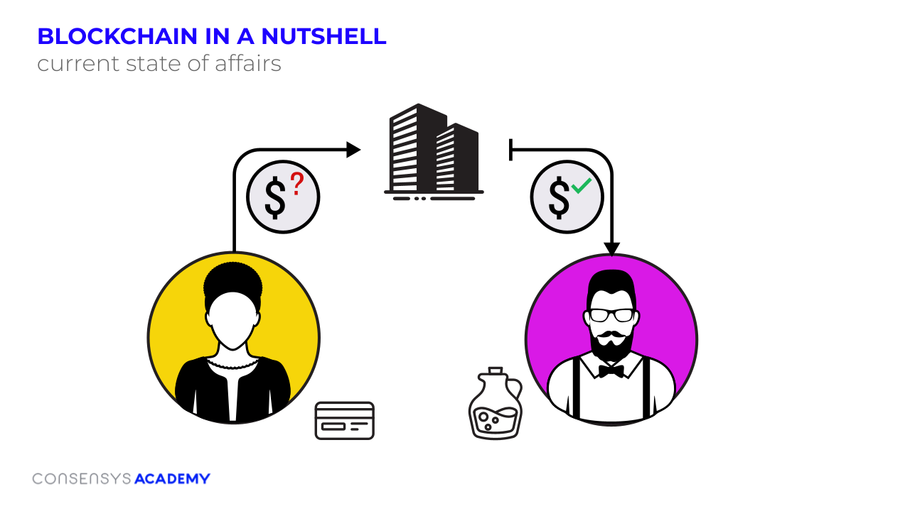
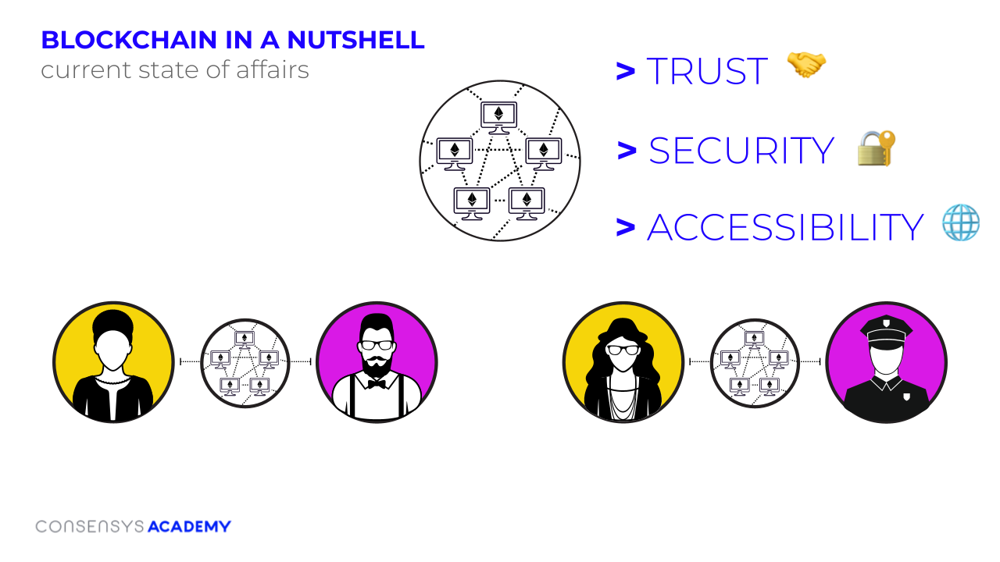

Fundamentals
============

**dusts hands* Well, well...Looks like we finally made it to the course content! Took us long enough, eh?*  Despite the Bitcoin white paper being written in 2008, Bitcoin, and blockchain generally, should be seen as the continuation of decades of technological development. In this first section, Fundamentals, we'll learn what those developments are and how they combine to become what we call blockchain.

This first section will lay the foundation for the rest of this course but we hope it will also broaden your understanding of computer programming, security and networking. The cryptographic and distributed computing tools you'll learn in this section are used in every facet of digital life. Online banking, communication networks, cloud providers, aerospace engineering and many more fields pull from similar starting points. By learning them here, you'll better your understanding of those systems, too.

The Argument for Blockchain
===========================

The Current State of Affairs
----------------------------

In our financial transactions, we always use an intermediary, be it a bank or a credit card company. We use these institutions because they have cultivated and embodied in society our values of trust, security, and accessibility (You can call someone if you have a problem, there’s a central website, for example)

  
  
What's the Problem?
-------------------

However, in recent years, those values have been violated in different ways (financial crashes, data breaches, or monopolization leading to poor customer service), which has led people to question whether there's a different way these processes can be done . 

At the same time, there's been an unprecedented amount of digitalization that has also occurred in all parts of our life, but also finance– it's not unusual to cash a check by phone, or pay off a credit card or utility bill by computer. 

### What's the Proposed Solution?

Significant system failures and increased digitalization led blockchain developers to consider alternatives to centralized financial institutions. Specifically, they looked to develop a **protocol** for financial transactions. 

A protocol is the reason why, when you dial a phone number, there's not an operator on the other end connecting your line to another. Or, when you type in a web address, you don't first leave your house to get that data. These are protocols that have been developed which have eliminated intermediate, human-mediated steps. 

This is the value proposition of blockchain. A peer-to-peer protocol which allows people to interact **directly** with each other, rather than going through a third party. People are so excited about blockchain because it aims to make important transactions (financial transactions or identity confirmation) peer-to-peer, removing the need for a middle player. 

   

Services such as Twilio have automated text message and receiving by allowing programmers to simply import the Twilio library into their program and, presto! They can send and receive text messages. Blockchain protocols such as Ethereum can be seen in a similar light – import Ethereum libraries (such as web3.js) and you can begin programmatically sending and receiving money. Setting up a bank account takes weeks, but with Ethereum, you can setup accounts, transfer funds and much more all from within your program. 

The Ethereum protocol is strong enough to sustain financial transactions, but it can also support much more. You can use the distributed network to host self-executing programs. You can build decentralized systems of reputation, you can also persist global state in a secure, trustless way. All of these things are possible within the world of Ethereum. 

What Makes Up a Protocol?
-------------------------

In the following modules, we're going to examine the elements engineers have used to build the peer-to-peer blockchain protocol. We'll then see how systems like Bitcoin and Ethereum join these separate elements together to make a wholly new product: blockchain. Last, we'll talk about the development of Bitcoin and how you can start playing with the Ethereum blockchain right from your browser.

 
