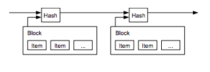

  Hashing
=======

  Cryptographic hash functions (also called hash functions or just *hashes*) are essential to us building a decentralized trust protocol by providing three main things (use this [cryptographic hash function sandbox](https://emn178.github.io/online-tools/sha256.html){target=_blank} to follow along):

 1. **Uniqueness** We can be assured if we put in the string `dark wallet puzzle` in a cryptographic function, it will always produce the same hash result. With a sufficiently large number of possibilities, this avoids the [“hash collision”](https://en.wikipedia.org/wiki/Hash_collision){target=_blank} problem, in that we don’t have to worry about two strings getting the same hash.
2. **Avalanche Effect** Small changes on the target string for a hash function leads to outsized effects. Change one letter in the string you hashed in the above example, maybe capitalizing the "d" in `Dark wallet puzzle`. You'll see it’s not changed a little bit but a lot. This illustrates the second characteristic of a good hashing function — “The Avalanche Effect”. This says a single change in the string will cause a successive series of changes that compound each other.
3. **Speed** Cryptographic hash functions can also run incredibly fast with little overhead and still maintain their security. This is more of a logistical concern. The hashing function can’t be too slow, otherwise it causes delays. But it also can’t be too fast or it will be easier to find collisions. It needs to be fast for processing but slow for hacking. Cryptographic hash functions speed combined with the difficulty in deriving the target input makes them a one-way or ["trapdoor" function](https://en.wikipedia.org/wiki/Trapdoor_function){target=_blank} — easy to go one way, near impossible to go the other.

 These three characteristics combine to help blockchains provide decentralized file integrity. Let's explain how.

 Hashing in Blockchains
----------------------

 In [the Bitcoin Whitepaper,](https://bitcoin.org/bitcoin.pdf){target=_blank} Satoshi Nakamoto articulates the ["double-spend" problem](https://en.wikipedia.org/wiki/Double-spending){target=_blank} facing digital currencies:

 
>   The problem of course is the payee can't verify that one of the owners did not double-spend the coin. A common solution is to introduce a trusted central authority, or mint, that checks every transaction for double spending. After each transaction, the coin must be returned to the mint to issue a new coin, and only coins issued directly from the mint are trusted not to be double-spent. The problem with this solution is that the fate of the entire money system depends on the company running the mint, with every transaction having to go through them, just like a bank. 
> 
>    **We need a way for the payee to know that the previous owners did not sign any earlier transactions.**  For our purposes, the earliest transaction is the one that counts, so we don't care about later attempts to double-spend. The only way to confirm the absence of a transaction is to be aware of all transactions. In the mint based model, the mint was aware of all transactions and decided which arrived first.  **To accomplish this without a trusted party, transactions must be publicly announced [1], and we need a system for participants to agree on a single history of the order in which they were received.**  The payee needs proof that at the time of each transaction, the majority of nodes agreed it was the first received. 
> 
>  

 To restate the problem: How do we know the transaction record is true and hasn't been tampered with? Hashing helps us with this. (The second point, proof of majority node agreement, we'll cover in the next Module on Distributed Consensus)

 Nakamoto proposes using hashing to create what they call a "Timestamp Server": 
>   The solution we propose begins with a timestamp server.  **A timestamp server works by taking a hash of a block of items to be timestamped and widely publishing the hash** , such as in a newspaper or Usenet post [2-5]. The timestamp proves that the data must have existed at the time, obviously, in order to get into the hash.  **Each timestamp includes the previous timestamp in its hash, forming a chain, with each additional timestamp reinforcing the ones before it.**  
> 
>  

 
 
 *from the [Bitcoin Whitepaper](https://bitcoin.org/bitcoin.pdf){target=_blank}* 

 The timestamp server leverages hash functions in one critical way. It includes the hash of the previous block into the hash of the current block. If any historical data in any of the previous blocks are altered, the changes will cascade throughout all the blocks after it. In this way, blocks of transaction data are **chained** together to form a blockchain 🤯 🤯 🤯.

 This chaining can only be effective in a large system because of those three characteristics of hash functions we discussed previously: **Uniqueness** (one string matches one hash), **Avalanche Effects** (one change in an input string creates outsized effects on the output) and **Speed** (hashes can be securely computed quickly at scale).

Hash Chains as General Data Structures
--------------------------------------

 While Nakamoto's timestamp server uses hash chains, hash chains are found in many different sorts of computer science applications before and beyond blockchain.

 The version control software **[Git,](https://en.wikipedia.org/wiki/Git){target=_blank}** for example, uses a [hash chain,](https://stackoverflow.com/questions/46192377/why-is-git-not-considered-a-block-chain){target=_blank} also called a [Directed Acyclic Graph,](https://en.wikipedia.org/wiki/Directed_acyclic_graph){target=_blank} to track changes of software over time.

 [Challenge-Response schemes,](https://en.wikipedia.org/wiki/Hash_chain#Applications){target=_blank} used for user validation, also use the concept of a hash chain.

 Learning about hash functions and the associated hash chaining will give you great insights into these power data structures as well as programming data primitives like [hash tables.](https://en.wikipedia.org/wiki/Hash_table){target=_blank}

Additional Links for Hashing
----------------------------

  
 
 ### General Hashing Material

 * [Interactive Code: Cryptographic Hash Function Sandbox](https://emn178.github.io/online-tools/sha256.html){target=_blank} A, simple nice way to see the characteristics of hash functions.
* [Article: Why is 2^256 Secure?](https://web.archive.org/web/20201026010255/https://privacycanada.net/cryptanalysis/why-is-2-256-secure/){target=_blank} Explanation behind the enormous "numberspace" that virtually guarantees no collisions, and therefore uniqueness, when using hash functions based on large exponents.
* [Video: Hashing Algorithms and Security (Computerphile)](https://www.youtube.com/watch?v=b4b8ktEV4Bg){target=_blank}
* [Video: SHA (Secure Hashing Algorithm) Explained (Computerphile)](https://www.youtube.com/watch?v=DMtFhACPnTY){target=_blank}
* [Article: How Hash Algorithms Work](https://www.metamorphosite.com/one-way-hash-encryption-sha1-data-software){target=_blank}
* [Article: Cryptographic Hash Function (Simple Wikipedia)](https://simple.wikipedia.org/wiki/Cryptographic_hash_function){target=_blank}

### Blockchain / Ethereum-Specific Hashing Material

 * [Interactive Code: ETH.Build](https://youtu.be/QJ010l-pBpE){target=_blank} Austin Griffith walks through Hash Functions using his [ETH.Build](https://sandbox.eth.build/wofCrGxhc3Rfbm9kZV9pZCLEgcSDxIVsaW5rxItkFsKlxIfEiXPClMKKwqLEjCDCpHR5cGXCqklucHV0L1RleHTCo3Bvc8KSZcOMw7_CpHNpemXCksONASwywqVmxIJnc8KAwqVvcsSJcgDCpG3EiGUAwqbEk8SqdHPCkcKDwqRuYW1lwqDEosSkxZPCpMSSxJTDgMKnb8SrxZfFmcWbxZ3Fn8WhxKPEpcKmxIRyxJNnwqXFpmvFmRXCqnByb8SlcnRpZXPChMKrYmxvY2vGhVPEvGUywqtwxIJjZWhvbMWNwq9lbnRlciDGoMSwIGjGoWXCpcaEdGxlwqTErsSwwqV2YWx1xq7GoMSExJ7EjB_FosSlwqtDcsSkdG8vSMSDaMSyxLTEvwHDl8S4xLrGkcKSeB7FhMWGxYjFisWMxqECxZDFksWUxZbEq8WtxZzFnsapx550xr1lwq3FtcW3LG51bWLGocWlxJNrFcWpxavHn8Wax6HFn8KkaMeHx6bFtHTFtm7FuMW6xZkWxb7GgMaCxoTGhsKAxrpkIcemwq1EaXPGlWF5L1dhdGPHiMSzxLXDjQLCs8OMw7XHj8S9xL8DMTzHlGHFh8WJxYvFjQPHm8SJx53Eqce3woTHucWgx6bFj8W6xJjEgsevbMKgx7V0xazCkci3xa_IucWyxZPFuceyc8OAxblhyL_CoMiHxoHGociKc8KBxqppxqzGqciZyJtowojEn8SNyJDIksiUxILIl1TJmsatx4nEtTx4yKXEvsigJgTIq8itx5fFjQHIssWTyZPIicaFc8KHwqhmb8afxpDEvSzGicaLxo3Gj8aRxpPIlcaXxpnGm8ahwqDJmcmbwqXJqMqUxrPGtcenx4ZzaCBGdW5jxoTKgsKqyoHGn0bFnmlsecK8J1J1YmlrIE3Kgm8gT25lJywgc2Fucy1zxqFpZsKlY8aaxYvCpyNky47Lj8mLxJTEtcKWFSAAHwDHqMiAx6rHrMeuxqHClhbLmCEAxZRnxoB1cHPCkMKmy4luZmlnwoDCp3bGocS7yoLDiz_DmcKZy7vLu8Ka){target=_blank} platform (highly recommended).
* [Article: Blockchain Underpinnings: Hashing (ConsenSys)](https://medium.com/@ConsenSys/blockchain-underpinnings-hashing-7f4746cbd66b){target=_blank}
* [Interactive Code: Cryptographic Hash Functions (ConsenSys / Josh Crites)](https://observablehq.com/@consensys-academy/cryptographic-hash-functions){target=_blank} Uses a platform called [Observable](https://observablehq.com/@observablehq/five-minute-introduction?collection=@observablehq/introduction){target=_blank} to provide you with code you can run in the article!
* [Lesson: Cryptographic Hash Functions (Khan Academy)](https://www.khanacademy.org/economics-finance-domain/core-finance/money-and-banking/bitcoin/v/bitcoin-cryptographic-hash-function){target=_blank}

### Advanced Hashing Resources

 * [Coding: Bitcoin Whitepaper Exercises: Hashing](https://github.com/cooganb/bitcoin-whitepaper-exercises/blob/master/hashing/README.md){target=_blank} This is a JavaScript-based exercise implementing the timestamp server outlined in the Bitcoin Whitepaper. It's the first in a [larger problem set](https://github.com/cooganb/bitcoin-whitepaper-exercises){target=_blank} we'll also recommend you try later in this section.

 
