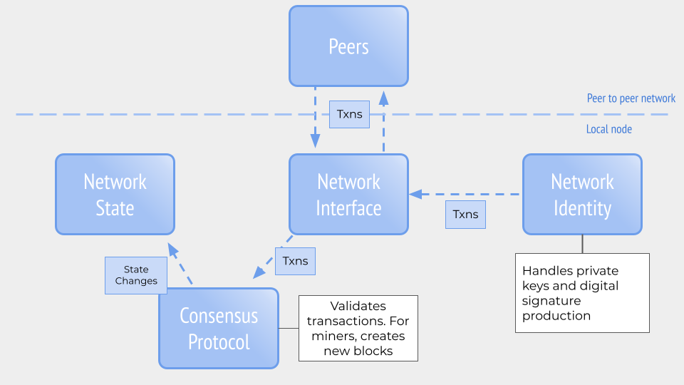
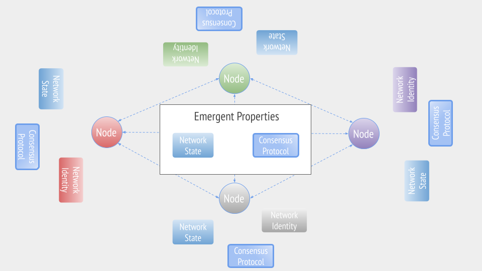

  Mental Model for Basic Blockchain Architecture
==============================================

  Let's take a look at this diagram of a blockchain node, which is not specific to any particular cryptocurrency and could be on any blockchain network:

 

 Above the dotted line is the distributed, peer-to-peer network with which the node is interacting. As we mentioned previously, the fundamental unit of communication is the **transaction,** (commonly shortened to *txn*), which the node is both sending and receiving from the network.

 Below the line are all the primitives we have discussed in this section. We have the cryptographic primitives used in the network identity, and those used to validate transactions. We also have the consensus protocol, which is agreed upon by the network, and which the node will use to check the validity of the blocks. If the block is valid, the node will update its network state with the changes the valid transactions make. If this node is a miner, the consensus mechanism will also work to produce a valid block.

 Let's now zoom out and see a simplified version of the larger network:

 

 The nodes have a different color to show they have unique identities, which are created by the cryptographic keys they use in their network identity. While the nodes have different identities, please note that they all have the same "Consensus Protocol." This is the mechanism they have all agreed to use to maintain and update their network state. However, it's only successful if everyone is using it and coming to agreement about the network state. Luckily, this network we are looking at is all in agreement about its state.

 Please notice the middle of the diagram, the **Emergent Properties**. It's easy to forget that the network state and the network consensus are not a set, static property. Instead, they are a constantly evolving and mutating entity that changes with each transaction that is confirmed by the consensus protocol then propagated to the rest of the network.

 In our everyday life, we're more likely to encounter centralized entities attesting to a state. Your bank tells you your balance is a certain number, etc. With distributed networks, the network state is not something that's dictated by one centralized force. Instead, it's something that emerges from all the networks of participants, sometimes numbering in the millions, passing transactions, valid blocks and gradually shifting from one network state to the next.

 In the next section, we'll talk about how some network configurations change and why. But don't forget that, for every blockchain network, there is a generalizable structure you can isolate and use to identify what's different or the same. This will help you discern what networks are good for what purpose, how stable a network may be, or what improvements or innovations will change which part of a network.

 Additional Material
-------------------

 * [Interactive Code: Building a Blockchain (Josh Crites, ConsenSys Academy)](https://observablehq.com/@consensys-academy/building-a-blockchain){target=_blank} We created an interactive notebook where you can deepen your understanding and experiment to see how their properties are essential for building blockchains
* [Interactive Code: Anders Blockchain](https://andersbrownworth.com/blockchain/){target=_blank} A great, web-based interactive tutorial going over fundamentals of Proof of Work consensus including [block production through hashing](https://andersbrownworth.com/blockchain/block){target=_blank} and [distributed blockchains](https://andersbrownworth.com/blockchain/distributed){target=_blank}
* [Code Tutorial: Build Your Own Blockchain](https://karpathy.github.io/2021/06/21/blockchain/){target=_blank} Andrej Karpathy, who's done some great machine learning tutorials, built this tutorial walking through building the Bitcoin network using Python.

 