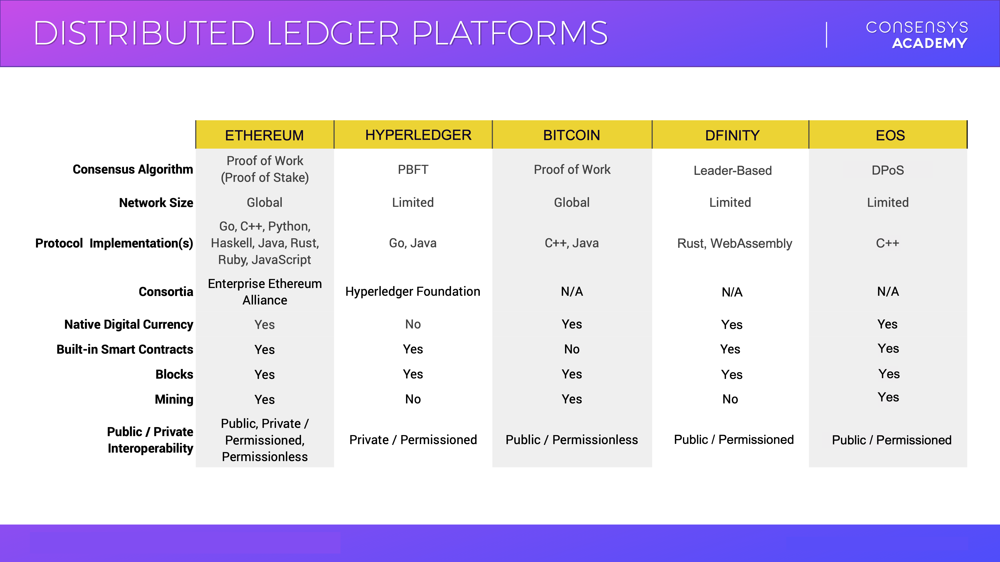

Configurations for Different Blockchain Networks
================================================

Now that we have a general model of a blockchain, when we encounter a new network, we know which questions to ask. Some suggested parts of the model you could build on:

* **Nodes and Roles** What are the different roles in the network for nodes? What are the ways the nodes join the network and acquire their different roles?
* **Consensus Mechanism** Always good to know for a blockchain network, will typically let you know whether a network is public, private or consortium. It typically also lets you know the processing limit for the network. The lower the trust assumptions, usually the more limited the processing limit (To be clear, not always the case).
* **Periods** We mentioned *Block Production* and *Block Propagation* as two general periods in Proof of Work. In any network, what are the different periods the network goes through as it achieves distributed consensus?
* **Cryptographic Primitives** This is very technical and advanced, but knowing what cryptographic family and implementation the network uses for its hashing and encryption can shed some light on a network. Mainly, if a network is using zero-knowledge proofs (which we'll learn about later) or something dramatically different from another network, that's good to know.
* **Level of Decentralization** This is a fuzzier variable and may involve incorporating the above data points to determine the level of decentralization. Or, the network is private or a testnet and will openly state that it's more centralized since that's appropriate for its function.
* **Reason for Being** Another fuzzy variable but it can be very telling to ask why another blockchain network needs to exist. Not because any are perfect, but rather because the answer will hopefully provide some more context into how the network is different from networks you are more familiar with. That way, you can port over what you already know about your favorite blockchain network to better understand another.

Other variables include: 
 
* Governance Structure (How does the network community decide on updates, fixes, etc.)
* Developer community size and support
* General community size and support
* Network size (How many nodes are there?)
* Open or Closed Source (Can anyone view or contribute to the implementation code online?)

 

 Below is an image showing a rough comparison of a few popular blockchain networks. Looking over it, you may see the benefit of having a set series of variables to analyze multiple networks. There aren't too many things that can change and those that do should have something to tell you about the purpose of the network and any strengths or weaknesses it might have:

 

 The other aspect of comparing blockchains is the concept of **crosschain compatibility** or [blockchain interoperability.](https://101blockchains.com/blockchain-interoperability/){target=_blank} This is the ability of public blockchains to share network data with each other. We're living in an increasingly multi-chain world, where there are many significant blockchain networks. Rather than trying to have one chain monopolize, blockchain interoperability seeks to leverage different strengths and minimize weaknesses of the existing chains. We'll discuss this in more detail in a later section.

 Additional Materials
--------------------

 * [Article: Secp256k1 (River Financial)](https://river.com/learn/terms/s/secp256k1/){target=_blank} Description of the Elliptic Curve used by Ethereum and Bitcoin.
* [Chart: Cryptography Behind Cryptocurrencies](https://www.susanka.eu/coins-crypto/){target=_blank} A table of which cryptography is used with major blockchain networks.
* [Article: Blockchain Interoperability: Why is Cross Chain Technology Important? (101 Blockchains)](https://101blockchains.com/blockchain-interoperability/){target=_blank} A brief introduction to blockchain interoperability.
* [Article: Understanding Cross Chain Communication (Ivan on Tech)](https://academy.ivanontech.com/blog/understanding-cross-chain-communication-examining-blockchain-interoperability-and-why-it-matters){target=_blank} Another overview of cross chain communication, including bridges.

 
