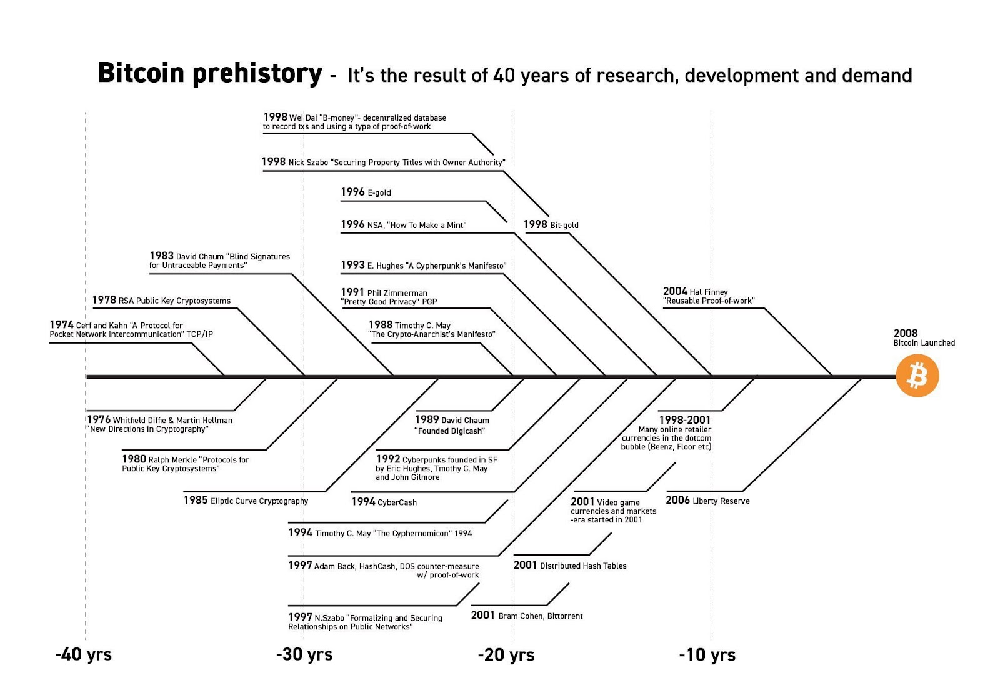

  Bitcoin: History and Development
================================

  *Please note: People have written books about Bitcoin's history and development and this is just a section of our course. We'll be the first to admit that an overview of Bitcoin requires discretion on our part. Opinionated or controversial comments are flagged as best we can but, as always, we're hoping mainly to give a overview of the major points. Inevitably, we'll miss something.*

 "Bitcoin is Old Technology"
---------------------------

 As we've mentioned frequently, Bitcoin relies on decades of technological development. This has led to a meme "Bitcoin is Old Technology":

 

 Satoshi Nakamoto was aware of all these developments, and references them throughout [their whitepaper.](https://bitcoin.org/bitcoin.pdf){target=_blank} But Bitcoin actually started on a listserve and with Nakamoto sharing a piece of software they were building. It was initially simply called "Bitcoin" and was built using C++. Nakamoto also encouraged others to run the software and began gathering the early developers who ran the first distributed network.

 Once the software was stable, Nakamoto released a whitepaper describing the concepts underpinning the software and referencing some of the older technologies it drew upon. By the release of the whitepaper, there was a growing community of developers interested in Bitcoin and discussing its future.

 Famously, Nakamoto stepped back from the project in early 2011. In April of that year, Nakamoto posted their last update to [Bitcoin Core,](https://en.bitcoin.it/wiki/Bitcoin_Core){target=_blank} as the software was now known and gave developer credentials to the now-lead technical developer, [Gavin Andresen.](https://en.wikipedia.org/wiki/Gavin_Andresen){target=_blank} ([source](https://bitcoinmagazine.com/technical/what-happened-when-bitcoin-creator-satoshi-nakamoto-disappeared){target=_blank})

 Many have speculated about Satoshi Nakamoto's identity but their identity has never been definitively proven. There is a significant amount of bitcoin (some estimates say around one million bitcoin) Nakamoto mined during their time running the Bitcoin Core software. It's considered to be the best identity test for anyone claiming to be Nakamoto: Sign a cryptographic digital message with the private key associated with this bitcoin. It has never been done! 

 Basic Technical Features
------------------------

 We'll briefly touch on two main technical parts of the Bitcoin network: The UTXO transaction model and the Script smart-contract language.

 - The Unspent Transaction Output or **[UTXO](https://en.wikipedia.org/wiki/Unspent_transaction_output){target=_blank}** model is the fundamental building block of transactions in the Bitcoin network. Per Wikipedia: "Each UTXO is analogous to a coin, and holds a certain amount of value in its respective currency. Each UTXO represents a chain of ownership implemented as a chain of digital signatures where the owner signs a message (transaction) transferring ownership of their UTXO to the receiver's public key." The UTXO model is in contrast to the [account model](https://ethereum.stackexchange.com/questions/326/what-are-the-pros-and-cons-of-ethereum-balances-vs-utxos){target=_blank} that Ethereum tracks value in the network
 

 - Many don't realize this, but Bitcoin does actually technically have a programming language it uses, called [Script,](https://en.bitcoin.it/wiki/Script){target=_blank} which is based off the [Forth](https://en.wikipedia.org/wiki/Forth_(programming_language){target=_blank}          ) programming language. It's very limited in its capacity, but you can read about some of its capacity in [Mastering Bitcoin](https://github.com/bitcoinbook/bitcoinbook){target=_blank} in the ["Advanced Transactions and Scripting"](https://github.com/bitcoinbook/bitcoinbook/blob/develop/ch07.asciidoc){target=_blank} chapter.

 Conclusion
----------

 It's sometimes easy for others to find fault with Bitcoin and the Bitcoin community. However, it's important to note Bitcoin's contribution to the world, both specifically to blockchains but also to distributed networks generally. We can't go as deep as we'd like to (we can't, but we'd like to talk about the Segregated Witness development and the more recent Taproot fork), but we'd encourage you to at least checkout the whitepaper. At this point, you should be able to understand all the concepts in it!

 Here are some great resources for reading the whitepaper, which can be intimidating on its own:

 * [Fermat's Library: Bitcoin Whitepaper Annotated](https://fermatslibrary.com/s/bitcoin){target=_blank}
* [Genius.com's Annotation of Bitcoin White Paper](https://genius.com/Satoshi-nakamoto-bitcoin-a-peer-to-peer-electronic-cash-system-annotated){target=_blank}

 Additional Material
-------------------

### History and Nakamoto

 * [Wikipedia: Bitcoin](https://en.wikipedia.org/wiki/Bitcoin){target=_blank} A general overview of Bitcoin from our favorite hive mind encyclopedia.
* [Article: Exploring Bitcoin's History](https://medium.com/coinmonks/exploring-bitcoins-history-ecbf1c59952c){target=_blank} A very long, but thorough, article discussing all the technology building up to Bitcoin, including TCP/IP, Elliptic Curve Cryptography, time-stamp servers, smart contracts and more.
* [Article: The Crypto-Currency](https://www.newyorker.com/magazine/2011/10/10/the-crypto-currency){target=_blank} An article discussing Bitcoin and it's mysterious creator Satoshi Nakamoto, from October 2011
* [Article: What Bitcoin Is and Why It Matters (MIT)](https://www.technologyreview.com/2011/05/25/194486/what-bitcoin-is-and-why-it-matters/){target=_blank}
* [Article: What Happened When Bitcoin Creator Satoshi Nakamoto Disappeared (Bitcoin Magazine)](https://bitcoinmagazine.com/technical/what-happened-when-bitcoin-creator-satoshi-nakamoto-disappeared){target=_blank} An article charting the rise of Nakamoto, the community of developers who grew around the project, and the eventual disappearance of Nakamoto from the project in 2011.

### Technical Features and Development

 * [Book: Mastering Bitcoin](https://github.com/bitcoinbook/bitcoinbook){target=_blank} Considered to be the best-in-class introduction to Bitcoin development.
* [Tutorial: Advanced Transactions](https://github.com/bitcoinbook/bitcoinbook/blob/develop/ch07.asciidoc){target=_blank} Section from "Mastering Bitcoin" about Script's more advanced features.

### General Resources

 * [Online Course: What is Money? (UC Berkeley)](https://berkeley-haas.hosted.panopto.com/Panopto/Pages/Viewer.aspx?id=c29702dd-1b12-4436-87d4-a87100137a6e){target=_blank}
* [Article: You Don't Understand Bitcoin Because You Think Money is Real](https://medium.com/@mariabustillos/you-dont-understand-bitcoin-because-you-think-money-is-real-5aef45b8e952){target=_blank} A favorite article of ours!
* [Article: What is Money? (London Review of Books)](https://www.lrb.co.uk/v38/n08/john-lanchester/when-bitcoin-grows-up){target=_blank} Sort-of paywalled, but a think piece about the implications of Bitcoin from April 2016.
* [Article: What the Heck is UTXO?](https://medium.com/bitbees/what-the-heck-is-utxo-ca68f2651819){target=_blank}

 
