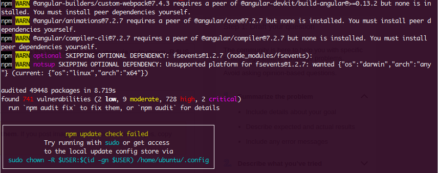

How Does MetaMask Keep Your Keys Safe?
======================================

There are more Ethereum wallets available now than, say, a few years ago. What makes MetaMask special? In the next two sections, we're going to prove to you why MetaMask holds a characteristic that raises it above the rest. Namely, MetaMask has taken more steps than any digital cryptocurrency wallet to protect its users. As we hope you realize by now, this is of the utmost importance in the Web 3 paradigm. If we are decentralizing systems, that also means users take on much more security concerns than they are used to having on the web. It's a tall order for users, but even more massive for those building tooling used as extensively as MetaMask.

Luckily, the MetaMask team is working with engineers in the broader JavaScript community who have been focussing on these issues for quite some time. All decentralized systems require a way to safely persist state and capture intent, not just blockchains, and the MetaMask team has been able to draw from decades of experience and contribute their own innovations. All of this helps push us towards a broader decentralized future. At the end of the day, MetaMask, is a **user consent tool** with a broad impact beyond public blockchains.

With the user's private keys in the browser, you may assume the private key at some point is passed outside of MetaMask. However, this is **never** the case. To do so would invite imminent hack. But how to make sure the keys never leave MetaMask? You have to build something very difficult to penetrate around MetaMask. Enter...[LavaMoat!](https://github.com/LavaMoat/LavaMoat){target=_blank}

From [the repo:](https://github.com/LavaMoat/LavaMoat){target=_blank}

**LavaMoat** is a set of tools for securing JavaScript projects against a category of attacks called software [supply chain attacks.](https://en.wikipedia.org/wiki/Supply_chain_attack){target=_blank}

This genre of attack occurs when a malicious dependency makes its way into a developer's application. An attacker could use the vulnerable dependency to then steal important secrets like credit card numbers, private keys, or personal data.

These attacks have occurred in the software system, in part due to a larger phenomenon exemplified by the wide use of `npm install` when working on projects. Tons of warnings and errors fly by and, while the first few times it may be alarming, it's easy to become used to these warnings and ignore them. However, each of these dependencies can be a potential backdoor!

*A common sight*

Major ransomware attacks like [the SolarWinds attack](https://en.wikipedia.org/wiki/2020_United_States_federal_government_data_breach){target=_blank} on US Federal Government Systems show us that the supply chain issue is not just restricted to JavaScript or cryptocurrency projects.

 Supply chain attacks present a significant risk for the developers and users of wallets and apps. In order to help mitigate the risk of such an attack MetaMask is building a suite of tools that range from a node-based runtime, to plugins for common app bundlers (eg webpack, browserify), to dependency analysis and visualization tools.

 The goal of LavaMoat is to bring added protections to modern JavaScript apps without having to rewrite them from scratch and automate a good first-start security configuration.

 Learn more about LavaMoat below and, in the next section, we'll hear from MetaMask co-founder Dan Finlay talk about MetaMasks' broader contributions in building a secure, extensible JavaScript to power a decentralized future.

 Additional Material
-------------------

 - [Video: Introduction to LavaMoat (DevCon V)](https://www.youtube.com/watch?v=c-UUfrZTmio){target=_blank}
 - [Video: LavaMoat: Securing Your Dependency Graph](https://www.youtube.com/watch?v=iaqe6F4S2tA){target=_blank}
 - [Code: LavaMoat GitHub Repo](https://github.com/LavaMoat/LavaMoat){target=_blank}
 
