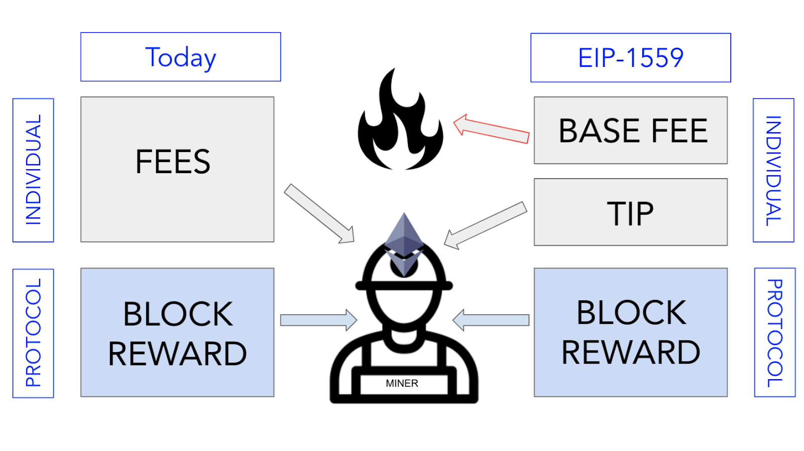

  EIP-1559
========

  We've talked about mining in the Ethereum as the way the network confirms and propagates state changes. However, in August 2021, the Ethereum core developer community, after many years of research, development and testing, released a major change to the mining process in Ethereum known as [EIP-1559](https://eips.ethereum.org/EIPS/eip-1559){target=_blank} (remember Ethereum Improvement Proposals or EIPs are the way the Ethereum community incorporates changes to the protocol).

 Before EIP-1559, Ethereum transaction fees were market-driven. Meaning, the gas price, or fee, dictated how quickly a miner would include a transaction in a block. This has led to some dramatic price swings in fees and pushed network developers to find a more stable solution. Enter EIP-1559.

 EIP-1559 replaces the gas fees with a fixed-price sale. Now, people submitting transactions won’t have to guess as much about how much gas is required, as there will be an explicitly ‘base fee’ to be included in the next block. For users or applications that want to prioritize their transaction, they can add a “tip” to pay a miner. The base fee will be "burned," meaning destroyed, while the tip goes to the miner.

 In times of high network activity, the base fee will adjust in a predictable manner to gate the flow of transactions. 

 

 As an analogy to explain the base fee and tip, imagine the experience of using a ride sharing service app on your phone (e.g. Uber, Lyft, or Didi). You want to use this app to get a ride to go from A to B. The cost to go from A to B is the same, regardless of which driver picks you up (the base fee in EIP-1559). Now, imagine if you were able to add a tip to your driver, prior to getting on the ride. If your tip is higher than what other people at that time are offering, drivers will be incentivized to pick you up over other potential passengers not offering a tip.

 This process is similar to your ETH transactions: you can set a tip for miners (the “driver” in the above example) to include your transaction in the next block (the “ride” in the above example). A higher tip means a greater chance of your transaction being included in the next block and therefore being completed.

 Crucially, EIP-1559 makes the gas prices more transparent but it does **not** lower the prices. This is a common misconception. EIP-1559 may reduce the amount of time the network has high gas prices, but the only way to deal with high gas prices is to improve scalability (which we'll discuss in a later section).

 It's still very early days for 1559 and we'll get to see how it progresses together!

 Changes for Developers
----------------------

 EIP-1559 is a backwards compatible upgrade. You'll remember from the section on distributed consensus, this means that pre-EIP-1559 transaction structure is still supported. However, post-EIP-1559, a transaction price is calculated using the following equation: 
```
transaction fee = baseFee + min(maxFee - baseFee, priorityFee)
```
An explanation of the three variables: 
* `baseFee` A fee that floats based on the network congestion and the most recent value can be fetched via a new JSON RPC call `eth_feeHistory`
* `priorityFee` (also called a tip) A fee to entice a block producer to include the transaction.
* **`maxFee`** The highest network fee the user is willing to pay.

Here are some changes to the [Ethereum JSON-RPC format](https://eth.wiki/json-rpc/API){target=_blank} you will see on the protocol level that may affect the way you develop as well, broken down by part of the Ethereum protocol affected:

### Blocks

* `eth_getBlockBy` A new field baseFeePerGas is included for post-London blocks
* `eth_getUncleBy*` A new field baseFeePerGas is included for post-London blocks
* Block header data `baseFeePerGas` is the base fee paid by all transactions in this block. (The field is empty for all blocks before the fork.)

### Transaction Data

* `maxPriorityFeePerGas` specifies the tip (priority fee) to entice a block producer to include your transaction.
* `maxFeePerGas` is the maximum fee the user is willing to pay the block producer for including this transaction.
* Legacy transactions that only include a `gasPrice` are still valid and they will be accepted into the blocks. The user will simply pay the entire proposed network fee and as a result they may pay a premium compared to other users on the network.
* `eth_gasPrice` is deprecated and replaced with `eth_feeHistory`, which returns transaction fee data for up to 1024 blocks. For each block, `eth_feeHistory` reports the base fee, a percentile list of effective priority fees and the ratio of gas used/limit. Note the required base fee for the next block is returned as well.

### Transaction Simulation

 * `eth_call` May require the developer to specify the gas price or new 1559 gas pricing to reflect true execution of a transaction. The Go-Ethereum (geth) developer team has more about the changes to `eth_call` [here.](https://github.com/ethereum/go-ethereum/pull/23027){target=_blank}
* `eth_estimateGas` May fail to estimate the gas if the gas price or new 1559 gas pricing is not filled in (i.e., greater than 0).
* London Fork, which implements EIP-1559, also implements the related EIP-3198. This adds a new opcode, `BASEFEE`, that returns the base fee of the current block it is executing in. It is recommended for developers to explicitly set the gas pricing for both JSON RPC calls to avoid a failed JSON RPC call response.

 Additional Material
-------------------

 * [Video: EIP-1559 Explained (Finematics)](https://youtu.be/MGemhK9t44Q){target=_blank}
* [Article: What is EIP-1559? (ConsenSys)](https://consensys.net/blog/quorum/what-is-eip-1559-how-will-it-change-ethereum/){target=_blank} A great introductory explainer article we used for much of the course material.
* [Article: What is EIP-1559? (MetaMask)](https://metamask.io/1559){target=_blank} Another introductory article, this time from the perspective of a MetaMask user
* [Video: How To Set Transaction Priority in MetaMask](https://www.youtube.com/watch?v=gsfJywNxpi4){target=_blank} Great video walking through the ways in which MetaMask is adjusting to EIP-1559.
* [Interactive: Ultrasound Money](https://ultrasound.money/){target=_blank} The website provides realtime updates on how much ether has been burned as part of EIP-1559

 ### Technical

 * [Article: London Fork (Infura)](https://blog.infura.io/london-fork/){target=_blank} Great technical overview of the protocol changes coming to clients, specifically to the JSON-RPC API calls all Ethereum clients must use.
* [Article: EIP-1559 JSON-RPC Changes (Tim Beiko)](https://hackmd.io/@timbeiko/1559-json-rpc){target=_blank} A more dry look at the JSON-RPC changes
* [Wiki: 1559 Resources (Tim Beiko)](https://hackmd.io/@timbeiko/1559-resources){target=_blank} A comprehensive list of resources to explore any aspect of EIP-1559, from the UX, Security, Economics, Mining or Simulations
* [GitHub: eth\_call invocations post 1559](https://github.com/ethereum/go-ethereum/pull/23027){target=_blank} Explainer from the Geth team about the changes to the `eth_call` JSON-RPC call

   
