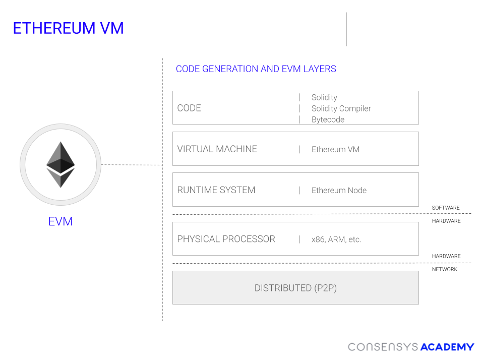
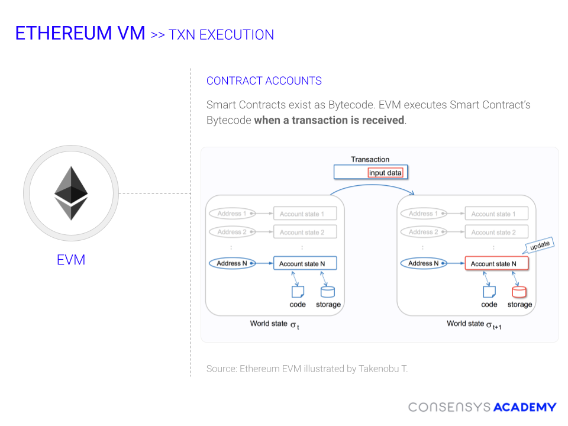

  Where Do Smart Contracts Fit in Our Mental Model?
=================================================

  In this chapter, we're going to dive deeper into **smart contracts**: What they are, how they work and how you can build with them safely.

 First, a general definition. [Smart contracts](https://en.wikipedia.org/wiki/Smart_contract){target=_blank} are programs deployed to a blockchain network that automatically execute when triggered by valid transactions. A basic analogy for a smart contract is a vending machine: The customer puts in money, punches in the code of the desired item. Assuming a valid input, the vending machine will release the desired item.

 The following properties are desired in any smart contract system: 
 - **Trustless** Meaning two or more parties can act on an agreement without relying on any intermediary to facilitate the transaction
 - **Universally Accessible** Meaning every participant must be able to access and use the system. They should not have to rely on anyone’s approval to participate in the network.
 - **Traceable** Contract transactions should be traceable. Data provenance is critical to resolving disputes and for legal compliance.
 - **Immutable transactions** Transactions should be irreversible (atomic). Participants should not be able to revoke their decisions, just as legal contracts are binding, so are smart contracts.
 - **Self executing** We want to move as far away from manual implementation as possible and have these contracts be automatic. The extent that the self executing contract is self executing is subject to use case variability.
 

 To understand where smart contracts fit into blockchains, let's review the blockchain mental model we constructed in the first chapter.

 

 Let's zoom into the **Network Interface — Consensus Protocol — Network State** elements on the lower left corner. We'll also update the names for the Ethereum network:

 

 The Ethereum Virtual Machine (EVM) is a secure execution environment for smart contracts. EVM bytecode is executed on the Ethereum Virtual Machine and the outcome constitutes the new world state. The EVM is Turing-complete, meaning it can execute more advanced code than the Bitcoin network. However, to make sure transactions don't loop forever, transactions on the Ethereum network also have gas limits, as we've discussed.

 

 EVM bytecode is machine code, meaning it's very difficult for humans to read or program in. However, core developers have built higher-order smart contract languages that compile to EVM bytecode. One well-known higher-order smart contract language that compiles down to EVM bytecode is **Solidity**.

 Here's a diagram showing how Solidity code compiles down into EVM bytecode, which is then deployed to the Ethereum network:

 

 Smart Contract Workflows: Creation and Execution
------------------------------------------------

 There are two practical types of transactions involving smart contracts: **Contract creation** and **Message call** 

 The image below shows the contract creation process. When a smart contract is deployed to the network, the code is initialized and states are created with addresses.

 

 Here, we can see the high-level process of the EVM executing a transaction to a smart contract. The transaction includes input data, which is fed into the smart contract bytecode. The outcome of the transaction contributes to the network state change.

 

 Let's look further into how the EVM handles deployed bytecode and contract data when it executes a transaction's EVM bytecode.

 

 While there are a lot of elements to this picture, try to keep in mind we are looking at a simple state machine. State is fed into the stack, the EVM processes the stack, and the result is either saved, if it affects the network state, or discarded, if it was only necessary for the transaction execution.

The state in the EVM stack is in three areas: 
* **Memory** This is *[volatile](https://en.wikipedia.org/wiki/Volatile_memory){target=_blank}* memory, meaning that, unless it is explicitly written back into the network state, will only be accessible during the transaction execution.
* **Storage** This is persistent memory taken from the network state. Read and writing to the network state is more expensive, gas-wise, than memory, since it affects the global state of the network.
* **Stack** The information processed by the EVM stack while going through the bytecode. (Stack is a data structure used by all computer processors, you can learn more about it [here](https://en.wikipedia.org/wiki/Stack_(abstract_data_type){target=_blank}))

 

 When the EVM wishes to process a transaction, it first takes the input data, fetches the relevant contract bytecode and any world state account storage data. Then, the EVM processes the transaction data through the stack data type. Last, after the EVM has finished processed the transaction, it takes any world state data altered by the transaction and writes those changes to the world state. The diagram below illustrates this process (note that PC is the Program Counter, essentially keeping track of the steps to measure gas):

 

 The handling of memory and storage in the transaction execution process can be one of the hardest challenges for new developers in the space. We'll go over it more in the Solidity section, but be aware it's a different level of programming than a typical JavaScript or Python developer encounters.

 New Development and Security Considerations
-------------------------------------------

 The process we've just outlined contains many challenges for developers entering the space, such as: 
 * **Smart contracts are immutable** They cannot be modified (only re-deployed). A common web development mantra is “move fast and break things”. This is not advisable in smart contract development due to this immutability.
* **High cost of failure** Typical software development that is this accessible does not involve potentially losing tremendous financial value. You're more likely to encounter this level of scrutiny and security in hardware and financial services programming.
* **Smart contracts information is public and anyone can call your public functions** Once your code is deployed and particularly if it starts accruing value, it will attract more opportunities for it to be hacked or misused.

 In this section, we hope to both equip you with the ability to code smart contracts but also protect yourself and anyone interacting with your code. Most of all, we hope to instill in you a healthy sense of paranoia and fear about the code you deploy to public networks. However, we will also show you how to deal with this terror by protecting your code with smart and secure tools.

 Additional Material
-------------------

 * [Wikipedia: Smart Contracts,](https://en.wikipedia.org/wiki/Smart_contract){target=_blank} [Stack (Abstract data type)](https://en.wikipedia.org/wiki/Stack_(abstract_data_type){target=_blank})
* [Video: Turing Complete (Computerphile)](https://www.youtube.com/watch?v=RPQD7-AOjMI){target=_blank} Video describing what it means for a language to be Turing complete, the difference between the Bitcoin execution environment and the EVM is the EVM is Turing complete.
* [Wiki: Ethereum Virtual Machine (Ethereum.org)](https://ethereum.org/en/developers/docs/evm/){target=_blank} A deep dive describing the EVM
* [Slides: Ethereum VM Illustrated (Takenobu T.)](https://takenobu-hs.github.io/downloads/ethereum_evm_illustrated.pdf){target=_blank} A slide deck describing the Ethereum VM. Many of the diagrams in this section are from this slide deck

 

