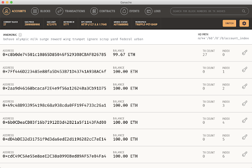
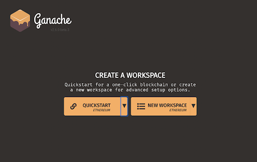
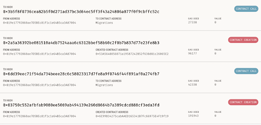
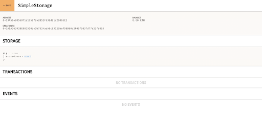

  Truffle Suite Deep Dive
=======================

  As with most things, the best way to learn is by doing, so without further ado let’s dive into a hands on example of using Truffle.

 In this example we’ll be leveraging some of the core Truffle commands to build the decentralized equivalent of a [“Hello World!” program](https://en.wikipedia.org/wiki/%22Hello,_World!%22_program), aka `SimpleStorage`. As the name suggests, this example will provide a means of both storing some on-chain data (essentially state stored indefinitely on the blockchain) and subsequently retrieving this state.

 *Note: If you’re going to be following along, this example assumes you followed the steps last lesson to successfully install Truffle*

 Initialize an Empty Project
---------------------------

 Let’s begin by creating an empty project using the `init` command. In a new directory (e.g. “SimpleStorage”) and from your terminal, run the following commands.
 
```
$ truffle init simple-storage-demo
cd simple-storage-demo
```

 Congratulations, you now have a bare bones project! Next up, let’s create a contract within which we’ll be able to store our SimpleStorage project’s code.

 Create a Contract
-----------------

 Truffle provides a create command with which you can achieve this, although as we'll show later it’s often just as easy to create the file via your favorite editor environment.

 
```
$ truffle create contract SimpleStorage
```

 This will create a new Solidity (note that this is the default language) file, `SimpleStorage.sol` within your contracts directory.

 Using a code editor (we recommend VS Code), paste the following Solidity code into the `SimpleStorage.sol` file and save:

 
```
// SPDX-License-Identifier: MIT
pragma solidity >=0.4.22 <0.9.0;

contract SimpleStorage {  
  uint storedData;  
  
  function set(uint x) public {    
    storedData = x;  
  }  
  
  function get() public view returns (uint) {    
    return storedData;  
  }
}          
```

 Sweet, your first contract! Now let’s try out the `compile` command we saw earlier.

 Compilation, baby!
------------------

 Running the `compile` command from your terminal like the following:

 
```
  $ truffle compile  
  
  Compiling your contracts...
  ===========================
  > Compiling ./contracts/SimpleStorage.sol
  > Artifacts written to /Users/emilylin/dev/proof-of-existence/build/contracts
  > Compiled successfully using:
    - solc: 0.8.16+commit.07a7930e.Emscripten.clang
```

 Assuming all went smoothly, Truffle should have compiled your contract and added the resultant output (something referred to as build **artifacts** that we’ll explore in more detail later) to `build/contracts/SimpleStorage.json`.

 Next up we’re going to explore deploying our contract to a simulation of a blockchain network using [Ganache.](https://www.trufflesuite.com/ganache)

 Migrating (or Deploying) Your Contract
--------------------------------------

 So we’ve created and compiled a contract, but now we need somewhere to deploy it so we can begin testing. This is where Ganache comes in!

 As alluded to earlier, Ganache comes in a number of different flavors. For ease we’re going to start by using the version built directly into Truffle itself (more on standalone Ganache CLI and Ganache UI shortly).

 To achieve this we can use Truffle’s `develop` command which both starts up a Ganache instance and provides us with an interactive REPL with which we can actually interact with our contracts.

```
  $ truffle develop    
```

And you should see this, if successful:

 
```
  Truffle Develop started at http://127.0.0.1:9545/  
  
  Accounts:  
  (0) 0x5ca1605d4671669b38f7e37c881ed996ede5ac68  
  …  
  Private Keys:  
  (0) dd7a8c358901b0f572e461585c9ab27f92b24902c45859114776af12077cb208  
  …  
  Mnemonic: cloth either reunion project inflict inside ghost welcome tip lemon again knee  
  
  ⚠️  Important ⚠️  : This mnemonic was created for you by Truffle. It is not secure.  
  Ensure you do not use it on production blockchains, or else you risk losing funds.  
  
  truffle(develop)>    
```
 We’ll be glossing over the details of the above output for the moment, other than to say it gives us access to 10 pre-funded accounts (as a default) that we can leverage as a means of interacting contracts.

 Before we actually migrate our contract we’ll need to create a migration script. This step enables you to granularly instruct Truffle how to migrate your contracts, including things like constructor arguments.

 In the migrations directory create a file called `1_deploy_contracts.js` and copy into that file the following:

 
```
var SimpleStorage = artifacts.require('SimpleStorage');

module.exports = function(deployer) {  
  deployer.deploy(SimpleStorage);
};          
```

  Now that we have a migration script ready to go we can migrate as follows. Since we’re doing this migration from the Truffle console we started with `truffle develop`, you can actually omit `truffle` from your command and just run: 

```
$ truffle(develop)> migrate      
```
  Assuming all goes well, you should see the following: 
```
1_deploy_contracts.js
=====================

   Deploying 'SimpleStorage'
   -------------------------
   > transaction hash:    0xd11b6d9e99ab82640df442674c3363940d7aac31176ab535d3442010a666ffb0
   > Blocks: 0            Seconds: 0
   > contract address:    0xE30DdDe92C79830A93BAAa445Fb9755ED3Cb13eB
   > block number:        1
   > block timestamp:     1664310955
   > account:             0xdcD10bB70E998bA982751b632a2A6472273c1f0f
   > balance:             99.999575921125
   > gas used:            125653 (0x1ead5)
   > gas price:           3.375 gwei
   > value sent:          0 ETH
   > total cost:          0.000424078875 ETH

   > Saving artifacts
   -------------------------------------
   > Total cost:      0.000424078875 ETH

Summary
=======
> Total deployments:   1
> Final cost:          0.000424078875 ETH   
```
 
 One of the key output values from the above is the contract address (`0xE30DdDe92C79830A93BAAa445Fb9755ED3Cb13eB` in the above example). As the name might suggest, this is the address of the deployed instance of contract and the means with how you’d reference it when sending future transactions.

 Migrations is definitely more of a deeper topic that we’ll be covering more later. In the interim, more details on migrations can be found in Truffle’s documentation [here.](https://www.trufflesuite.com/docs/truffle/getting-started/running-migrations)

 Interacting with SimpleStorage
------------------------------

 Last but not least, let’s go ahead and actually interact with our freshly deployed `SimpleStorage` contract.

 Ultimately, there’s a number of ways in which you can interact with on-chain contracts, but for the sake of ease in this instance we’ll be doing it directly from the Truffle console.

 Let’s create an instance of our deployed contract via the following. Note that behind the scenes, Truffle is referencing the build artifacts (which in turn store the aforementioned contract address), that's why this is an async JavaScript call.

 
```
$ truffle(develop)> let storage = await SimpleStorage.deployed()    
```
 You can now interact via the returned `storage` object, for example. Let's do that now, but calling the `set` contract method, writing a new value in the contract state. As you’ll see, given this invocation results in a change of on-chain state, we actually get a transaction “receipt” returned.

 
```
      $ truffle(develop)> await storage.set(42)
      {        
        tx: '0x46e4bb35108e5ecf7ff656008295fda572a753476d5e04c286fcdb7868447dd6',        
        receipt: {          
          transactionHash: '0x46e4bb35108e5ecf7ff656008295fda572a753476d5e04c286fcdb7868447dd6',          
          transactionIndex: 0,          
          blockHash: '0x85dbdf5d71194cb0d841d58bbac283ccf078ce0ebe1c054c6c2ab76442459894',          
          blockNumber: 9,          
          from: '0x5ca1605d4671669b38f7e37c881ed996ede5ac68',          
          to: '0x524b2860a2489e385c5e12537f58d5a09a9d33ab',      
      ...      
      }    
```

  And a drum roll for this last command! Run the following to get the originally stored number. (We can also explain the syntax a little bit, since it's a bit odd: We're creating a promise to deliver a big number, which will be our stored number.)

```
$ truffle(develop)> (await storage.get()).toNumber()
42        
```

 Congratulations! You’ve now just created, deployed, and interacted with your very first smart contract using the Truffle Suite. Next, we're going to walkthrough how to use Ganache GUI. 

 Ganache GUI
-----------

 Ganache UI can be really helpful for folks new to smart contract development. Due to its visual nature, it’s a great way to familiarize yourself with all the core constructs of an EVM-based blockchain and help move past that stage of “not knowing what you don’t know”. It’s fully cross-platform and available to download [here.](https://www.trufflesuite.com/ganache)

 

 As you can seen in the above screenshot, it has tabs for all the major constructs including accounts, blocks, transactions, contracts, and events. It also starts it’s own chain instance on port `7545` (note that by default `truffle develop` starts on `9545` and `ganache` on `8545`).

 To best see Ganache UI in action, let’s try deploying the same SimpleStorage (with a few small enhancements) contract from the previous exercise to the chain instance it instantiates.

 ### Creating a Workspace

 Upon opening Ganache UI, the first screen you should see is shown below. Select "New Workspace>> Ethereum" (depending on your version you should also see the Corda and Filecoin flavors listed in the dropdown).

 

 From here, you’ll be presented with a file picker wherein you can navigate to the project we created earlier and select the `truffle-config.js` file.

 All going well you should be presented with the accounts screen we saw earlier. Feel free to take a browse through the tabs to begin familiarizing yourself.

 ### Migrating our contracts to Ganache UI

 Next up we’re going to migrate our contracts (with a few twists) to the chain instance instantiated by Ganache UI on port `7545`. This will give us a great way to visually inspect what's happening not only on our testnet, but also with the contract itself, as you'll see in a moment.

 Before we can migrate, we’ll need to update our `truffle-config.js` file to include the new network as a destination. Because we used `truffle init` to create our project, it handily includes a number of commented destinations under the `networks` entry. As such you’ll be able to scroll down and uncomment (currently lines 67-70 at the time of writing). Note that we have to change `port` to 7545

 
```
  development: {  
    host: "127.0.0.1",
    port: 7545,
    network_id: "*",
  },      
```
 Awesome, we now have a new network we can migrate to! For reference, this same principle applies when migrating to public networks (such as testnets or mainnet; the Ethereum of equivalent of staging and production environments).

 By default, truffle will migrate to the `development` network. If you do not want to use the development network, you can specify an alternative network using `--network <network name>`.

```
$ truffle migrate
```

 Assuming this ran successfully, you’ll now see some corresponding activity in Ganache UI. Of note are the transactions listed under the "Transactions" tab and all the contract information (such as storage, etc) surfaced under the "Contracts" tab. This is a really helpful feature of Truffle and Ganache: the integration of both the testnet environment and smart contract values, updated dynamically. To have all this visually is really powerful for developing and debugging a contract.

 

 Note the `Storage` (state) section in our "Contracts" section:

 

 Last, let’s update our contract to include an event that is emitted every time a new value is set (we'll learn about [events](https://medium.com/linum-labs/everything-you-ever-wanted-to-know-about-events-and-logs-on-ethereum-fec84ea7d0a5) in more detail later in this section). Copy and paste the following over your existing SimpleStorage.sol.

```
// SPDX-License-Identifier: MIT
pragma solidity >=0.4.22 <0.9.0;

contract SimpleStorage {  
  uint storedData;  
  
  event setEvent(uint newValue);  
  
  function set(uint x) public {    
    storedData = x;    
    emit setEvent(x);  
  }  
  
  function get() public view returns (uint) {    
    return storedData;  
  }
}      
```

Now, we will migrate our contract again! Note that `migrate` also runs `compile`.

```
$ truffle migrate
```

 Let’s now jump back into the Truffle console, this time using the `console` command (vs `develop` which also spins up a ganache instance, which would be redundant this time). Again, by default, Truffle will use the `development` network specified in your config.

 
```
$ truffle console
```

 Like earlier, we can now send the following to set the value within our SimpleStorage.

 
```
  $ let contract = await SimpleStorage.deployed()  
  $ contract.set(888)
```

 If all has been successful, you’ll now see both a reference to `setEvent` in the logged output. In addition, you’ll also be able to navigate to the events tab within Ganache UI and also see it there.
 
  Ganache CLI
-----------
  Ganache CLI is the standalone version of the simulation blockchain built into truffle, it is for folks who are comfortable with the command line and desires full control of thier development blockchain. The latest Ganache CLI version 7 comes with some exiting new features and improvements/bug fixes (discussing these new features and improvements is beyond the scope of this material but if you're curious to dig in, you can start [here](https://trufflesuite.com/blog/introducing-ganache-7).
  
  To get started Ganache CLI, you need to have Node.js >= v12.0.0 and NPM >= 6.4.1 installed on your computer. See [here](https://nodejs.org/en/download) to download the latest version for your operating system. With the supported versions of Node.js and NPM installed, you can install Ganache CLI by running `npm install ganache --global`.
  
  Once installed, start Ganache CLI with the command `ganache`. This is similar to running `truffle develop`. Your command line should look like this:
  
  
  
  As usual, you are provided with 10 pre-funded account for interacting with your smart contracts.
  
  ### Migrating our contracts to Ganache CLI

  Migrating contracts to Ganache CLI is very similar to how its done using Ganache GUI as explained above, the only difference is you will have to update the network in `truffle-config.js` to use port `8545` instead.
  
  ```javascript
    development: {  
      host: "127.0.0.1",
      port: 8545,
      network_id: "*",
    },      
```

Now run `truffle migrate` to start the migration process.


 Conclusion
----------

 Great! You’ve now successfully familiarized yourself with Ganache UI and in doing so, hopefully got a little more comfortable with both some of the core Ethereum constructs and the basic elements in the development lifecycle.

 We know this may be a bit out of your comfort zone, but now that you have a basic understanding of Truffle, you'll be able to start playing around with the Solidity we're going to start learning next!

 After we go through Solidity fundamentals and Security, we're going to dive deeper into elements of development on Truffle so you can feel even more confident and capable as a developer.

 Before all that, though, we want to introduce one more tool to help you play around with Solidity and other smart contract development languages: [Remix.](https://remix.ethereum.org)

 Additional Material
-------------------

* [Docs: Truffle Suite](https://www.trufflesuite.com/docs/truffle/overview)
* [Web3 Unleashed](https://trufflesuite.com/unleashed/) is a series dedicated towards building various dapps and talking with industry experts about the latest in web3 development.

 
