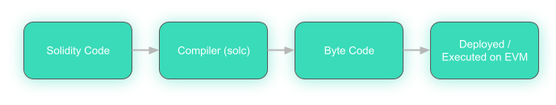

  Solidity Background and Context
===============================

  

 Solidity is "an object-oriented, high-level language for implementing smart contracts...programs which govern the behaviour of accounts within the Ethereum state” ([source](https://docs.soliditylang.org/en/latest/){target=_blank}). While a few smart contract programming languages have developed over the years, Solidity remains the most dominant one.

 As we mentioned earlier, Solidity is a higher-order language meaning that the code deployed with a smart contract is not Solidity, but rather EVM bytecode. Solidity is an abstraction on top of that fundamental language so we don't have to be writing code that looks like this: 
```
  PUSH1 0x80 PUSH1 0x40 MSTORE PUSH1 0xE PUSH1 0x0   
  SSTORE CALLVALUE DUP1 ISZERO PUSH1 0x14 JUMPI   
  PUSH1 0x0 DUP1 REVERT JUMPDEST POP PUSH1 0x35   
  DUP1 PUSH1 0x22 PUSH1 0x0 CODECOPY PUSH1 0x0   
  RETURN INVALID PUSH1 0x80 PUSH1 0x40 MSTORE PUSH1   
  0x0 DUP1 REVERT INVALID LOG1 PUSH6 0x627A7A723058   
  KECCAK256 RETURNDATASIZE 0x25 0xb6 0xcf CALLDATALOAD   
  LOG1 DUP16 PUSH9 0x27AC943141CFD6D0FA MSTORE SHL   
  DUP6 LOG4 PUSH8 0x7FADA153CC03D771 BLOCKHASH 0xb3   
  STOP 0x29    
```
 But, rather code that looks like this: 
```
  pragma solidity >=0.4.0 <0.9.0;  
  
  contract MyContract {      
    uint i = 10 + 2 * 2;  
  }    
```
 While both these blocks of code describe the same operation, the second version (Solidity) is much easier to read and write. 

 General Characteristics of Solidity
-----------------------------------

 Solidity uses the [ECMAScript](https://en.wikipedia.org/wiki/ECMAScript){target=_blank} syntax like JavaScript, to make it approachable for web developers. However, do not be lulled into complacency! Solidity is much more demanding in its requirements.

 Some of Solidity's basic characteristics: 
* **Case Sensitive**
* **Statement termination via a semicolon `;`**
* **Files use the `.sol` extension**
* **Statically typed** Types need to be known at compile time. This makes Solidity more like [TypeScript](https://en.wikipedia.org/wiki/TypeScript){target=_blank} than JavaScript in practice.
* **Various compilation options** Solidity compiling can be done on the command line by [Solc](https://docs.soliditylang.org/en/latest/installing-solidity.html){target=_blank}, you can compile it in a web-browser using [Remix,](http://remix.ethereum.org/){target=_blank} or compile it as part of a smart contract development framework like [Truffle](https://www.trufflesuite.com/){target=_blank} or [Hardhat](https://www.hardhat.org){target=_blank}.
* **Compiles down to EVM bytecode** Which then runs within the Ethereum Virtual Machine when deployed to a network

 Overall, the Solidity workflow can be illustrated as follows: 

 

 In this section, we're going to go over the basic conventions of Solidity. We're also going to start building smart contracts and discussing their general structure and design patterns.

 We can't emphasize this enough: smart contract coding is both really exciting and really dangerous! We see smart contracts [rekt](https://rekt.news/){target=_blank} every day! We want to both give you all the tools to both build with creativity *and* confidence. Let's go!

 Additional Material
-------------------

 * [Wikipedia: Solidity](https://en.wikipedia.org/wiki/Solidity){target=_blank}
* [Docs: Official Solidity Documentation](https://docs.soliditylang.org/en/latest/){target=_blank}

 If you'd like some other places to learn Solidity, you can also check out these great resources. To be clear, we'll definitely be teaching you Solidity along with how to develop dapps. We also want to provide any external help we can as well!
 
* [Bootcamp:Learn Blockchain, Solidity and Full Stack JavaScript Development:](https://www.freecodecamp.org/news/learn-blockchain-solidity-full-stack-javascript-development/){target=_blank} A 32 hour long comprehensive Blockchain Development Bootcamp by Patrick Collins
* [Course: CryptoZombies](https://cryptozombies.io/){target=_blank} One of the most well-known introductions to Solidity
* [Course: Ethernaut (OpenZeppelin)](https://ethernaut.openzeppelin.com/){target=_blank} An excellent in-browser "game" teaching Solidity from a security perspective.
* [Course: Intro to Solidity (Chainshot)](https://www.chainshot.com/learn/solidity){target=_blank} Chainshot uses a very cool interactive platform to teach Solidity
* [Wiki: Solidity by Example](https://www.solidity-by-example.org){target=_blank} A bunch of great examples of Solidity, including excellent design patterns, hacks and security tips.
* [Wiki: Use Web3](https://useweb3.xyz/){target=_blank} Another good collection of learning resources
* [Article: Test Driven Introduction to Solidity](https://michalzalecki.com/ethereum-test-driven-introduction-to-solidity/){target=_blank} From an older pragma version of Solidity, but might be interesting to check out! Repo accompanying the article [here.](https://github.com/MichalZalecki/tdd-solidity-intro){target=_blank}
* [Thread: What Does Ethereum Development Look Like Today?](https://twitter.com/smpalladino/status/1421901085279756300){target=_blank} Santiago Palladino, who wrote [Ethereum for Web Developers,](https://www.apress.com/gp/book/9781484252772){target=_blank} updates parts of his book for the current Ethereum ecosystem.
* [Article: Learn X in Y Minutes (Solidity)](https://learnxinyminutes.com/docs/solidity/){target=_blank} A bit long and rough, but a comprehensive overview of learning Solidity

Advanced Material
-------------------
* [Twitter Thread: Resource You Need to Know to Become a Solidity Dev ](https://twitter.com/bensparks_/status/1513238520575537162)
* [Series: EVM Deep Dive](https://noxx.substack.com/p/evm-deep-dives-the-path-to-shadowy)
