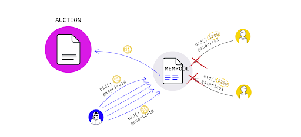
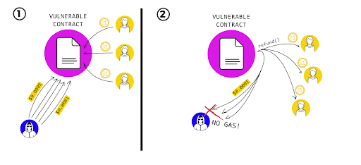
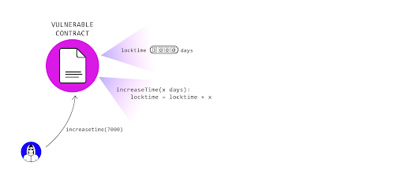
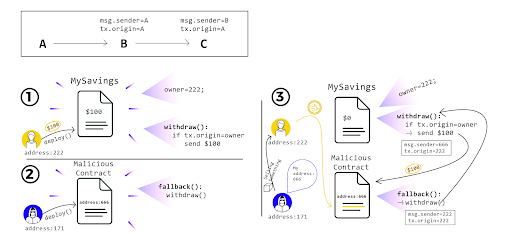

Smart Contract Pitfalls and Attacks
===================================

Now that we've gone through some of the attack vectors in the language and syntax of Solidity, let's move on to more general smart contract pitfalls and attacks. These are more general attack patterns which involve zooming out from a codeline level to a broader contract workflow view (*Call Known Attacks*). There are also concerns that come from a protocol level, which will require marrying the information we learned in the first few sections of the course with the smart contract knowledge you gained (Network Known Attacks).

All these attack vectors (and more) are compiled in the Smart Contract Weakness Classification and Test Cases or [SWC Registry](https://swcregistry.io/){target=_blank}, we'll reference attack vectors by their SWC index number:

Network Known Attacks: 
* Front-Running ([SWC-114](https://swcregistry.io/docs/SWC-114){target=_blank})
* Timestamp Dependence ([SWC-116](https://swcregistry.io/docs/SWC-116){target=_blank})
* Network Stuffing DoS

Call Known Attacks: 
* Forcibly Sending Ether ([SWC-132](https://swcregistry.io/docs/SWC-132){target=_blank})
* Block Gas Limit DoS ([SWC-128](https://swcregistry.io/docs/SWC-128){target=_blank}{target=_blank})
* Reentrancy ([SWC-107](https://swcregistry.io/docs/SWC-107){target=_blank}{target=_blank})
* Integer Overflow/Underflow ([SWC-101](https://swcregistry.io/docs/SWC-101){target=_blank}{target=_blank})
* Unexpected Revert DoS ([SWC-113](https://swcregistry.io/docs/SWC-113){target=_blank}{target=_blank})
* Tx.Origin Authentication ([SWC-115](https://swcregistry.io/docs/SWC-115){target=_blank})

Frontrunning
------------


Frontrunning has become a big issue in the Ethereum community as related to Miner-Extracted Value (MEV), which we discussed earlier. Frontrunning exploits how transactions are included in the blockchain and considerations around the process. Transactions that are broadcast to the network but have not yet been included in a block are in the mempool.

Miners choose the order in which to include transactions from the mempool into a block that they are mining. Also, since transactions are in the mempool before they make it into a block, anyone can know what transactions are about to occur on the network.

This can be problematic for things like decentralized markets.

Protecting against this is difficult and you will likely need to devise contract specific solutions.

Decentralized markets can mitigate concerns by implementing batch auctions or using a pre-commit scheme, where the details are submitted after the transaction is committed.

More information about Transaction Order Dependence and concrete samples are available in [the corresponding SWC Registry entry.](https://swcregistry.io/docs/SWC-114){target=_blank} Due to the increased focus on MEV, we can expect to see a lot more security tips and research around frontrunning.

Timestamp Dependence
--------------------


Contracts often need access to time values to perform certain types of functionality. Values such as block.timestamp, and block.number can give you a sense of the current time or a time delta, however, they are not safe to use for most purposes.

In the case of block.timestamp, developers often attempt to use it to trigger time-dependent events. As Ethereum is decentralized, nodes can synchronize time only to some degree. Moreover, malicious miners can alter the timestamp of their blocks, especially if they can gain advantages by doing so. ([source](https://swcregistry.io/docs/SWC-116){target=_blank})

Network Stuffing DoS
--------------------



This is an attack vector based around time-sensitive operations, such as an auction or a time-locked wallet, or operations requiring user input before committing an irreversible action. Essentially, we need to guard against the fact that, particularly now, there can be moments of high-traffic (not even malicious) where it can be near-impossible to get one's transactions to a smart contract. We hope with EIP-1559 these moments are short, but they may exist. As such, we need to make sure time-sensitive operations have some fallback or failsafe mechanism to guard against network stuffing, malicious or otherwise.

Forcibly Sending Ether
----------------------


Another danger is using logic that depends on the contract balance.

Be aware that it is possible to send ether to a contract without triggering its fallback function.

Using the selfdestruct function on another contract and using the target contract as the recipient will force the destroyed contract’s funds to be sent to the target.

It is also possible to pre-compute a contracts address and send ether to the address before the contract is deployed see ([CREATE2](https://docs.openzeppelin.com/cli/2.8/deploying-with-create2){target=_blank}).

The contract’s balance will be greater than 0 when it is finally deployed.

Block Gas Limit DoS
-------------------



There is a limit to how much computation can be included in a single Ethereum block, currently 10,000,000 gas worth. This means that if your smart contract reaches a state where a transaction requires more than 10,000,000 gas to execute, that transaction will never successfully execute ([SWC-128](https://swcregistry.io/docs/SWC-128){target=_blank}{target=_blank}). It will always reach the block gas limit before finishing.

Similarly, if the require gas for the transaction is sub 8,000,000, but close to it, you may have a harder time getting your transaction included in a block by a miner. It is more likely that if you send a transaction to the network with a startGas close to 8,000,000, a miner will not pick the transaction to include in a block. You can find more info about the default mining transaction ordering options in the most popular clients [here.](https://ethereum.stackexchange.com/questions/6107/what-is-the-default-ordering-of-transactions-during-mining-in-e-g-geth/6111#6111){target=_blank}

This situation becomes possible if your contract loops over an array of undetermined size. If the array becomes too large it may never execute. A concrete sample of a dynamic array potentially resulting in a denial of service is available at the [SWC Registry entry here.](https://swcregistry.io/docs/SWC-128){target=_blank}

Reentrancy
----------


Reentrancy attacks ([SWC-107](https://swcregistry.io/docs/SWC-107){target=_blank}{target=_blank}) are very well-known thanks to the infamous DAO hack that happened on the Ethereum network. In a reentrancy attack, a vulnerable contract sends ether to an unknown address that contains a fallback function. Then, a malicious code calls back repeatedly a function in the vulnerable contract before the first call be finished.
 
```
// Vulnerable contract
function withdraw(uint _amount) public {    
  require(balances[msg.sender] >= _amount, "Not enough balance!");    
  msg.sender.call.value(_amount)("");    
  balances[msg.sender] -= _amount;
}

// Malicious contract
function () payable external {    
  if(address(vulnerableContract).balance > 1 ether) {        
    vulnerableContract.withdraw(1 ether);    
  }
}      
```

If you can’t remove the external call, the next simplest way to prevent this attack is to do the internal work before making the external function call.
 
```
mapping (address => uint) private userBalances; // Better!

function withdrawBalance() public {    
  uint amountToWithdraw = userBalances[msg.sender];    
  userBalances[msg.sender] = 0;    
  
  // The user's balance is already 0, so future invocations won't withdraw anything
  require(msg.sender.call.value(amountToWithdraw)()); 
}  
```

Or to use the withdrawal design pattern and separate the contract accounting logic and the transfer logic.

Another thing to be aware of is potential cross function re-entrancy. This can be problematic if your contract has multiple functions that modify the same state.

```
// INSECURE    
mapping (address => uint) private userBalances;        

function transfer(address to, uint amount) {        
  if (userBalances[msg.sender] >= amount) {           
    userBalances[to] += amount;           
    userBalances[msg.sender] -= amount;        
  }    
}        

function withdrawBalance() public {        
  uint amountToWithdraw = userBalances[msg.sender];   
  // At this point, the caller's code is executed, and can call transfer()
  require(msg.sender.call.value(amountToWithdraw)());         
  userBalances[msg.sender] = 0;    
}  
```

In this case, the attacker can call transfer() when their code is executed on the external call in withdrawBalance. Since their balance has not yet been set to 0, they are able to transfer the tokens even though they already received the withdrawal. This vulnerability was also used in the DAO attack.

There are several ways to mitigate these problems.

The first is the Check-Effect-Interaction design pattern we described earlier. It is generally a good idea to handle the flow of a function like so: 
* **Check** Test condition. eg `require`
* **Effect** Update state variable (eg update balance)
* **Interaction** Interact with external contract (eg send ether using `call.value`)

In short, you handle your internal contract state changes before calling external contracts. 

A more complex solution could implement mutual exclusion, or a [mutex.](https://en.wikipedia.org/wiki/Lock_(computer_science){target=_blank}) This allows you to lock a state and only allow changes by the owner of the lock. You can see an example of a mutex in Solidity [here.](https://medium.com/coinmonks/protect-your-solidity-smart-contracts-from-reentrancy-attacks-9972c3af7c21){target=_blank}

You can dig deeper into known attacks such as these [here.](https://consensys.github.io/smart-contract-best-practices/known_attacks/#race-conditions42){target=_blank}

Integer Under / Overflow
------------------------



**Note: With the inclusion of SafeMath natively with Solidity 0.8.x, the likelihood of writing an integer under / overflow is unlikely. However, this is still an issue that exists in the wild and there are edge cases in which it could be achieved.**

Integers can underflow or overflow in the EVM ([SWC-101](https://swcregistry.io/docs/SWC-101){target=_blank}{target=_blank}). This happens when an arithmetic value oversteps the minimum or maximum size of a type.

The max value for an unsigned integer is 2 ^ 256 - 1, which is roughly 1.15 times 10 ^ 77. If an integer overflows, the value will go back to 0. For example, a variable called score of type uint8 storing a value of 255 that is incremented by 1 will now be storing the value 0.

You may or may not have to worry about integer overflow depending on your smart contract.

A variable that can be set by user input may need to check against overflow, whereas it is infeasible that a variable that is incremented will ever approach this max value.

Underflow is a similar situation, but when a uint goes below its minimum value it will be set to its maximum value.

Be careful with smaller data types like uint8, uint16, etc… they can more easily reach their maximum value

More information and concrete examples can be found at [the corresponding SWC Registry entry](https://swcregistry.io/docs/SWC-101){target=_blank}

Unexpected Revert DoS
---------------------

This attack basically consists of make a vulnerable contract inoperable by forcing a failure or an awaiting situation, locking temporarily or permanently the contract execution ([SWC-113](https://swcregistry.io/docs/SWC-113){target=_blank}{target=_blank}).

```
// INSECURE  
contract Auction {      
  address currentLeader;      
  uint highestBid;        
  
  function bid() payable {          
    require(msg.value > highestBid);            
  
    // Refund the old leader, if it fails then revert
    require(currentLeader.send(highestBid));             
    currentLeader = msg.sender;          
    highestBid = msg.value;      
  }  
}
```

In the provided example, the `highestBidder` could be another contract and transferring funds to the contract triggers the contract’s fallback function. If the contract’s fallback always reverts, the `Auction` contract’s bid function becomes unusable - it will always revert. The bid function requires the transfer operation to succeed to fully execute.

The contract at the provided address throws an exception, execution halts and the exception is passed into the calling contract and prevents further execution.

This problem is avoidable using the withdrawal pattern and push-pull. You could also use a multisig contract, expire time or another technique as an emergency plan for possible lock situations.

`tx.origin` Authentication
--------------------------



This kind of attack happens when a vulnerable contract uses `tx.origin` for authentication. An attacker can induce the owner of the vulnerable contract make a call to a malicious contract. Then, a malicious code calls the vulnerable contract, taking advantage of the owner authorizations.

```
// Vulnerable contract  
function withdraw(address payable _recipient) public {      
  require(tx.origin == owner);      
  _recipient.transfer(address(this).balance);  
}    

// Malicious contract  
function() external payable {      
  vulnerableContract.withdraw(attackerAddress);  
}
```

An example of this was the [Poly Network hack,](https://twitter.com/kelvinfichter/status/1425217046636371969){target=_blank} although not on the Ethereum network.

There are always more attack vectors, be sure to look through the SWC registry,  [follow Diligence on Twitter](https://twitter.com/ConsenSysAudits){target=_blank}, or whatever source you need to make sure you stay up to date with security on Ethereum.

Additional Material
-------------------

* [Wiki: Smart Contract Best Practices](https://consensys.github.io/smart-contract-best-practices/){target=_blank} and [Recommendations](https://consensys.github.io/smart-contract-best-practices/recommendations/){target=_blank}
* [Article: Ethereum is a Dark Forest](https://medium.com/@danrobinson/ethereum-is-a-dark-forest-ecc5f0505dff){target=_blank} A long, comprehensive article discussing frontrunning from a first-person perspective. Got a lot of people's attention in the community around the topic.
* [Wiki: Flashbots](https://github.com/flashbots/pm){target=_blank} A collection of research and news about Miner Extracted Value and Frontrunning.
* [Article: Smart Contract Bugs and Security Best Practices](https://sunnya97.gitbooks.io/a-beginner-s-guide-to-ethereum-and-dapp-developme/smart-contract-best-practices.html){target=_blank}
* [Article: To Sink Frontrunners, Send in the Submarines](http://hackingdistributed.com/2017/08/28/submarine-sends/){target=_blank} An article discussing a frontrunning defense mechanism
* [Article: Protect Your Solidity Smart Contracts from Reentrancy](https://medium.com/coinmonks/protect-your-solidity-smart-contracts-from-reentrancy-attacks-9972c3af7c21){target=_blank} Discusses mutex locks in Solidity.
