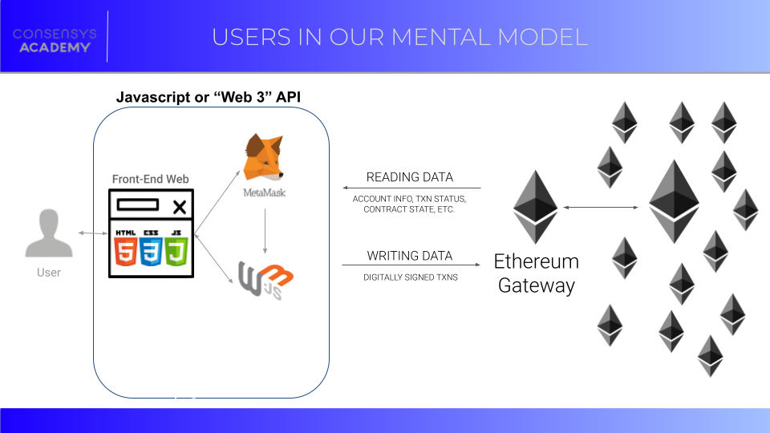
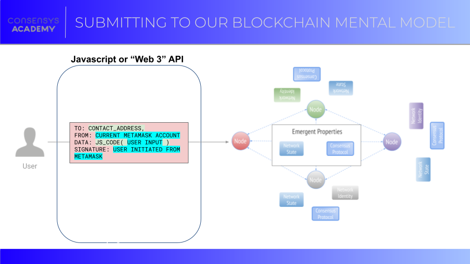

  Where Do Users Fit in Our Mental Model?
=======================================

  Now that we've gone through the smart contract section and have a good understanding of how we can deploy self-executing code to a blockchain network, it's time to turn to the users of our applications. In particular, we're going to examine how users that are interacting with our smart contracts deployed on our favorite blockchain fit into the mental model we've been building

 After we've looked at this, we're going to start building an understanding of the smart contract development workflow and how it can be changed or altered based on the kind of application we're developing and the user we're targeting.

 Users in the Mental Model
-------------------------

 The users represent a potential new element, that is to say the non-blockchain world. In an ideal world, all your users know how to use blockchain, are loyal [degens](https://www.coingecko.com/en/glossary/degen){target=_blank} on [Crypto-Twitter,](https://www.forbes.com/sites/haileylennon/2021/03/16/are-cryptocurrency-and-twitter-mutually-exclusive/?sh=7a340478614b){target=_blank} and are already onboarded to the blockchain world. if only it were so easy! In reality, we have users located on a [spectrum](https://twitter.com/CupOJoseph/status/1413334858143834114  ){target=_blank} of abilities, understanding and desires.

 We'll build this out more as we go, but for sake of simplicity, in this section we will emphasize how the overwhelming majority of your blockchain users will interact with your application: through a JavaScript API. Below is a diagram illustrating how the typical user interacts with a distributed application (we're using Ethereum as the public blockchain, but you can imagine it to be any general public blockchain):

 

 On the left, we see a user interacting with a frontend interface, usually a website on a traditional web browser their device, either on mobile or desktop. That website is powered primarily by "Web 2.0" technology (browser connects to a server, has responsive layout, has interactive JavaScript interface). However, the website has two main elements powered by blockchain. The first is any data the website is reading from the blockchain. This might be recent transactions, current user balance, current block number on the network, etc.

 The second is the ability for the user to submit their own transactions to the blockchain from the website ("writing" to the network). This is made possible through a concert of three aspects: 
* **A Ethereum Provider JavaScript library** These libraries (web3.js or ethers.js, for example) have all the tooling needed to simplify communication between your website and the Ethereum network 
* A **cryptowallet** which can safely handle a user's private key, allowing them to sign transactions (MetaMask, in this case)
* **Code deployed by you, the developer,** to your website which constructs pre-formatted transactions, targeting your deployed smart contract, specifically a function in its ABI.

 You, the developer of the distributed application, have coded in certain transaction parameters to be filled in by the user. These transactions parameters are targeting a deployed smart contract's ABI. That transaction will then be properly signed by the cryptowallet then submitted to the blockchain network. In this case, MetaMask will submit our transaction using an Infura endpoint. The image below shows a simplified version of the workflow we just described:

 

 Let's return to our blockchain network and our smart contract model to see how this user workflow comes into play. Specifically, let's see how that pre-formatted transaction code is submitted to the network and propagates a new network state.

 

 The image above shows how we are combining the two mental models we've been working with. On the left-hand side, we see the user has their transaction, which has been pre-formatted by the application developer but populated and authorized by the user. To the right, we see the basic blockchain network. Effectively, when the user submits their transaction, they do so as a node in the network broadcasting any other transaction. It will be propagated throughout the network (each node that receives it checks its digital signature validity before passing it on) and eventually become part of the emergent ["mempool"](https://academy.binance.com/en/glossary/mempool){target=_blank} of unmined transactions. Once it is mined, we can then see how it will affect global network state.

 Assuming the user's transaction is valid (including proper gas fees, etc.), it will be included into a block by a miner. That miner will then propagate the block out into the network, requiring all the other nodes in the network to check the block and then incorporate the state changes implied by the transactions included in that block. Below, we see our user's transaction being processed by another node who has received it in a block:

 

 As each node in the network processes the block containing our user's transaction, the new global network state will begin to emerge that includes the state changes caused by our user's transaction (We're showing that network state change below with a checkmark). Since submitting the transaction, the user's website interface has been using MetaMask as its network gateway. It's looking specifically for the transaction's "confirmation" (both inclusion in a mined block as well as that block's propagation). Once it detects the transactions confirmation, the website interface will be updated to reflect that state change and let the user know their transaction has "gone through".

 

 Conclusion
----------

 Now that we have an understanding of where the user sits in our mental model, we're faced with a new set of challenges. Mainly, how do we integrate all these different elements of development so our user's have a seamless exeperience? In the next few sections, we're going to show you how you can begin to approach this. In the process, you will become intimately acquainted with developer tooling that will give you confidence in approaching this tall task.

 Additional Material
-------------------

 - [Article: Building for the Blockchain](https://blog.ycombinator.com/building-for-the-blockchain/){target=_blank} Dated material but has a nice overview of the paradigm shift taking place between Web 2 and Web 3.
 - [Article: Want to Understand Blockchain? You Need to Understand State](https://consensys.net/blog/blockchain-explained/want-to-really-understand-blockchain-you-need-to-understand-state/){target=_blank} Overview discussing the integration of state from a JavaScript framework perspective to the blockchain public network perspective.
 

