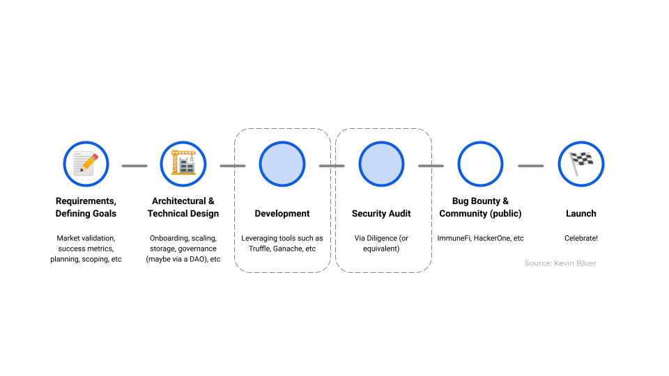
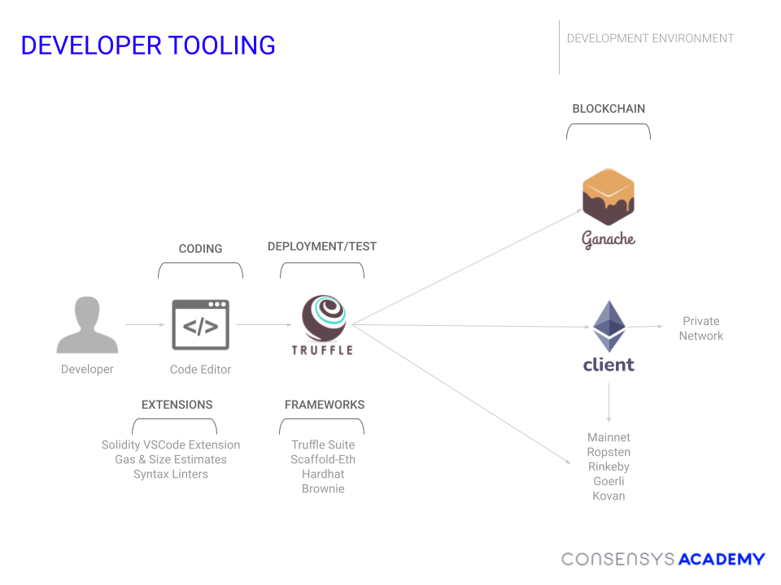
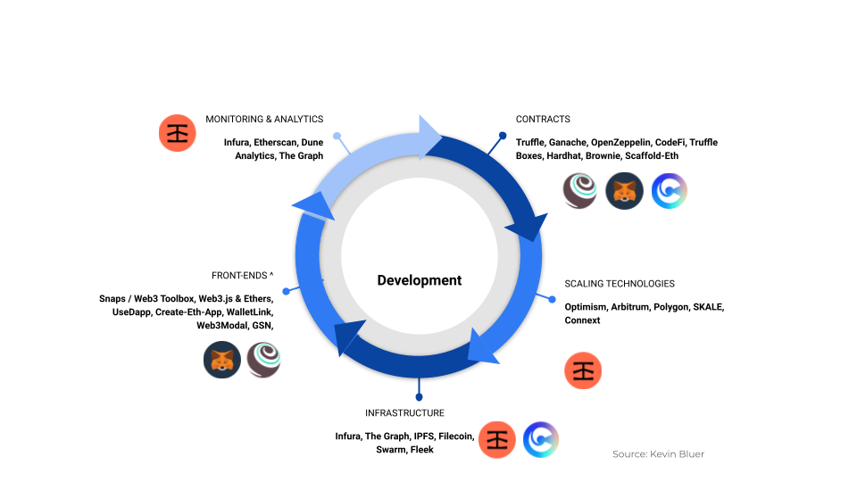

# Blockchain Agnostic Developer Workflow

It's no surprise by now that, in this course, we want to give you frameworks to help you approach the complicated business of blockchain development. In this section, we're hoping to give you a sense of the general workflow you'll be doing as a developer while developing a distributed application ("dapp" or smart contract + interface) on any blockchain. 

_Note: This is *not* the workflow of a protocol designer, which is a more traditional project-based work environment based on the development language_

## Lifecycle of a Project

Let's see the overall lifecycle of a dapp project:

Perhaps the most important work you can do as a developer is the first step: *Determine the scope and goals of your project.* This does not require _any_ code at all, but it will save you so much time in the future. It's essentially creating the roadmap for your application and, when things get complicated, you'll be able to refer back to it for clarity. (This step should be familiar as the first exercise in the course was for you to do this step for your final project!)

Next comes the *Architectural and Technical Design*: Sketching out the technical parameters of your project. What will your smart contract function parameters look like? Where will you do storage? How will you divide on-chain and off-chain logic? If your project involves others, how will you implement governance? How do you plan to scale?

Next is the *Development* phase, which is typically what people think the _only_ phase. Please note that this is the *third* step in building a project (Planning is so important)! We'll drill deeper into this step later in the section, but it's primarily the building and testing of your smart contract and interface. In this step, you'll leverage framework development tools, like Truffle or Hardhat, as well as testing tools, like testing suites and testnets. You'll also be referring to the notes you've made in the previous two steps, being sure to stay within the guidelines you made for yourself.

Next comes *Security Audit.* We've already heard about Diligence and security tools such as MythX, Scribble, Slither or Manticore. For projects that could potentially hold enormous value this step is *critical* and should not be overlooked. It can sometimes be challenging to find a team or project to audit your code, but it is worth the effort considering the potential downside!

Simultaneous with an audit, you might be running the next step, *Bug Bounty and Community,* meaning somehow starting to ask your community to test-drive your project. Note, this is before an official, version 1.0 release.

Last, after all these steps, is the *Launch*. You may have already stealthily deployed your contract, assuming you've done all the testing and auditing, but this is where you announce the interface and let folks know that it's ready to go! As we'll see next, in some ways your work has just begun, but at least you've gotten your project launched into the world!

## Developer Tooling

We're now going to drill into the **Development** phase mentioned above. This is probably what we all think of when we think about developing application for the blockchain. Here's a simplified oveview of what a development flow looks like at the beginning of a project:

Here we see the developer (you) working mainly from their code editor, in which they'll have both the smart contracts *and* whatever frontend interface they're working on. The code editor will be stocked with the most helpful general extensions as well as specific smart contract extensions, such as the [Solidity extension](https://marketplace.visualstudio.com/items?itemName=JuanBlanco.solidity){target=_blank} for VSCode as well as tools to help with gas estimation or contract sizing. Next, the developer will have a framework that they're using to deploy the smart contract and interface. In the image above, the developer is using Truffle to build their contracts, hold the build artifacts, run tests and deploy to a testnet. There are other options as well, such as [Hardhat](https://hardhat.org/){target=_blank}, [Scaffold-Eth](https://github.com/austintgriffith/scaffold-eth){target=_blank}, and [Brownie](https://eth-brownie.readthedocs.io/en/stable/){target=_blank}, to name some of the more popular ones.

The developers will be then having some private testnet tool they're using to deploy the smart contract in the early stages. This will be Ganache for us, since we're using Truffle. As we continue to become more confident in our development process, we may want to deploy to a public testnet. For this, we will use either an Ethereum node we have on our machine or we'll use a gateway service like [Infura](https://infura.io){target=_blank}, which will allow us to easily deploy to an Ethereum testnet, Ethereum mainnet, or even networks like Polygon, Arbitrum or Optimism. (If we're starting to lose you, don't worry we'll cover all these things later in the course!)

## Environment Variables

One thing that seems trivial but is incredibly important is the `.env` file for your project. These are the local environmental variables that allow you to deploy your application to the public blockchain network. It also is the best way to ensure you don't expose your private keys or any other sensitive information when you're developing. Particularly when you're pushing material to a git repository, it's easy for folks to forget they've included sensitive information. There are definitely bots that are continually scanning GitHub for private keys that will immediately be compromised.

Please read <a href="https://consensys.net/blog/developers/how-to-avoid-uploading-your-private-key-to-github-approaches-to-prevent-making-your-secrets-public/" target="_blank" rel="noopener noreferrer">this article</a> about how to keep your development environment safe by using a `.env` file and other essential techniques!

These environment variables are also useful to adapt your application to different networks. For example, you may want to use a different contract address on the mainnet than you do on a testnet. You can use environment variables to make this happen.

## Advanced Developer Tooling

As you become more familiar with blockchain development and as your project grows, so will your toolset and workflow. Below is a diagram showing a more expansive development lifecycle that includes auditing, scaling, monitoring and advanced onboarding of users:

(We're using ConsenSys products here mainly for reference, since we've discussed many of them so far.)

We'll get into these tools more but it's a bit beyond the scope of this lesson. In the next few sections, however, you'll become more familiar with the tools and mechanisms shown here.

## Additional Materials
- [Remix Interface](https://remix.ethereum.org){target=_blank} The original IDE for Ethereum! Well, probably not the original, but still the best first place to go to start Solidity development.
- [Basic Training: Code Editors, VSCode Extensions](https://courses.consensys.net/courses/bootcamp-basic-training){target=_blank} I know, I know, you're super sick of hearing about Basic Training. Fair! But you should be sure to install all the VSCode extensions in this section of Basic Training, since it will help with development!
- <a href="https://consensys.net/blog/developers/how-to-avoid-uploading-your-private-key-to-github-approaches-to-prevent-making-your-secrets-public/" target="_blank" rel="noopener noreferrer">Tutorial: Using an .env file to keep your secrets safe</a> Essential reading!
- **Good Extensions to Know About** [Hardhat-contract-sizer](https://www.npmjs.com/package/hardhat-contract-sizer){target=_blank}, [hardhat-gas-reporter](https://hardhat.org/plugins/hardhat-gas-reporter.html){target=_blank}
- [Replit](https://www.replit.com){target=_blank} Still exploring this one, but really good potential for troubleshooting code with friends. Not blockchain specific!
- [Testing in the Twenties](https://www.tbray.org/ongoing/When/202x/2021/05/15/Testing-in-2021){target=_blank} Really good general advice about testing! 
- [How to Setup a Solidity Project](https://blog.oliverjumpertz.dev/how-to-set-up-a-solidity-project-and-create-your-first-smart-contract){target=_blank}
