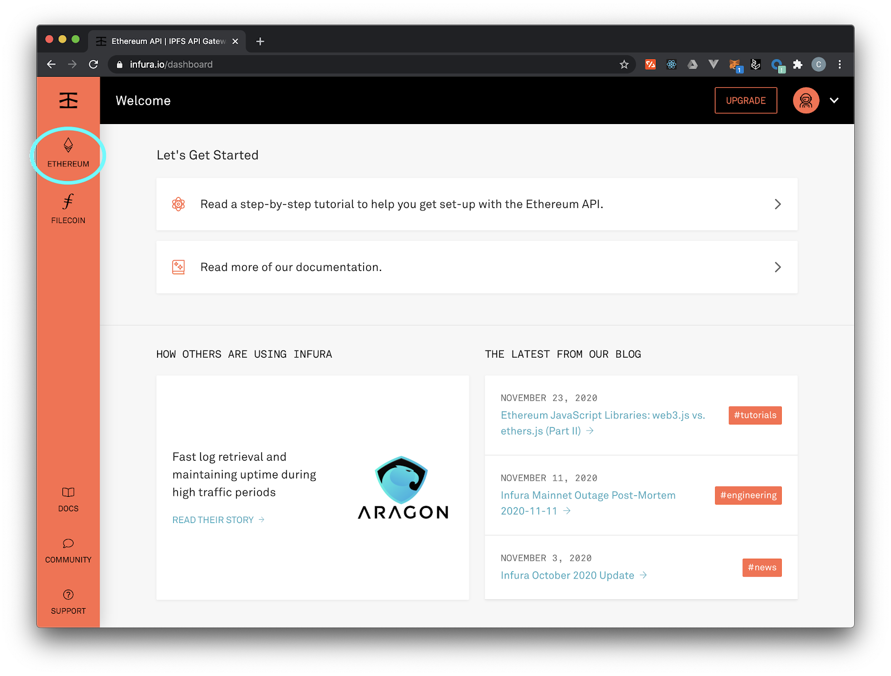
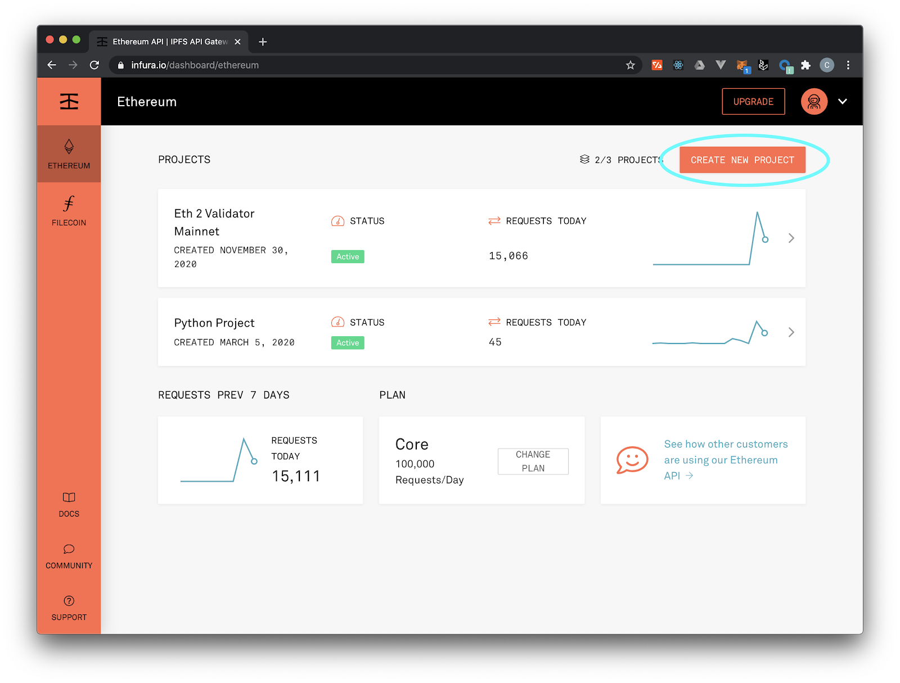

In our section on "Development Workflow" and "Users in the Mental Model," we described our interactions with the Ethereum network going through a network gateway. In the "Ethereum Basics" of the course, we talked about Ethereum clients, nodes, and how to interact with the network you need to run a full node.

However, for developers just starting on Ethereum or users who don't have easy access (or knowledge) of an Ethereum node, you can use an Ethereum gateway service called <a href="https://infura.io" target="_blank" rel="noopener noreferrer">Infura.</a>

Infura provides a simple API access point for not only the Ethereum mainnet and all public testnets, but also for IPFS, the Ethereum 2.0 Beacon Chain, Filecoin, Optimism, Arbitrum and Polygon. Incorporating Infura into your workflow will make deploying much easier. As your project grows, you can absolutely consider other options, but it's a nice, easy onramp to development.

Follow the steps below to sign up for Infura (there are also great step-by-step instructions on Infura's website <a href="https://blog.infura.io/getting-started-with-infura-28e41844cc89/" target="_blank" rel="noopener noreferrer">here</a>):

## Register

First thing, register for a free account on <a href="https://infura.io" target="_blank" rel="noopener noreferrer">Infura.</a> For smaller development projects (or even medium-sized ones), Infura's free tier is more than capable of handling your requests. Coogan is currently running an Eth2 validator client on Infura's free tier (you'll see it in the screenshots below!)

## Setting Up Your First Project

Once you've registered, you'll click the Ethereum logo on the left-hand side. (see below)



You can also see the other available network endpoints listed here, which will be more since we took the above screenshot!

Next, click “Create New Project” in upper right hand corner:



Name your project and go to “Settings.” There, you'll be able to access the credentials you'll use in your local environment (either Truffle or some other framework) to help make deployment easy. Again, these are your personal, sensitive credentials so be sure to store them in a .env file that you add to your .gitignore doc! <a href="https://consensys.net/blog/developers/how-to-avoid-uploading-your-private-key-to-github-approaches-to-prevent-making-your-secrets-public/" target="_blank" rel="noopener noreferrer">Read more about that here.</a>

A `.env` file for our Infura credentials will look something like:

```
MNEMONIC="Your MNEMONICs" // A wallet with enough ETH
INFURA_URL="Your Infura URL with API key"
```

<a href="https://ethereum.stackexchange.com/questions/96929/infura-io-secret-configuration-in-hdwalletprovider-truffle-config-js" target="_blank" rel="noopener noreferrer">source</a>

## Incorporating Infura Into Your Development Environment

Now let's see how we take our Infura credentials and plug them into a development framework like Truffle. For this, we're going to dive deeper into our `truffle-config.js` file

As you might have gathered by now, the Truffle configuration file (`truffle-config.js`) is the backbone of a Truffle-based project. Thus far we’ve only seen it used to store details of the different networks we’re targeting (e.g. local, testnet, mainet, etc), but it’s actually used for a lot more, such as network configuration.

To illustrate this, let's look at the <code>networks</code> section of our `truffle-config.js` from our SimpleStorage example we've been working on in previous lessons. Here's a sample `truffle-config.js` file that targets the Ganache endpoint we setup earlier:

```javascript
module.exports = {
  networks: {
    development: {
      host: "127.0.0.1",
      port: 8545,
      network_id: "*" // Match any network id
    }
  },
  compilers: {
    solc: {
      version: "^0.8.0"
    }
  }
};
```

When we run `truffle init` earlier, though, the `truffle-config.js` contains a ton of helpful material that's been commented out. For example, here's a section under `networks`:

```javascript
    // Useful for deploying to a public network.
    // NB: It's important to wrap the provider as a function.
    // ropsten: {
    // provider: () => new HDWalletProvider(mnemonic, `https://ropsten.infura.io/v3/YOUR-PROJECT-ID`),
    // network_id: 3,       // Ropsten's id
    // gas: 5500000,        // Ropsten has a lower block limit than mainnet
    // confirmations: 2,    // # of confs to wait between deployments. (default: 0)
    // timeoutBlocks: 200,  // # of blocks before a deployment times out  (minimum/default: 50)
    // skipDryRun: true     // Skip dry run before migrations? (default: false for public nets )
    // },
```

To activate this, all we have to do is comment the code back in (`⌘ /` in VSCode) and substitute in the credentials we got from Infura. Note that you need to change the `YOUR-PROJECT-ID` and well as whatever subdomain network you'd like to work from. Be sure as well to change the `network_id` to <a href="https://besu.hyperledger.org/en/stable/Concepts/NetworkID-And-ChainID/" target="_blank" rel="noopener noreferrer">the appropriate one for your network.</a> 

Install hdwallet-provider
```bash
npm install @truffle/hdwallet-provider
```
and dotenv to handle our .env file
```bash
npm install dotenv
```

To grab our Infura credentials safely from our `.env` file, you'll include this at the top of `truffle-config.js` (HDWallet is provided, we just need to comment it out):

```javascript
const HDWalletProvider = require('@truffle/hdwallet-provider');
const dotenv = require('dotenv');
dotenv.config();
const mnemonic = process.env.MNEMONIC;
```

(For reference, in the above snippet we're also using Truffle’s <a href="https://github.com/trufflesuite/truffle/tree/develop/packages/hdwallet-provider" target="_blank" rel="noopener noreferrer">HDWalletProvider library</a> enabling us to use a custom mnemonic as part of the deployment.) 

We can change the name of our testnet to any one we'd like. Here's what it would look like for Rinkeby:

```javascript
    rinkeby: {
      provider: () => new HDWalletProvider(mnemonic, process.env.INFURA_URL),
      network_id: "4",
      gas: 5500000
    }
```

To migrate SimpleStorage to Rinkeby, we run the following command:

```bash
$ truffle migrate --network rinkeby
```

That's it! If you have enough Rinkeby test Eth in the account associated with your mnemonic phrase, your contract is now deployed to a public testnet using Infura!

Later in the course, we'll discuss how Truffle and Infura can be used in the `truffle-config.js` file to deploy to multiple networks, including non-Ethereum networks.
