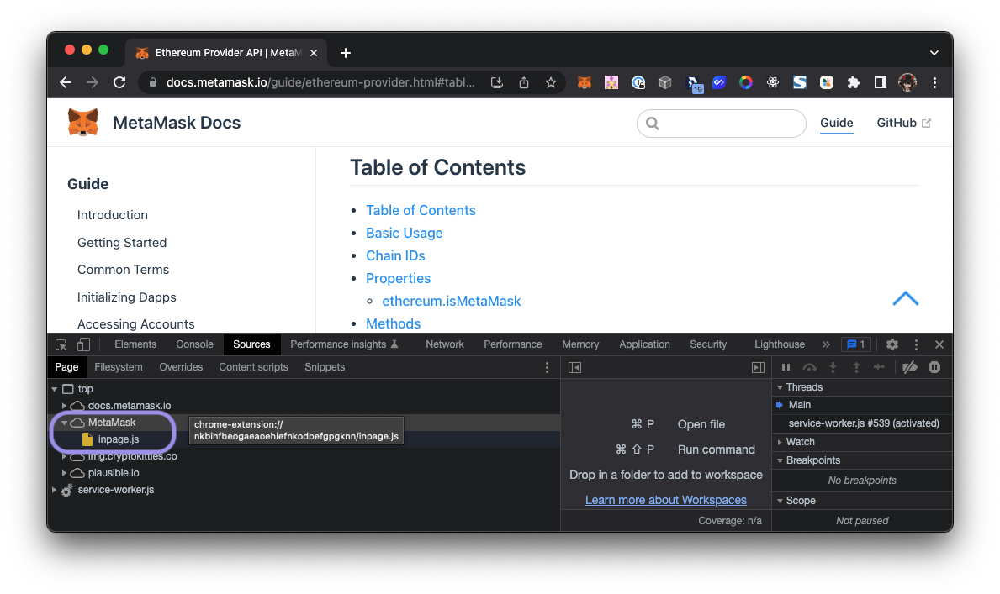
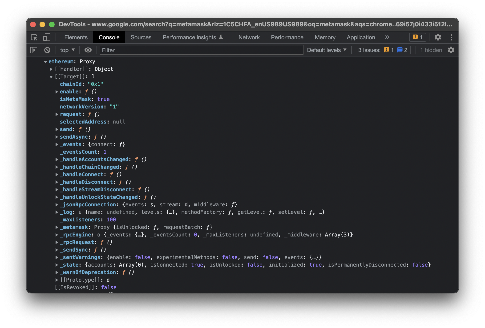
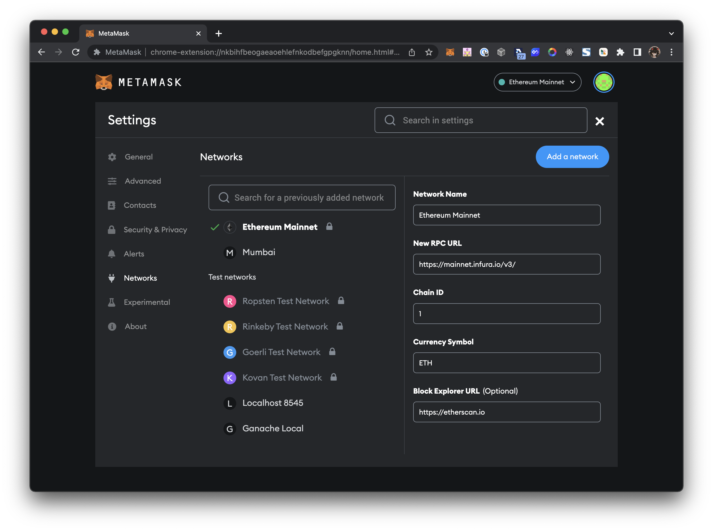

# Ethereum Provider API

Now that you have your smart contract fundamentals down, how about frontend alpha?

The privileges enabled by Web3 are both some of the most promising and challenging in the web development landscape. The ability of users to use digital signatures to validate identity, submit transactions validated without a central authority and interact with a public-state database are extraordinary achievements. But, they also are radically different from the way many users experience the internet.

If you go to any dApp frontend, it knows immediately that you may not have a browser wallet, so it onboards you to one. If it’s your first time using that dApp, it knows you haven’t granted the dApp permission to access your wallet, it prompts you to “Connect”. If you’ve used that dApp before, it knows who you are and shows your address, along with your balances or your NFTs. The reason why your user has access to this sort of functionality, and will, later on, be able to make contract calls, sign messages, and approve transactions is that your dApp will have access to an API called the [Ethereum Provider API](https://docs.metamask.io/guide/ethereum-provider.html#ethereum-provider-api){target=\_blank}.

If you’ve built a CRUD app with a REST API for a backend, then you had to define a function to make that API call, then supply `fetch` with an endpoint, and then based on the action you intend for your user to take, your function would use a particular [HTTP method](https://developer.mozilla.org/en-US/docs/Web/HTTP/Methods){target=\_blank}. If your CRUD app was just pulling in data from an API, you’d also have to supply that endpoint to fetch from.

In Web3, this is less common. While we can interact with third party services, most of our data is stored on the Ethereum Blockchain. We’re not referencing our database with our version of on-chain events, we need the Ethereum blockchain. We need the version of events from the nodes with the longest chain because a blockchain is essentially one massive database.

## Where does this API come from?

On a browser where you have MetaMask installed, open up Chrome Devtools, navigate to **Sources**, and then look at the **Page** panel. If you expand MetaMask, there’s a resource that loads with the page, in the screenshot, it’s `inpage.js`. 



`[inpage.js](https://github.com/MetaMask/metamask-extension/blob/43c33b676fe1ecece3e0543eb6ca64d3ae9aa9af/app/scripts/inpage.js){target=\_blank}` is a script that tries to declare an object globally in the browser window. If it’s successful, it’ll create a communication stream to 👀 initialize a provider 👀. Once that runs, `[contentscript.js](https://github.com/MetaMask/metamask-extension/blob/42c8703f3e3e0fbfddcc9faa4ddb49045ce9631a/app/scripts/contentscript.js){target=\_blank}` is executed. And here’s where things get tricky but interesting. On [line 45](https://github.com/MetaMask/metamask-extension/blob/42c8703f3e3e0fbfddcc9faa4ddb49045ce9631a/app/scripts/contentscript.js#L45){target=\_blank}, there’s an else-if statement that calls a function, seen on [line 272](https://github.com/MetaMask/metamask-extension/blob/42c8703f3e3e0fbfddcc9faa4ddb49045ce9631a/app/scripts/contentscript.js#L272){target=\_blank}, to check if a provider should be 👀 injected 👀. 

```javascript
/**
 * Determines if the provider should be injected
 *
 * @returns {boolean} {@code true} Whether the provider should be injected
 */
function shouldInjectProvider() {
  return (
    doctypeCheck() &&
    suffixCheck() &&
    documentElementCheck() &&
    !blockedDomainCheck()
  );
}
```

This function returns a boolean and checks for conditions like if the window even exists, so if the `doctype` is HTML (`doctypeCheck()`), and if it’s an HTML node (`documentElementCheck()`). It checks if the site URL ends in `.xml` or `.pdf` (``suffixCheck()`). It checks if the site you’re currently on is not on a list of blocked domains (`!blockedDomainCheck()`). (*Check out some of those [blocked domains](https://github.com/MetaMask/metamask-extension/blob/42c8703f3e3e0fbfddcc9faa4ddb49045ce9631a/app/scripts/contentscript.js#L332){target=\_blank}. Are some of them familiar? Are you beginning to see a pattern here?*) If all conditions pass, then MetaMask knows it can act as a client to facilitate user Web 3 interactions. This is why you get a popup whenever you try to take any action.

The thing to take away here is that we as developers aren’t supplying that API endpoint, or the functionality to interact with it, and it’s for the safety of the user. We’re building around its expected existence, and that’s because MetaMask and other browser wallets, per [EIP-1193](https://eips.ethereum.org/EIPS/eip-1193){target=\_blank}, globally inject a standard provider interface as a bridge to the Ethereum blockchain into our browser. The browser wallets actually do the heavy lifting by providing the API endpoint. As developers, we just have to call it with `window.ethereum`. (*Provided, we’re not on that blocked domain list, cause we absolutely should not be.*)

When you switch to the Console tab, type in `window.ethereum` to see the Ethereum API methods and properties like `isMetaMask`, `chainId` or `request()`, to name a few.



When we call these methods, we submit a “Remote Procedure Call” request to a particular blockchain network. We need to connect to the nodes on a particular network where the target smart contract is deployed, so we’ll need a network RPC endpoint. 

For us, it’s an endpoint we can supply to MetaMask to request blockchain data. Does that sound a bit familiar? If you look at the RPC URL I have for Ethereum Mainnet, I’m connected to the Mainnet nodes that are hosted by Infura, who is the default node provider for MetaMask.



Instead, we use the `request()` and `send()` methods. From there, we pass in arguments to determine what we’d like to request. We can use `request` to:

- Prompt our user to allow us to view their accounts and balances. Or we can
- Prompt them to switch to a particular network, and if they don’t have it configured, we can suggest that network.
- If they receive tokens that aren’t on a pre-approved list of recognized tokens,
- we can suggest that their [token can be tracked](https://eips.ethereum.org/EIPS/eip-747){target=\_blank} to show up as an asset in their wallet.

You can see the whole list of methods [here](https://metamask.github.io/api-playground/api-documentation){target=\_blank}. For every single request, MetaMask will pop up asking the user to confirm the action, because the request has to go through MetaMask to the nodes.

In the next lesson we’ll start off by demystifying what it means to “Connect your Wallet”, and how you can achieve that with React and the Ethereum Provider API.


## Additional Reading

[Ethereum Provider API](https://docs.metamask.io/guide/ethereum-provider.html){target=\_blank}

[Github: MetaMask/Provider](https://github.com/MetaMask/providers){target=\_blank}