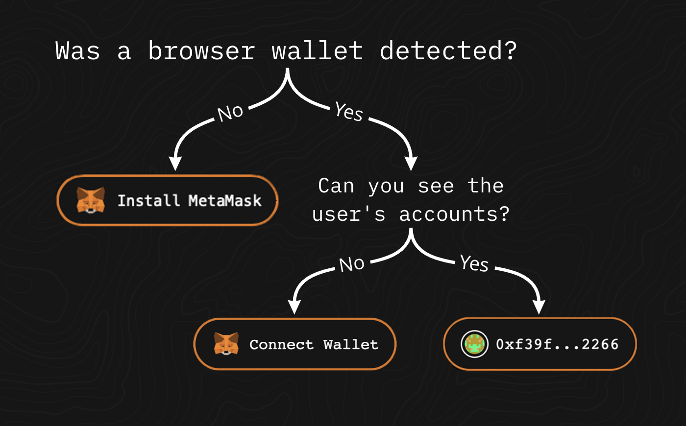

# A Demystification of “Connect Wallet”

[](https://codesandbox.io/s/0x0-metamask-connect-start-8csed1){target=\_blank}

We’re going to start out with one of the first things you’ll want to tackle when developing your frontend alpha: The user’s ability to connect their wallet.

This presents Web3 developers with a user experience (UX) quandary because [Jakob’s Law of the Internet User Experience](https://www.nngroup.com/videos/jakobs-law-internet-ux/){target=\_blank}  dictates that people “prefer your site to work the same way as all the other sites they already know.” You’ll know you’re on a Web3-enabled frontend when you see a button in a site’s header prompting you to *connect*. This is the button you’ll be rendering in your dApp if `window.ethereum` was detected. This call to action might come as a shock to your users who are accustomed to input fields for their credentials to log in.

](../../../img/S04/connect-wallet-tweet.png)

You know how, on a traditional website, you can’t take certain actions until you’ve logged in? You need to verify who you are initially. And the logic to log yourself in involves `fetch()` and how that queries a database to confirm if the inputted credentials match the ones stored after some cryptographic black magic, like [salting](https://auth0.com/blog/adding-salt-to-hashing-a-better-way-to-store-passwords/){target=\_blank}, has been applied?

Well, “Connect Wallet” is the equivalent for Web3. You won’t be able to execute writable functionality until you've connected with your wallet. The calls you make to those smart contracts require a sender to initiate and fulfill them. After all, someone has to pay the gas needed for that transaction.

When you click “Connect Wallet,” MetaMask will trigger a pop-up asking you to grant that dApp permission to view your accounts, your balances, and your activity, and initiate transactions on your behalf. 

The transactions you make will be public, but you can remain pseudonymous. You don’t exchange doxxable information. You’re able to own your data, you never surrender your private key for a database to manage. The wallet proves your identity by proving you own the accounts associated with it because all of your accounts are derived from your seed phrase. Interactions with public blockchains are intended to be permissionless and trustless. ***On Web3, your word is only as good as how much ether you have for gas.***

> 📕 *But what does it **actually** mean to connect a wallet?* If the pop-up from MetaMask tells you that you’re granting this dApp permission to view publicly available information that is on a WHOLE blockchain for everyone to see, what’s the difference between that and someone viewing your account history on Etherscan? It comes down to trust. You can remain pseudonymous in both cases, yes. However, that person viewing your account history on Etherscan can’t initiate a contract call on your behalf, nor can they suggest one. The idea of permissions here can be reduced to a single question: *Do I trust this dApp to let me call smart contract functions in a way that is safe for me?*


## Onboarding

[Websites on Web2 require onboarding of their own, but as end users, we don’t pay much mind to it because it’s something we’ve always been used to doing](https://uxdesign.cc/15-rules-of-user-sign-in-experience-ae9011d04ee3){target=\_blank}. On Web2, it starts with providing contextual information like our email address, and our names that we enter into input fields. Oh, and our phone numbers too. We play [regex gymnastics](https://www.oreilly.com/library/view/regular-expressions-cookbook/9781449327453/ch04s19.html){target=\_blank} to generate secure passwords. These personally identifying tidbits of data are managed by a centralized entity that’ll only interact with us if it knows who we are. Sometimes, however, they need to know too much. [And we don’t always know how our data is being managed](https://www.notion.so/forbes.com/sites/marketshare/2012/03/05/if-youre-not-paying-for-it-you-become-the-product/?sh=35b534ce5d6e){target=\_blank}. 

Web3 comes with an onboarding process of its own, but it *delegates the task of identity management to applied cryptography and the Ethereum blockchain*, not just a single database managed by one big tech giant. Instead of your user creating an account from their credentials, they’ll need to have a browser wallet like MetaMask to derive an account from their private key.

When we begin building, we want to assume our user doesn’t have MetaMask installed, therefore the Provider Interface is non-existent, and we can’t execute any Web3 functionalities. So we want to prompt them to install it. If they do have MetaMask installed, we want to offer them the ability to connect. If they approve that request, we want to show the address of the account they’re connected with. 



## How Buidl?

[](https://codesandbox.io/s/0x0-metamask-connect-start-8csed1){target=\_blank}

If you take a look at `[App.js](https://codesandbox.io/s/0x0-metamask-connect-start-8csed1?file=/src/App.js)`, you’ll see it’s been purged of the boilerplate that `yarn create react-app` generates. There are styled components and a sprinkle of Framer Motion for animations. But we don’t have any other Web3 dependencies. In the `/components` directory, there are, however, three specifically named components, and they are the only ones you’ll be using for this activity. You won’t need to create anymore.

What is important for us to have is a browser wallet like MetaMask. This is where it all begins.

The first objective here is to ***conditionally render*** a button that prompts your user to **Install MetaMask** if `window.ethereum` does not exist. And we can achieve this using [ternary operators](https://developer.mozilla.org/en-US/docs/Web/JavaScript/Reference/Operators/Conditional_Operator){target=\_blank} in our JSX. We can then *[embed* JavaScript expressions in our JSX](https://reactjs.org/docs/introducing-jsx.html#embedding-expressions-in-jsx){target=\_blank} very easily, so long as we wrap the logic in curly braces.

```jsx
<>
  {condition
    ? <Element to render if condition is true>
    : <Element to render if condition is false>
  }
</>
```

Open up `App.js` and you’ll see the components `InstallMetaMask`, `ConnectButton`, and `Account` are imported, but they’re commented out. Using ternary operators, go inside `<main></main>`, get `ConnectButton` to show up if `window.ethereum` is defined. If it is not defined, render `InstallMetaMask`. Now open the code sandbox in two windows— one where you have MetaMask installed, and one where you don’t. See how on one browser there’s a call to action to install MetaMask, and the other has a call to action to ✨ *Connect* ✨?

```jsx
 <main>
  {window.ethereum
    ? <ConnectButton />
    : <InstallMetaMask />
  }
</main>
```

### State

To get users connecting to your dApp, we’ll need to call the `[eth_requestAccounts](https://docs.metamask.io/guide/rpc-api.html#restricted-methods)` JSON-RPC method from `window.ethereum`. In `App.js`, we’re importing `useState` from React. The `eth_requestAccounts` method returns a promise. When that promise to grab a user’s accounts resolves to an array, we’ll need to hold onto it with the [state hook](https://reactjs.org/docs/hooks-state.html){target=\_blank}. `useState` accepts an initial state but returns two values: the current state, and a function to update the state.

Because our user hasn’t connected yet, our initial state would be an empty string. The first value will be `account`, and the second will be `setAccount`. We can define this hook in `App.js`. When the promise resolves, we get the array, we’ll want to *hold it in state*, which we’ll achieve by calling `setAccount`.

```jsx
const [account, setAccount] = useState('')
```

Now that we have that setup, we can 👀 define the function to connect 👀.

### Async/Await

We’ll need to define our function to connect [asynchronously, rather than synchronously](https://www.freecodecamp.org/news/synchronous-vs-asynchronous-in-javascript/){target=\_blank}, because of the way functions in JavaScript behave. If `eth_requestAccounts` returns a promise, we’ll want to wait for that promise to resolve before any other action in that function can be executed. We need to wait for our request to be sent to the blockchain through the nodes, then back to us to consume.

Inside the function body, we can throw in a `try/catch` block. See the code below:

```jsx
const connect = async () => {
	try {
		// eth_requestAccounts
	}
	catch (e) {
		console.log(e)
	}
}
```

We can see here the connect function will now *attempt* to ask a user to connect, but anticipate failure. In the event of a failure, [it will spit out an error code](https://docs.metamask.io/guide/ethereum-provider.html#errors){target=\_blank} that can then be used to give feedback— in this case, we can prompt a user to retry connecting. If a user rejects the request to connect, this is where the `catch` will be triggered letting them know that they didn’t approve the request.

Next step is to create a variable and assign the `eth_requestAccounts` method to it. See the code below:

```jsx
const account = (await window.ethereum.request({ method: 'eth_requestAccounts' })[0]`
```

This is where we can tie up our connect functionality. Because we have an `async` function, we’ll get to use the `await` statement on the method we’ll want to wait for. The parentheses around the `await` statement followed by the `[0]` means once this promise is resolved and we get an array, we’ll only want the first account. That’s what our `accounts` variable will return, and that’s what we’ll use the  `setAccount`  function on.

Your function should look like this:

```jsx
  const connect = async () => {
    try {
      const account = (
        await window.ethereum.request({ method: "eth_requestAccounts" })
      )[0];
      setAccount(account);
    } catch (e) {
      console.log(e);
    }
  };
```

Once the function is defined, switch over to `ConnectButton`. As a React functional component, it takes the prop of `connect`. The next place you’ll see `connect` being used in `ConnectButton` is in the return block, in `<Button>`, where it’s being passed into `handleClick`. `ConnectButton` will be expecting the connect function that we can pass into it when we render it in `<main></main>` like so:

```jsx
<ConnectButton connect={connect} />
```

The updated expression will look like this:

```jsx
// in a server-side framework like Next.js or Vite SSR you might have to do a check to see if window is defined like typeof window !== 'undefined' && window.ethereum
 <main>
 
  {window.ethereum
    ? <ConnectButton connect={connect} />
    : <InstallMetaMask />
  }
</main>
```

### Showing the account


Tried to click connect, connected successfully, and noticed you’re still seeing the connect button? We’re going to have to tweak our logic in the `<main></main>` element to reflect what sorcery we have going on in our app state right now.

Up until this point, we had a binary condition to check for: if `window.ethereum` was injected into the browser. If you look back on `account`, it initially started as an empty string— one of the six [falsy values](freecodecamp.org/news/falsy-values-in-javascript/){target=\_blank} in JavaScript. If a user has connected, it has a value as a 42-character long hexadecimal string. Ternary operators come in handy here because we can chain them (but not much or they get hard to read 😅).

```jsx
<>
  {firstCondition
    ? <Element to render if firstCondition is true>
    : secondCondition
	  ? <Element to render if secondCondition is true>
	  : <Element to render if secondCondition is false>
  }
</>

```

The first condition to check for can be `account`. If that is no longer an empty string, then we can render a `<p>` tag with the content of `account`. If it is still an empty string, we can check for `window.ethereum`. Perhaps the user doesn’t have MetaMask installed, and that’s why `account` is an empty string. So we can go show them `ConnectButton` if it was detected, and `InstallMetaMask` if it wasn’t.

Your updated expression should look like this:

```jsx
{account
  ? <p>{account}</p>
  : window.ethereum
  ? <ConnectButton connect={connect} />
	: <InstallMetaMask />
)}
```

And now you should be able to see your address in its full glory. All 42 characters of it. This is great, but it feels a bit excessive, no?

### An externally owned account by any other formatting… would still be you.

We’re not displaying embarrassing usernames or email addresses anymore. There’s no longer a limit to how long your username can be. I mean, we’re at 42 WHOLE characters long. Imagine displaying that on a mobile browser 😅. Thanks, but no thanks. As developers architecting a user experience in uncharted territory, we have to ask ourselves if we’re overloading the user cognitively by displaying their address in its entirety.

Consider the [Serial Position Effect](https://medium.com/@coffeeandjunk/design-psychology-serial-position-effect-ca0e4cf299cb){target=\_blank}. Looking at your address, try to read out the characters before you lose your position. But you know you connected, if you check MetaMask, you’ll see the first and last few digits are identical. The code you wrote helped connect a user. Is it really necessary to show the whole address? No. Not really. Ideally, you don’t want a user spending too much time confirming that their address on a dApp matches what they know connected with. But you do want to show a portion of their address.

Before you do anything, in `<main>`, let’s swap the `<p>{account}</p>` for `<Account account={account} />`.

Now open up `Account.js`. The return block has a `<Wrap>` element, but `<Blockie />` is commented out. Without uncommenting `<Blockie />`, add `{account}` inside `<Wrap>`. You’ll still see the whole address, but we have some styling. So we have that going for us, which is nice. But it doesn’t fix our problem of how to display an address. What we need to do is… truncate it. Just a smidge. To the first six and last four characters, to be more specific. The first six account for the leading `0x`, which is the hash prefix, plus the next four characters.

We can define a function called `formatAddress` that takes the argument of a user’s address. Because the address is a string, we can use the [`substr()` method](https://developer.mozilla.org/en-US/docs/Web/JavaScript/Reference/Global_Objects/String/substr){target=\_blank} to return portions of it. BUT… we need to separate those portions too. What we’ll return is a [template literal](https://developer.mozilla.org/en-US/docs/Web/JavaScript/Reference/Template_literals){target=\_blank} with the first substring, followed by ellipses, and then the second substring.

Your function should look like this:

```jsx
const formatAddress = (addr) => {
  return `${addr.substr(0, 6)}...${addr.substr(-4)}`;
};
```

Now you can add a `<p>` tag inside `Wrap`, and inside that `<p>` tag, you can add `{formatAddress(address)}`. Looks a lot better, right? But we’re not done yet. There’s something even cooler we can add.

### Identicon

If you open up MetaMask and look on the right, you’ll see a little pixelated icon. Depending on your settings, you might be seeing a [Jazzicon](https://www.npmjs.com/package/jazzicon){target=\_blank} or a [Blockie](https://www.npmjs.com/package/ethereum-blockies){target=\_blank}. If you change accounts on MetaMask, it also changes. That’s because it’s unique to you. It was generated from your address. There can be as many variations of Jazzicons or Blockies as there can be addresses. So now it can be used as a digital representation of your address. When a user sees what their identicon looks like on MetaMask, it would be helpful to see what it would also look like on your dApp as a subtle visual confirmation that they are using the correct account.

Take a look at `<Blockie />`. Right now it takes the props of `size` and `scale`, but those are just for styling. What we’ll want to pass in is a `seed`, which will determine how our blockie is generated. All we need to do is pass in our address as the seed. Hit save. I know. Cool, right? That simple.

Here’s what your `Account.js` should look like:

```jsx
const Account = ({ account }) => {
  const formatAddress = (addr) => {
    return `${addr.substr(0, 6)}...${addr.substr(-4)}`;
  };

  return (
    <Wrap>
      <Blockies seed={account} size={10} scale={3} />
      <p>{formatAddress(account)}</p>
    </Wrap>
  );
};
```

## You can disconnect, but you can never leave… Maybe

So far, the bases you’ve covered include onboarding a user. Allowing them to connect. And showing that they’ve connected. But what about when they leave your dApp? Go ahead and refresh the page. See how it doesn’t show your address anymore? Now click connect. Notice now how MetaMask didn’t even popup, but your address shows up right away? But wait, get this. Open up MetaMask. We’re still connected?


Try connecting to a known dApp. Now refresh. Address still there? Let’s dig around a bit, *some* of these dApps will let you disconnect. Re-read that sentence. Now try to disconnect, if there’s a button for it. You won’t see your address anymore, great. But go check MetaMask. You’re **still** connected. I know. *I know.*

Your users will be expecting a button to log out, it seems only rational. And you have to look them in the eyes, wistfully, and say, no… no, I’m sorry, things work a bit differently in the wonderland that is Web3. Go look in `/components`, there’s no component for a button to log out. Not only that but your users will remain connected and you have to explain this to them because this is unlike any good experience they ever had on an application before. So what is actually going on?

Your users are connected until they’re not— even if they refresh their browser, clear their cache, cookies and browser data. In the next lesson we’ll cover why your user stays connected.