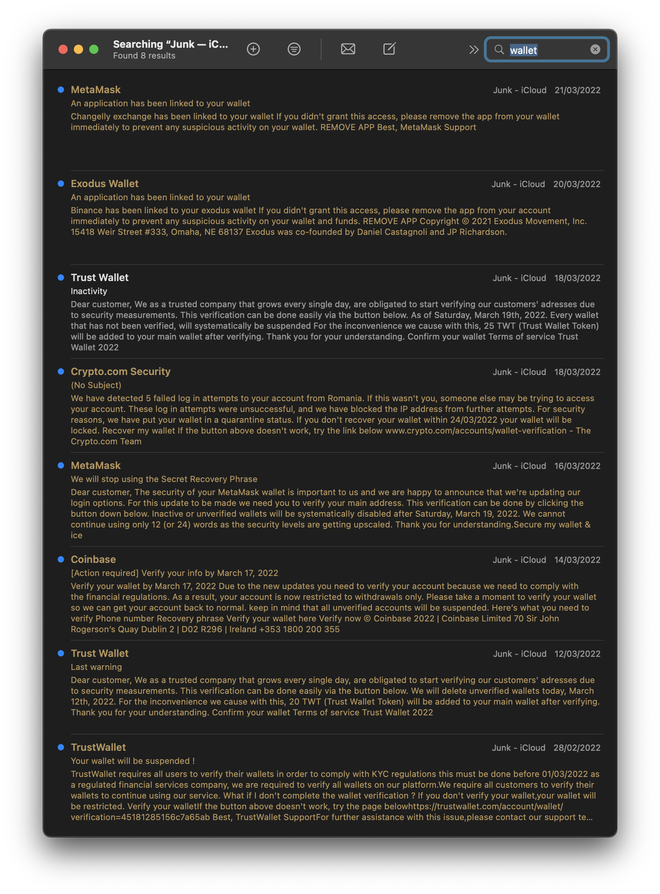

# Persisting Connectivity in Web3 with useEffect

*This lesson builds on the CodeSandbox example from “A Demystification of “Connect Wallet”*

What actually happens when you leave a dApp and why are you still connected? For this, let’s hop in a time machine.

The year is 2006. You’ve just spent the last three hours fine-tuning the spaghetti code that makes up your MySpace layout to show off to all the new frens you got from that bulletin board S4S. You’re good at this, way ahead of your time. You do this all in Notepad— in plain text with no syntax highlighting. 

Life is good until you receive a seemingly innocuous email prompting you to visit MySpace with a strange URL. On login, the site looks a little different. By the way, you did log in. It didn’t take you back to MySpace, so you open up a new window and see that now your whole bulletin board is flooded with spam from your account. The credentials you used to log in don’t work anymore. Your layout is broken now and your profile photo has changed.

You were the victim of a [phishing attack](https://www.computerworld.com/article/2815426/myspace-again-under-phishing-attack.html){target=\_blank}. It happens all too often, unfortunately. [You get emails telling you that something completely out of your control, and sometimes beyond your comprehension, has happened to your account, here’s how you can fix it](https://www.fbi.gov/scams-and-safety/common-scams-and-crimes/spoofing-and-phishing){target=\_blank}. Phishing attacks have bamboozled users online since the time [you were able to get a 30-day free trial of ✨the internet✨from an AOL floppy disk](https://cofense.com/knowledge-center/history-of-phishing/){target=\_blank}. We can try to rely on a site logging us in automatically to circumvent this attack because when a site logs us in automatically, it does us a few favors. It reduces the password fatigue that has already burnt us out. And it reminds us to take a step back from this email and visit the site with a URL we know and trust to make sure everything is okay. If the site remembers us, we should be okay, right?

Just because we can try to rely on auto-login doesn’t mean we should. We’re really relying on the possibility a site may allow for that. That our browser data wasn’t purged. The problem is that it’s not set in stone, we don’t know if we’ll always be logged in. But wait, it can get worse. Auto-login is not entirely a good thing to rely on. If your device ends up in the wrong hands, now whoever has it can also access the same sites that promised to remember you. It’s no longer a convenience at that point, but an attack vector.

## Why do you stay connected?

Phishing never really went away. [It just got smarter](https://twitter.com/troyhunt/status/1508184697070780418){target=\_blank}. Now the stakes are higher because real assets are involved.

If you force quit and restart your browser. Notice how the button still says ‘Connect’. Click it and it should open MetaMask, now you have to enter your password for MetaMask because you were logged out. But, do you notice how you’ve connected to the dApp again, and you didn’t have to select an account to connect with? If you don’t remember disconnecting or logging out, *it’s because you didn’t.*

Your session wasn’t retained in local storage, but after restarting your browser, you were logged out of MetaMask— this is by design. Your device can fall into the wrong hands, but unless they know your password for MetaMask, your private key, or your mnemonic phrase, they can’t do anything. They can’t even get your private key or mnemonic phrase from MetaMask because they need your password!

But wait, there’s more! The only reason why you will ever need to use your private key or mnemonic phrase is if you’re importing accounts from other wallets. You don’t use it often like regular credentials and are encouraged to store it in some place like a safety deposit box, *(or entombed in concrete)*. In the meantime, here’s what your junk mailbox can get filled with.


<p style='font-style: italic' align=center><a href="https://www.youtube.com/watch?v=MK6TXMsvgQg">*Benny Hill theme intensifies*</a></p style='italic'>{target=\_blank}


By default, you’ll always be connected because you didn’t need to verify your identity for authentication. The mere fact that your account was generated from a number so large that it could not be manmade is proof enough that your account is authentic. The reason why you stay connected is that you granted this dApp permission to view your accounts, and your assets and suggest transactions on your behalf. Restarting your browser, clearing your session, and clearing your cookies and cache doesn’t disconnect you. Because MetaMask and other browser wallets act as this bridge between you and dApps, it supplies the functionality for dApps to check if you have granted permissions with your account with the Ethereum Provider API.

Malicious actors can then fork popular protocols and spin up their own versions and deceive you into thinking you might be interacting with the real protocol, but you’re greeted with a new user flow as if permissions only you could grant and revoke were automatically granted and revoked for you, without your explicit consent.

This is why connectivity and permissions in Web3.0 is a paradigm shift from traditional authentication flows in Web2.0.

## Showing your user’s connectivity

To display this persistent connectivity with React, we’ll need to make a few more tweaks. For this, we can use the [Effect](https://reactjs.org/docs/hooks-effect.html){target=\_blank} hook. React components are dynamic because of their ability to go through different [lifecycles](https://reactjs.org/docs/state-and-lifecycle.html#adding-lifecycle-methods-to-a-class){target=\_blank}. You'll commonly see the phrase "side effect" used in explanations for `useEffect`, so a side effect of the Ethereum Provider API being present in the `window` results in either the ‘Connect’ button or the ‘Address’ component being rendered.

In `App.js` you’ll see we’re already importing `useEffect` from React. Now we can define it right beneath our `useState` hook like this:

```jsx
useEffect(() => {
  // Callback function
}, []) // Dependency array
```

Logic can fire off in a component where we’re using `useEffect` and it can change state, and ultimately how our components and our app look. That array is where you have a variable that needs to change before the callback function can fire off. So perhaps we’re waiting on something to exist, like say… an Ethereum provider, we can then fire off a callback function in our `useEffect` to show the address that a user has connected with.

First, you’ll need to destructure the `window` object to unpack the `ethereum` property and define it as its own variable like this:

```jsx
const { ethereum } = window
```

And then let’s quickly change wherever we have `window.ethereum`  to `ethereum`, like in our connect function:

```jsx
const accounts = (
  await ethereum.request({ method: "eth_requestAccounts" })
  await window.ethereum.request({ method: "eth_requestAccounts" })
)[0];
```

And also in our `<main>` element:

```jsx
<main>
  {account 
		? <Account address={account} />
		: ethereum
		? <ConnectButton connect={connect} />
	  : <InstallMetaMask />
  )}
</main>
```

Now let’s go back to the `useEffect`. We know at some point, on load, the Ethereum Provider in our window will return an object, but until it does, we want to hold off on firing any logic. So now we can throw that into our dependency array like this:

```jsx
useEffect(() => {
  // Logic will fire off here if Ethereum changes from undefined to defined.
}, [ethereum])
```

## Why did we unpack `ethereum` from `window`?

Using `window.ethereum` in our dependency array would break one of the rules of React Hooks. This would trigger the `react-hooks/exhaustive-deps` warning that tells us that `window.ethereum` is an outer scope value, and that changing it will not re-render the component.

For a while, we were checking if `window.ethereum` existed, if console logging it would return a truthy value. If it doesn’t exist, the value returned will be false. But we were never checking if it changed while it was in the `window`, or if the `window` as a whole changed.

What if `window` does change, but `ethereum` doesn’t? This is where the issue of it being an outer scope value comes into play because we’re relying on `ethereum` while it’s **inside** `window`, instead of `ethereum` when it’s defined on its own. We’ll see a scenario where a side effect turns into a butterfly effect as one rabid dependency triggers a series of unfortunate re-renders. We don’t want this, so `react-hooks/exhaustive-deps` fire off to let us know we may end up with this kind of behavior.

Next, we can call the JSON-RPC method: `eth_accounts`. We don’t have to request accounts from a user because they already granted our dApp permission. We instead get to see if they’ve connected with the account they are currently using. This is another promise that returns an array. So we’ll have to use the same syntax with `await` that we used with our connect function, like this:

```jsx
useEffect(() => {
	(async () => {
		// Why it look like that ser?
	})()
}, [ethereum])
```

This looks the way it does because it is an async IIFE, an [immediately invoked function expression](https://developer.mozilla.org/en-US/docs/Glossary/IIFE){target=\_blank}. The parentheses have a job title now as a ‘grouping operator’, and this is where we throw in our logic. Then the second set of parentheses at the end is where we immediately call that anonymous function. Because we aren’t reusing this function anywhere else at the moment, we don’t need to explicitly name it.

Inside our IIFE, we can throw in a `try/catch` block.

```jsx
useEffect(() => {
	(async () => {
		try {
			// You've done this before
		} catch (e) {}
	})()
}, [ethereum])
```

And now we can make that API call:

```jsx
useEffect(() => {
	(async () => {
		try {
			const connectedAccount = (await ethereum.request({method: 'eth_accounts'})[0]
			setAccount(connectedAccount);
		} catch (e) {
			console.log(e)
		}
	})()
}, [ethereum])
```

As long as you haven’t revoked permissions, you should see immediately that the `<Account />` component with your address is present. On refresh, it’ll still be there. All up until you manually disconnect with MetaMask— and then strangely, notice how the `<Account />` component is still present?

This might be confusing for your users who are expecting a ‘Disconnect’ button to replace a logout button. But if you look for it in components, there isn’t one there. We simply don’t have one. This is also by design, you see, a dApp can’t facilitate this request to just revoke the permissions you granted. It doesn’t have permission to do so because it’s not you. You can stay connected, but even then transactions cannot be approved and messages cannot be signed without you, as the private key holder, confirming them.

If your user takes a certain action like disconnecting, and they’re doing that through MetaMask, the dApp frontend needs to know what just occurred, and what to do next. In the next lesson, we’ll cover event listeners with the Ethereum Provider API.

## Additional Reading (or just references)
- [Ethereum Provider API](https://docs.metamask.io/guide/ethereum-provider.html){target=\_blank}
- [A Guide to React's `useEffect` hook](https://blog.logrocket.com/guide-to-react-useeffect-hook/){target=\_blank}
- [A Complete Guide to `useEffect`](https://overreacted.io/a-complete-guide-to-useeffect/){target=\_blank}