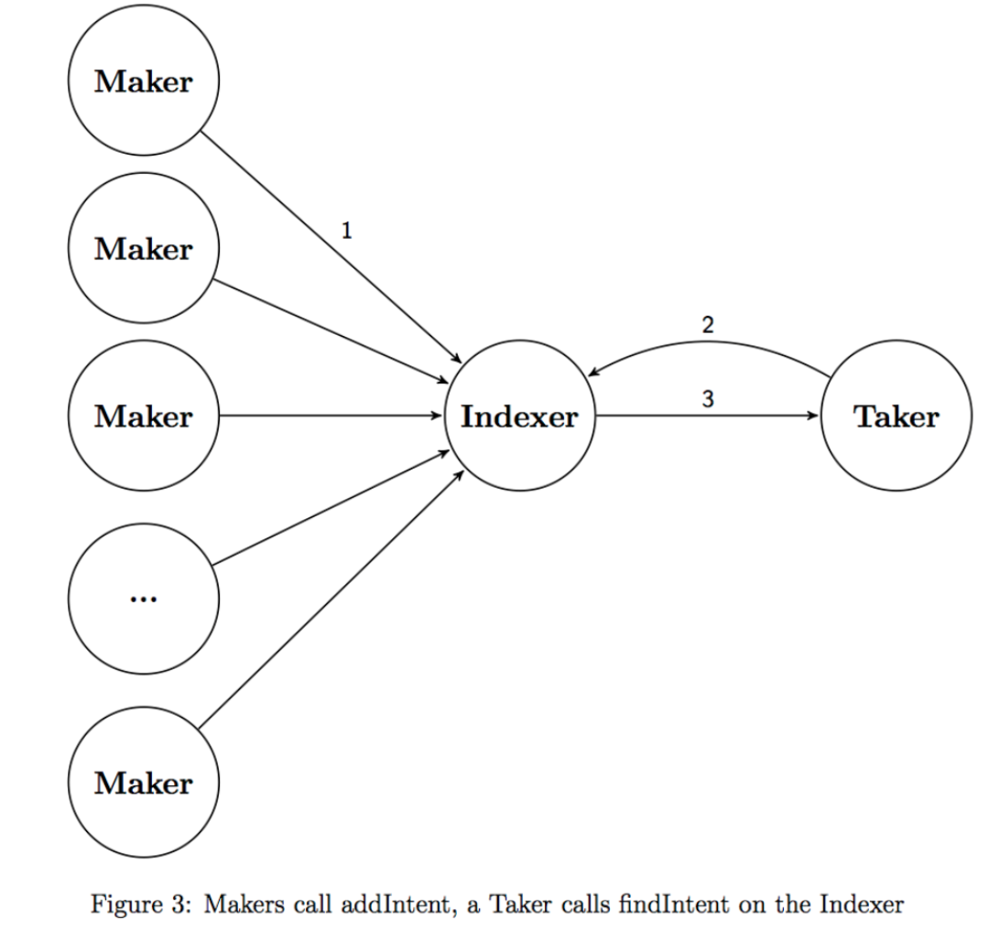
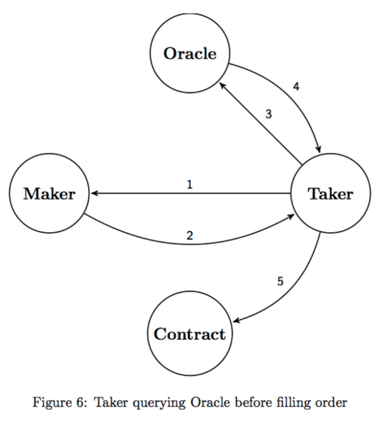
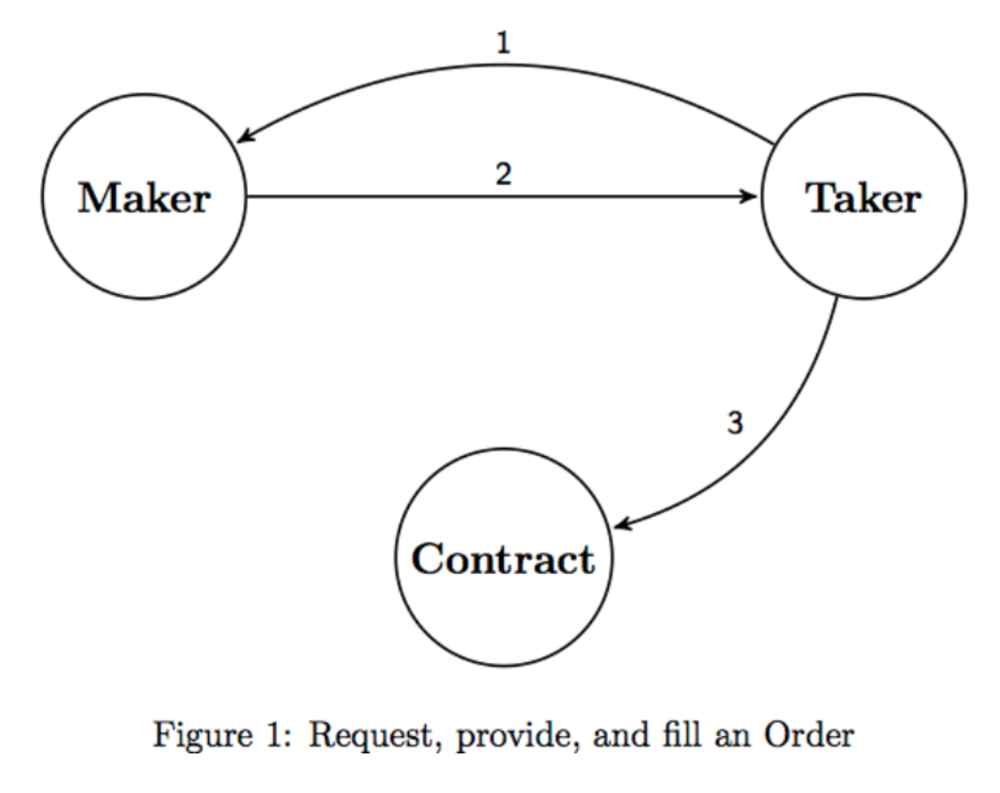

# Request for Quote

## When to use which tool

Have a large order? Use [AirSwap](https://www.airswap.io/){target=\_blank} and go deep.

It’s great for larger trades to protect margins and protect against a kind of front running called ["miner extracted value"](https://hackmd.io/ivUzk3piQEG8ALzCGbxlag){target=\_blank}. This is because trades are direct between traders, so there is no slippage or public information to the front-run orders.

Need liquidity? Use an Automated Market Maker like UniSwap and go wide.

It’s great for variety and availability. But, ideally, aim for smaller trades to anything under 2% of the total supply of an asset. This is due to how the "Constant Product Formula" used by AMMs is modelled to ensure liquidity.

**Key Idea**: Use the appropriate tool based on the size of your order.

RFQ facilities direct trade between parties which is:

- Fair - avoids the [mempool](https://decrypt.co/42839/inside-the-mysterious-world-of-bitcoins-mempool){target=\_blank} and issues around Front running, and miner extractable value.
- Efficient - Eliminates slippage, so you get what you paid for.
- Scalable - negotiations happen off-chain (not on Ethereum) and scales better than relying solely on Ethereum’s throughput.

## Summary

Request for Quote handles trades with off-chain negotiations and on-chain settlement ([trades](https://about.airswap.io/technology/request-for-quote){target=\_blank}). Market makers are called Makers who run servers to fulfil orders. Counterparties to makers are called Takers, who wish to trade tokens.

RFQ can be seen as a peer-to-peer system. The protocol’s smart contracts focus on on-chain settlement of trades via "atomic" swaps using smart contracts. Price discovery and negotiation are made off-chain via RPC ([remote procedure call](https://en.wikipedia.org/wiki/Remote_procedure_call){target=\_blank}), which is scalable and resistant to AMM issues related to front running and miner extractable value.

This model exists because of Ethereum’s constraints and the issues around large orders on AMMs mentioned previously.

## Supplying Liquidity

Liquidity is provided by Makers who run [Servers](https://docs.airswap.io/guides/makers){target=\_blank}. These servers are discoverable via the [Registry Protocol](https://docs.airswap.io/technology/discovery){target=\_blank} which allows for price discovery.

Makers submit their prices to trade. Takers are counterparties who wish to start a trade.

Instead of talking to each Maker, the Taker sends a request to the Indexer, who aggregates the different Makers for Takers.

This negotiation is done off-chain via RPC (remote procedure calls), making it resistant to flashbots searching the mempool for frontrunning opportunities, Miner Extractable Value and other shenanigans.

## Price Discovery and Verification

Makers can consult with [Oracles](https://ethereum.org/en/developers/docs/oracles/){target=\_blank} to consider a fair price suggestion. Takers can also consult with Oracles to ensure the price given is a good deal.

## Liquidity via Delegates

If standing up a Server is too much, a Maker could use [Delegates](https://medium.com/fluidity/introducing-airswap-delegates-1c3db83be1db){target=\_blank}. Delegates enable any trader to add rules that specify the size and price for a particular token, which can be used as limit orders. The added benefit is that the trader doesn’t lose custody of their tokens when doing so.

## Orders and Settlement

Once discovery and off-chain negotiation are complete, the orders are settled on-chain.

This is done via [atomic swaps](https://support.airswap.io/en/articles/2455935-what-is-an-atomic-swap){target=\_blank} using a Swap contract. They are called atomic because they settle or they don’t.

The added benefit of this is that compared to order books, off-chain negotiation makes it more likely that orders will be filled once they are accepted. It helps to eliminate slippage and front running.

