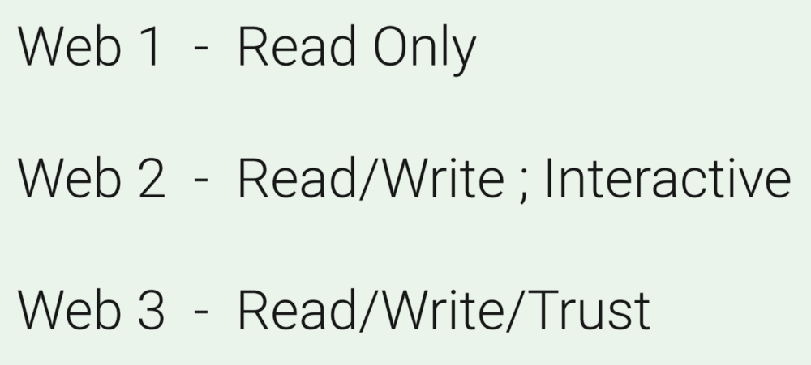
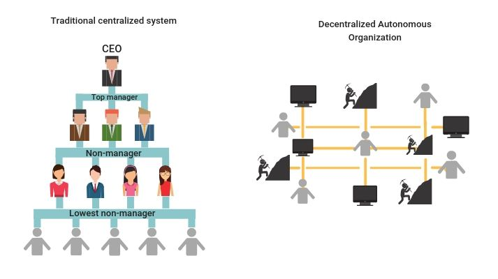
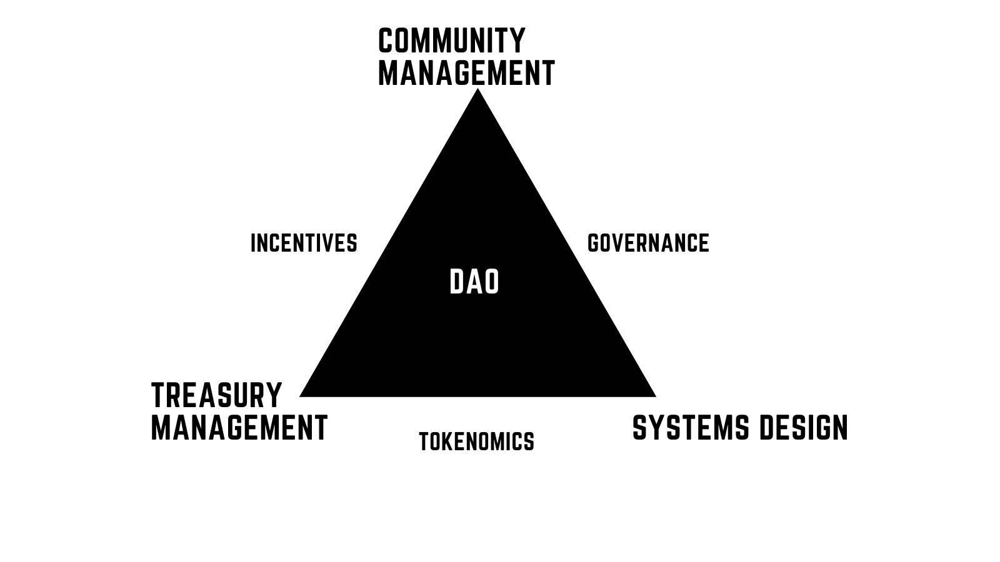

# DAO - Decentralized Autonomous Organizations

“If you want to go fast, go alone.
If you want to go far, go together.”

– African proverb.

## Understand a DAO

### What are they?

[DAOs or Decentralized Autonomous Organizations](https://ethereum.org/en/dao/){target=\_blank} are member-owned communities with a built-in treasury, no central leadership, and whose rules of engagement are codified into smart contracts. They can be a safe way to collaborate with internet strangers while committing funds towards a specific cause. DAOs are a mechanism for [social scalability](http://unenumerated.blogspot.com/2017/02/money-blockchains-and-social-scalability.html){target=\_blank} since they allow members to organize and direct capital towards goals in a trustless and fluid manner. The use of smart contracts allows for the transparency of funds, the rules of operation, and the creation of incentive mechanisms to provide security guarantees around member actions. Thus the economics and control of an organization are laid out transparently, allowing for “trustless” peer to peer participation in open and insecure networks.

[Aragon further explains DAOs,](https://aragon.org/dao){target=\_blank} a DAO framework we will soon explore. An [excellent visual description of DAOs can be found here](https://nirolution.com/decentralized-autonomous-organization/){target=\_blank}. Finally, you can find a list of interesting DAO resources via [DAOtalk.org](https://daotalk.org/){target=\_blank} and [metagame.wtf](https://wiki.metagame.wtf/docs/great-houses/house-of-daos){target=\_blank}.

Simply, DAOs are internet-native organizations.

### What do they offer?

Pragmatically DAOs have the ability to:

- establish the token - initial founders + economics/design
- fundraise and allocate
- corporate actions - voting
- network establishing - maybe the DAO/token is a starting point for another side chain.
- initial conditions for network/network design - maybe there are certain aspects of the network that could be voted on.
- creating partnerships
- creating buckets for grants
- paying employees - yay, [Opolis](https://opolis.co/){target=\_blank}, [Coordinape](https://coordinape.com/){target=\_blank} and [Smart Invoice](https://medium.com/raid-guild/introducing-smart-invoice-211776245a0b){target=\_blank}!

DAOs address the [Principal-Agent Problem](https://www.gemini.com/cryptopedia/decentralized-autonomous-organization-dao#section-da-os-a-solution-to-the-principal-agent-dilemma){target=\_blank}, whereas networks grow members who delegate their power to a representative, concentrating power. This is done to deal with [the complexity costs of dealing with large groups of people](https://en.wikipedia.org/wiki/Dunbar%27s_number){target=\_blank}. This is most pronounced in large centralized institutions. However, due to an asymmetry of power, information and incentives, these agents can serve themselves at the expense of others. Examples of this can be Chief Financial Officer misappropriating funds. Or a charity’s executive board devoting the majority of donations to salaries instead of its stated mission. The root of these issues is due to the general lack of immediate accountability due to poor transparency of rules, incentives, and financial information, the arbitrary execution of policies and poor ability to voice concerns.

Through smart contracts, DAOs provide transparency, self-reinforcing rules, clear incentives and disintermediate control. This allows everyone to have a vote that is enforced. It also provides an open and programmatic means of viewing the community’s finances and voting history. Smart contracts can also be used to design incentives that limit the principal-agent problem, increase security, direct member actions towards a goal, and increase collaboration between members.

In some ways, DAOs can be seen as an evolution of tokens where they help further coordinate actions between people. The token represents a shared ownership; the DAO helps to coordinate this. One could take this further and anchor a DAO to the real world with a [LAO](https://defirate.com/lao/){target=\_blank}, creating a link between the internet native organization and a local jurisdiction (like Wyoming, which has laws around DAOs){target=\_blank}.

DAOs have been called the future of work. For example, one could spin a DAO up, inject a company via LAO, a payment mechanism and then help coordinate an industry with freelancers around the world for-profit.

### Incentive Design

[Token engineering](https://blog.oceanprotocol.com/towards-a-practice-of-token-engineering-b02feeeff7ca){target=\_blank} can be applied to create the guardrails which can concentrate member actions towards a goal. Token engineering is [defined as a discipline focused on designing the self-organizing systems enabled through cryptographic peer-to-peer networks](https://medium.com/block-science/on-the-practice-of-token-engineering-part-i-c2cc2434e727){target=\_blank}. Since individual motivations can vary, one starts with the assumption that economic incentives and disincentives can motivate members towards a particular action. These levers can be used to scope participant actions, creating predictability absent social cues on the internet or understanding each entity’s intent.

An economic assumption creates an upper bound on an attack or counter-incentivized actions. This is because if costly enough, the attacker will at some point run out of funds. Thus, we limit the scope and number of potential hostile actors and actions by raising the cost of negative actions. This idea also underpins how Cryptoeconomics works. Cryptoeconomics is the use of economic incentives to provide guarantees about applications in open and adversarial networks. In the context of DAOs, the application is social collaboration towards a goal. This economic assumption can also be extended to [social capital](https://en.wikipedia.org/wiki/Social_capital){target=\_blank}.

Through the application of tokenomics, communities can scale collaboration through the careful management of their treasury. [CryptoEconomics is the hamburger bun, tokenomics is the meat of a community](https://www.youtube.com/watch?v=P_nJP_GWWdo){target=\_blank}. CryptoEconomics can provide security, while tokenomics provides the additional layer of incentives to grow and manage the community.

You can use tools and services by [BlockScience](https://block.science/){target=\_blank} like [CadCad](https://cadcad.org/){target=\_blank} to begin to reason how to design and stress test a token.

### Community Tokens, Social Tokens and Creator Economies

Some level of social capital can be captured into a social token or community token. A good [breakdown of both can be found here](<https://medium.com/open-source-x/what-are-social-tokens-f594f1ae3e76#:~:text=%E2%9D%B7%20Community%20Tokens%20%E2%80%94%20issued%20and,decentralized%20autonomous%20organization%20(DAO){target=_blank}.&text=Something%20similar%20to%20this%20happened,influencers%20hyped%20dubious%20token%20projects.>){target=\_blank}.

Learn about [social tokens and how DAOs](https://newsletter.banklesshq.com/p/the-bull-case-for-social-tokens){target=\_blank} help enable them. Listen to [a16z’s perspective on social tokens](https://future.a16z.com/podcasts/nfts-creator-economy/){target=\_blank} with Kevin Chou from [Rally](https://rally.io/){target=\_blank}. Rally is like WordPress for social tokens. Another platform can be [Fyooz](https://www.fyooz.io/){target=\_blank}.

An excellent community token example can be [FWB](https://www.fwb.help/){target=\_blank}. An example of a social token can be [Portugal The Man’s Social Token](https://www.rollingstone.com/pro/features/portugal-the-man-cryptocurrency-ptm-coin-1129477/){target=\_blank}. An interesting example of a social token is [r/cryptocurrency](https://www.reddit.com/r/CryptoCurrency/){target=\_blank}’s MOON token. These tokens can be the building block to a creator economy of producers. However, just having a social token doesn’t create a DAO.

### Gradients of Decentralization

Decentralization can be considered a spectrum and, to many aspiring projects, a goal. However, just because a project is on a blockchain or has smart contracts does not mean it is decentralized. For example, projects like Circle's USDC or Tether's USDT are major projects controlled by centralized entities. Although they use smart contracts, they are developed by a traditional company and leverage traditional banking infrastructure to hold the underlying collateral.

Similarly, just because a project has a governance token does not make it decentralized. This could be due to the concentration of governance tokens in a few wallets. Another reason could be how the smart contract is designed, centralizing through the amount of "admin-only" permissions in the code. A project could be centralized through the governance structure itself. One manner is by requiring a high minimum of tokens to make a proposal. If this proposal is higher than what 99% of token holders have, this effectively centralizes control, [similar to complaints about Uniswap](https://cointelegraph.com/news/uniswap-s-first-governance-vote-fails-despite-98-support){target=\_blank}. A project could also restrict control at the final decision level, similar to [Sythentix's Spartan Council](https://blog.synthetix.io/the-spartan-council-election/){target=\_blank}, where proposals are voted on by a rotating committee of people elected by token holders.

There are legal mechanisms that can restrict participation as well. The restriction could be through [the open-source project's license, which limits the scope of what can be forked](https://www.coindesk.com/tech/2021/03/23/uniswap-v3-introduces-new-license-to-spoil-future-sushis/){target=\_blank}. If a project has a formal corporate entity to develop the underlying protocol and project, then the shareholders and possible investors could sway the project. Examples can be Uniswap or Compound, which have companies that act as stewards of the protocol. This is not to be confused with any intention control projects in a disingenuous manner.

Due to the newness of DAOs, the legal codification of this new structure of organization is not widespread, with [the state of Wyoming being one of the few that has laws around them](https://www.coindesk.com/markets/2021/07/08/regulators-everywhere-should-follow-wyomings-dao-law/#:~:text=July%201%20marks%20the%20first,existed%20anywhere%20in%20the%20world.){target=\_blank}. Having a legal entity helps with off-chain things like taxes, bank accounts, paying bills, etc. Additionally, industry patterns are emerging around [using multi-signature wallets to allow teams to have checks and balances](https://decrypt.co/37011/synthetix-is-now-controlled-by-three-daos){target=\_blank} over code updates and treasury spending. There [are even some new ideas around using a network to help manage wallets](https://www.qredo.com/blog/what-to-look-for-in-a-crypto-treasury-management-solution){target=\_blank}. That way, [one person can't run off with the funds like what occurred early on with SushiSwap](https://news.bitcoin.com/sushiswap-returns-14-million-exit-scam/){target=\_blank}. Or have the concentration risk of one person having a massive amount of power.

A simple way to restrict control could also be by just keeping certain key repositories closed sourced, thereby limiting information. However, information could also be limited intentionally or unintentionally through having too many informal or off-chain governance mechanisms which excluded the token holders. Off-chain governance occurs if consensus or voting without voting on-chain.

With all this being said, complete decentralization is a target goal for many projects. Most projects start somewhat centralized, as the people that make up the teams are experimenting with a new form of organization. Usually, [projects will express their intent to decentralize and issue a roadmap with goalposts to meet.](https://forum.badger.finance/t/bip-33-phase-1-of-decentralizing-badger-dao/2607){target=\_blank} As patterns and tools are refined and people share experiences, we can expect to see more projects initially start with a higher level of decentralization.

As of 2021, a few projects have achieved some high level of decentralization, like [MakerDAO](https://blog.makerdao.com/makerdao-has-come-full-circle/){target=\_blank} and Synthetix, among others.

### Examples of DAOs

DAOs are emerging in many places. See an overview of [DAOs in the 2021 Q2 ConsenSys DeFi report](https://consensys.net/reports/defi-report-q2-2021#Down-to-Dao){target=\_blank}. In the DeFi space, [MakerDAO](https://www.gemini.com/cryptopedia/makerdao-defi-mkr-dai-coins){target=\_blank} focuses on creating a stablecoin for the world. [Yearn Finance](https://www.gemini.com/cryptopedia/yearn-finance-defi-lending-protocol){target=\_blank} works to help automate yield farming with crowdsourced strategies for its members, similar to a decentralized hedge fund. Uniswap and SushiSwap are both Decentralized Exchange Protocols aiming to help users trade digital assets. [Nexus Mutual](https://medium.com/nexus-mutual/dao-governance-a-pragmatic-approach-27d529ad0819){target=\_blank} is a decentralized insurance protocol that offers policies to guard against exchange and smart contract hacks. [BadgerDAO](https://badgerdao.medium.com/introducing-badger-dao-ed47a586c619){target=\_blank} creates products and infrastructure to bring Bitcoin to DeFi. [IndexCoop](https://medium.com/indexcoop/introducing-the-index-cooperative-a4eaaf0bcfe2){target=\_blank} creates indexes of crypto assets and aims to become a decentralized BlackRock. [Finally, TheLAO](https://medium.com/openlawofficial/the-lao-a-for-profit-limited-liability-autonomous-organization-9eae89c9669c){target=\_blank} is an example of the first decentralized for-profit DAO backed by a legal framework pioneered by [OpenLaw](https://www.openlaw.io/){target=\_blank}. [LexDAO](https://www.lexdao.coop/){target=\_blank} is made up of legal engineers creating bridges between legal code and smart contracts.

DAOs also found the world of art and media. [BanklessDAO](https://www.bankless.community/mission){target=\_blank} aims to practice what they preach and organize to create a decentralized newsroom and set of financial products. [FlamingoDAO](https://flamingodao.xyz/){target=\_blank} invests in NFT, games and the Metaverse. [Bored Apes Yacht Club](https://boredapeyachtclub.com/#/){target=\_blank} and [Pudgy Penguins](https://www.pudgypenguins.io/#/){target=\_blank} focus on [selling limited edition art around NFTs](https://decrypt.co/79071/cryptopunks-bored-apes-nft-avatar-trend-is-about-community-building){target=\_blank}, to pretty good success. Finally, Audius is creating a decentralized music service.

DAOs can emerge around social causes like [Meta Gamma Delta](https://metagammadelta.com/){target=\_blank}, an inclusive and empowering society [supporting women-led projects](https://p2pmodels.eu/feminist-strategies-for-p2p-organisations/){target=\_blank}. Or [Gitcoin, which is focused on advancing public goods funding](https://gitcoin.co/blog/seeking-a-new-kind-of-public-good/){target=\_blank}. They can be used to organize developers around creating developer tools like [RaidGuild](https://www.raidguild.org/){target=\_blank} and [Radicle](https://radicle.xyz/){target=\_blank}.

Learn more about the latest DAO developments at [DAOTalk.org](https://daotalk.org/c/ecosystem/16){target=\_blank}, [p2pModels.EU](https://p2pmodels.eu/){target=\_blank} or subscribe to [Boardroom's substack](https://governance.substack.com/){target=\_blank}.

Read more about DAOs [via DAOHaus](https://app.daohaus.club/explore){target=\_blank} or [Aragon's list of DAO in 15 different industries](https://blog.aragon.org/15-ways-the-world-is-being-transformed-by-daos/){target=\_blank}.

## Additional Resources
- [Article: Organizational Legos, The State of DAO Tooling (Nichanan Kesonpat)](https://medium.com/1kxnetwork/organization-legos-the-state-of-dao-tooling-866b6879e93e){target=_blank} Excellent overview of available tooling for DAOs from Fall 2021

- [Whitepaper: Decentralized Autonomous Organizations: Beyond the Hype (World Economic Forum)](https://www3.weforum.org/docs/WEF_Decentralized_Autonomous_Organizations_Beyond_the_Hype_2022.pdf){target_blank}A comprehnisve resource to learn everything in depth  about DAO's, right from understanding what is a DAO and how it works to its legal and regulatory challenges.

