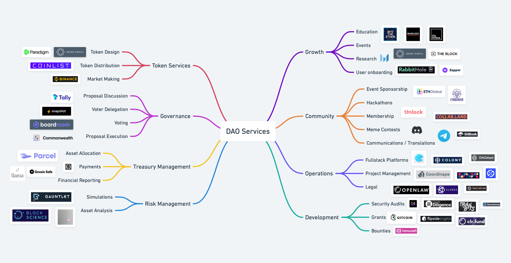

# DAO - Decentralized Autonomous Organizations

“If you want to go fast, go alone.
If you want to go far, go together.”

– African proverb.

## Create a DAO

Like building a website, you can create a DAO with easy-to-spin-up tools or customizable frameworks. If you want to start quickly, you can use DAOHaus.

DAOHaus has a [great general guideline on the basics you need to start a DAO](https://daohaus.substack.com/p/four-and-a-half-steps-to-start-a){target=\_blank}. Here is another guide on [an overview of how DAOs work](https://www.gemini.com/cryptopedia/decentralized-autonomous-organization-dao#section-how-do-da-os-work){target=\_blank}.

The bare minimum that is needed is:

- A mission statement
- A place to hang and meet
- A regular community call or meeting
- The DAO Smart Contracts

### DAO Tools and Services

{target=\_blank}

Beyond the basics, developers can build full-featured and more customized DAOs. Here are some of the leading DAO frameworks.

### DAO and Governance Frameworks

Moloch (via DAOHaus)

[Moloch](https://medium.com/raid-guild/moloch-evolved-v2-primer-25c9cdeab455){target=\_blank} is a governance framework that allows a creator to spin up a DAO via DAOHaus easily. Their contracts are very minimal to avoid bugs and were used to spin up various DAOs early on. The project is named after the Canaanite god of child sacrifice to refer to the suboptimal outcomes due to poor group coordination. Groups can suffer from poor judgement, misaligned incentives and wrong goals. Moloch was created to help solve the incentive and coordination problems in funding public goods open-source protocols. Circa 2021, they also have lots of funding available for promising DAOs. You can learn more about them [here](https://www.molochdao.com/){target=\_blank} and get an excellent overview [here](https://messari.io/asset/molochdao/profile){target=\_blank}. [Their GitHub](https://github.com/MolochVentures/moloch){target=\_blank} and their [hackMD](https://hackmd.io/@daohaus){target=\_blank} also have interesting resources to learn more.

#### Aragon

[Aragon](https://aragon.org/){target=\_blank} offers a full suite of tools to create and manage your DAO. They have [an easy way to spin up your DAO via their site](https://client.aragon.org/#/){target=\_blank}. Aragon client lets you spin up the DAO. [Aragon Govern](https://aragon.org/aragon-govern){target=\_blank} is a tool for on-chain voting. [Aragon Court](https://aragon.org/aragon-court){target=\_blank} is for dispute resolution that is Sybil resistant, similar to [Kleros Court](https://kleros.io/){target=\_blank}. [Aragon Voice](https://aragon.org/){target=\_blank} helps DAOs with submitting proposals similar to [Discourse](https://www.discourse.org/){target=\_blank}. [Finally, Vocdoni](https://aragon.org/vocdoni){target=\_blank} focuses on digital voting solutions for organizations.

#### OpenZeppelin

OpenZeppelin developed OpenZeppelin Governor, a suite of smart contracts for governance. [This post has a very comprehensive look](https://blog.openzeppelin.com/governor-smart-contract/){target=\_blank} into OpenZeppelin Governor. OpenZeppelin Governor ties into Tally and OpenZeppelin Defender for a comprehensive method of governance. You can play with [OpenZeppelin Governor via Openzeppelin's fantastic code interface](https://wizard.openzeppelin.com/#governor){target=\_blank}. [Their docs](https://docs.openzeppelin.com/contracts/4.x/governance){target=\_blank} have a great explanation of how to set up on-chain governance. [Tally's Docs](https://wiki.withtally.com/docs/openzeppelin-governor){target=\_blank} describes OpenZeppelin Governor as well. Using OpenZeppelin allows for a more customizable and extensible system.

#### Others

[Colony](https://colony.io/){target=\_blank} and [DAOStack](https://daostack.io/){target=\_blank} are two other DAO frameworks. However, their communities are smaller than Aragon and Moloch. Therefore, evaluate the frameworks and choose the best. A deeper [comparison of Colony, DAOStack and Aragon can be found here](https://kronosapiens.github.io/blog/2019/06/16/aragon-daostack-colony-moloch.html){target=\_blank}.

### DAO Management Tools

Coordination goes beyond having a suite of smart contracts. DAO typically have various other tools to help create, sustain and grow their communities.

#### Authority

The industry is fast coalescing to using [Multi-Signature wallets](https://academy.binance.com/en/articles/what-is-a-multisig-wallet){target=\_blank} to decentralize the control of contracts and increase security. [Gnosis Wallet](https://gnosis-safe.io/){target=\_blank} is the leader in this space, being used by Synthetix, SushiSwap, Balance, Ethereum Name Service and more. [Multi-sigs](https://medium.com/gauntlet-networks/multisig-transactions-with-gnosis-safe-f5dbe67c1c2d){target=\_blank} are essentially smart contracts that hold assets, thereby having extensible logic which can help with security. Synthetix is a good case study to [outline their use of multisig](https://sips.synthetix.io/sips/sip-141/){target=\_blank} within [their governance system](https://docs.synthetix.io/governance/#ambassador-dao-adao){target=\_blank}.

#### Chat Platforms

Most DAOs chat via Discord, a popular gaming platform due to its free and powerful paid features. DiscordJS allows for the creation of bots that can be integrated into the server. However, Discord is a centralized service. Using them creates centralization risk, and they would be able to shut down your server as they did to [Wall St. Bets](https://www.theverge.com/2021/1/27/22253251/discord-bans-the-r-wallstreetbets-server){target=\_blank}. Open source decentralized solutions exist like [Matrix Protocol](https://matrix.org/){target=\_blank}, a decentralized conversation store with no central point of failure. There are [various user-friendly clients](https://matrix.org/clients){target=\_blank} for both mobile and desktop that support Matrix Protocol like [Element](https://element.io/){target=\_blank}. [Mastodon](https://joinmastodon.org/){target=\_blank} is another open-source and user-friendly project. Think of it as a decentralized Twitter meets Reddit.

User onboarding is essential to a community. This can happen on a Chat Platform. A great example is how BanklessDAO does it. Check them out and [see how they approach their website and discord onboarding](https://www.bankless.community/){target=\_blank}.

For lead generation, you can create a subreddit to populate it with content and attract new members. However, be aware that Reddit is centralized. The upside is that it's highly customizable with the ability to add wikis, widgets. Their auto moderator system is pretty advanced to keep a good percentage of spam, trolls and scammers out. You can integrate it with Ethereum based tokens and create an attractive token economy there. You can see [r/cryptocurrency](https://www.reddit.com/r/CryptoCurrency/){target=\_blank} and [learn about MOONs](https://www.kraken.com/en-us/learn/what-is-reddit-moon){target=\_blank}.

#### Video platforms

Video chat allows for members to create a closer community. Zoom, Google Meet, Discord's video conferencing feature, and [Jitsi](https://jitsi.org/){target=\_blank} are popular options. Zoom and Google limit the time a call can occur. Discord Limits the size. Jitsi is free, open-source and works via a web browser. Its paid version called 8x8 is $USD 12 a year and allows for saving video recordings. If you are more technical, you can deploy your own Jitsi instance to host conversations.

#### Proposal Staging

There are various tools to stage and propose improvements to the community. The most popular platform used is [Discourse](https://www.discourse.org/){target=\_blank}. However, Discourse was not made for DAOs, and fast-rising platforms cater to crypto projects like [Tally](https://docs.withtally.com/){target=\_blank} and [Boardroom](https://www.boardroom.info/){target=\_blank}. Tally helps users participate with on-chain governance, while [Boardroom helps with the entire flow of collaboration](https://governance.substack.com/p/boardroom-raises-2m-to-help-stakeholder){target=\_blank}. Ironically Discourse could be a more decentralized approach since their codebase is free and open-source, allowing customization and self-hosting. Another tool that can be used is [Notion](https://www.notion.so/){target=\_blank} which allows for easy customization.

Hackathon idea: Create an open-source Discourse plug-in that reads from the chain.

#### Voting and Vesting

Voting can happen on-chain or off-chain. Before Layer-2 solutions, on-chain voting was expensive. So tools like SnapShot were created to allow off-chain voting by allowing users to sign for or against a proposal. Boardroom and Tally also aim to help with this.

Although people can vote, it doesn't mean that they will. Or that they would hold on to the governance token. DeFi projects like [Curve](https://github.com/curvefi/curve-veBoost){target=\_blank} and [SushiSwap](https://forum.sushi.com/t/sushinomics-introducing-osushi/4055){target=\_blank} are looking to use a vote locking mechanism to boost yields to those who stake their tokens long term vs others who don't.

#### Rewarding

DAOs can also reward contributors with payroll-like solutions. Developed by Yearn Finance, [Coordinape](https://coordinape.com/){target=\_blank} allows DAOs to reward, incentivize and scale DAO operations. [Smart Invoice](https://smartinvoice.xyz/){target=\_blank} by Raid Guild is another solution and is [described here](https://medium.com/raid-guild/introducing-smart-invoice-211776245a0b){target=\_blank}. You can also engage in liquidity mining operations as a marketing and onboarding strategy for user engagement.

### Domains

You can host your site on a decentralized file storage solution like IPFS or Filecoin. An easy and free way to use IPFS is via [NeoCities](https://neocities.org/){target=\_blank}. You can use [Unstoppable Domains](https://unstoppabledomains.com/){target=\_blank} to buy domains for: .crypto, .bitcoin, .dao, .nft, .blockchain, .wallet and more. Furthermore, you can use [Ethereum Name Service](https://ens.domains/){target=\_blank} to buy a .eth domain name and [eth.link](https://eth.link/){target=\_blank}, which links DNS to Ethereum via [EthDNS](https://medium.com/@jgm.orinoco/ethdns-an-ethereum-backend-for-the-domain-name-system-d52dabd904b3){target=\_blank} and also link your website, which also works with IPFS.

#### Data

Another identity solution is [3Box](https://3boxlabs.com/){target=\_blank} which offers various tools for decentralized storage, messaging and identity. They also offer [Ceramic Network](https://ceramic.network/){target=\_blank} for serverless applications. You can also host your DAO's data via [Textile's](https://www.textile.io/){target=\_blank} decentralized infrastructure, which runs on IPFS.

#### Identity

With [Serto](https://www.serto.id/){target=\_blank} can issue a [verifiable credential](https://decentralized-id.com/web-standards/w3c/wg/vc/verifiable-credentials/){target=\_blank}, aka "Crypto Cookies, " a building block for decentralized identity. They are tamper-resistant cryptographic signatures issued by one entity to a receiver to establish a relationship. And the work off-chain!

Why use these over NFTs? An NFT is on-chain and is like a commendation, while verifiable credentials are like recommendations and work on or off-chain. They establish a relationship between entities, say like a club and its members or a college and a graduate. These relationships are important because people's recommendations and references help make up our external identities and reputations.

By having a self-sovereign identity, one could interact reliably and issue credit or other benefits without intermediaries. In DeFi, identity would help to create credit scores. They could be within DAOs for reputation or to promote greater trust between members since affiliations cannot be forged. This would help build an interoperable deep web of trust based on user interactions rather than issued centrally.

We will now see how these tools are used in conjunction to create a governance system.
