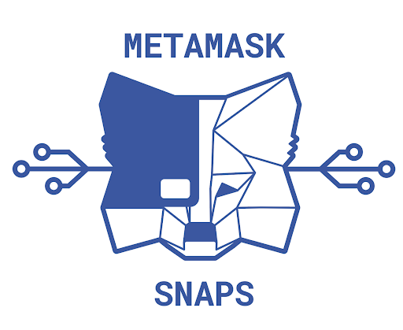
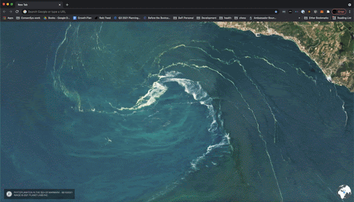

# MetaMask Snaps

MetaMask Snaps is a <a href="https://medium.com/metamask/introducing-the-next-evolution-of-the-web3-wallet-4abdf801a4ee" target="_blank" rel="noopener noreferrer">plug-in system</a> for MetaMask. A plugin is a script loaded over a verified and permissionless protocol like IPFS, ENS, or Swarm. They have zero privilege by default but will be able to request a variety of powerful APIs from MetaMask to extend what MetaMask Users can do.

In this section, we're going to briefly touch on some of the aspects of Snaps and how you can start building or using them.

## Why Snaps?

As the oldest Dapp-login system, the MetaMask team has been through several cycles of innovation on various levels of the Ethereum platform, and have basically felt like we (and any single team) can't really keep up.

The plugin system was conceived as an answer to the question: What is the simplest extensible wallet architecture? One that ends the need to develop a new wallet for every new network, or contract account, or asset type that comes along? You can read more about the motivations behind Snaps <a href="https://github.com/MetaMask/metamask-snaps-beta/wiki/Motivation" target="_blank" rel="noopener noreferrer">here.</a>

As we discussed earlier, the MetaMask team uses extensive security measures like LavaMoat to keep the blockchain users as safe as possible. With this protection, MetaMask is able to provide a very powerful set of APIs, <a href="https://metamask.github.io/api-playground/api-documentation/" target="_blank" rel="noopener noreferrer">which you can see here.</a> 

MetaMask Snaps builds from the desire to “[increase] usability while maintaining coherent security” (<a href="https://ethereum-magicians.org/t/web3-login-permissions/3583" target="_blank" rel="noopener noreferrer">source</a>) a pivot point away from core API functionality and towards more open-ended innovation.

## Building with Snaps

So far, the best available way to learn how to use Snaps is to try it out with the Filecoin Plug-in. We're going to walk through the process of installing the Filecoin Plug-in. By doing so, you'll become familiar with the developer version of MetaMask.

### Create a New Browsing Profile

## Additional Material
- <a href="https://www.youtube.com/watch?v=VkvElJY6uLs" target="_blank" rel="noopener noreferrer">Video: MetaMask Plugin System Developer Alpha Introduction (2019)</a> A dated but important introduction to Snaps.
- <a href="https://www.youtube.com/watch?v=yK_gS3KaY4E" target="_blank" rel="noopener noreferrer">Video: MetaMask Snaps at DevCon 5</a> Announcement of Snaps at DevCon
- <a href="https://www.youtube.com/watch?v=d0NtNbbMQ1s" target="_blank" rel="noopener noreferrer">Video: Filecoin Developer Preview</a> The first standalone example of MetaMask Snaps is the Filecoin Developer Plugin. Check out this walkthrough!