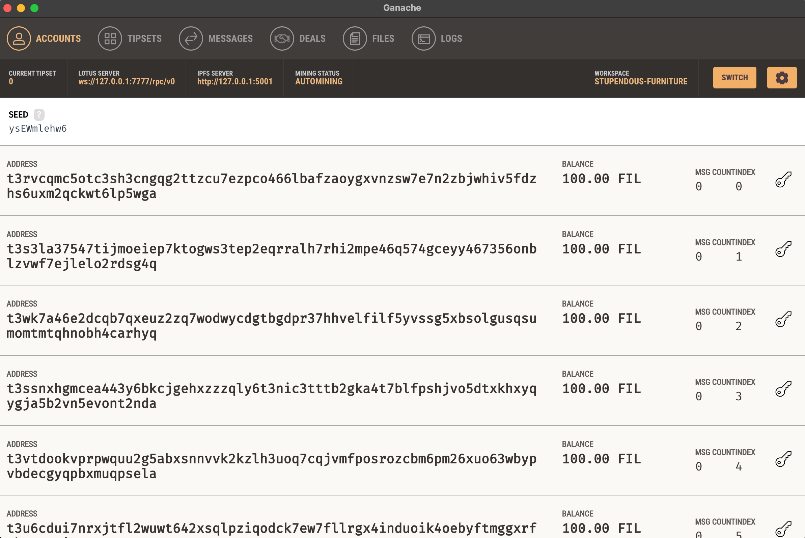
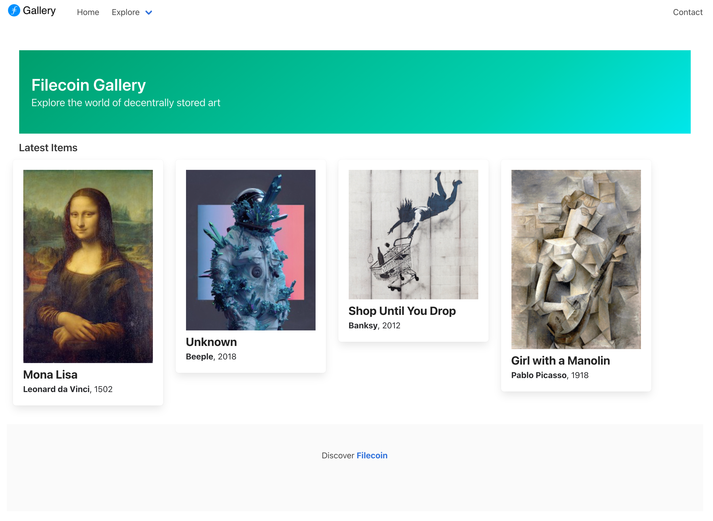

# Filecoin

Protocol Labs, who built IPFS, have developed an entire network for decentralized filesharing called Filecoin. In this section, we'll go through a Truffle Box which sets up a Filecoin environment on your computer.

## Using the Filecoin Truffle Box
This quick start uses an already-created project to provide the base Truffle project structure and example contracts.
In your workspace directory, run the following commands:

    mkdir filecoin-example
    cd filecoin-example
    truffle unbox filecoin

## Running Filecoin Ganache

Once installed, you can run Filecoin Ganache with the following command:
    
    npx ganache filecoin

This creates 10 accounts, each loaded with 100 FIL, and displays both their account addresses and associated private keys.

    Available Accounts
    ==================
    (0) t3rvcqmc5otc3sh3cngqg2ttzcu7ezpco466lbafzaoygxvnzsw7e7n2zbjwhiv5fdzhs6uxm2qckwt6lp5wga (100 FIL)
    (1) t3s3la37547tijmoeiep7ktogws3tep2eqrralh7rhi2mpe46q574gceyy467356onblzvwf7ejlelo2rdsg4q (100 FIL)
    (2) t3wk7a46e2dcqb7qxeuz2zq7wodwycdgtbgdpr37hhvelfilf5yvssg5xbsolgusqsumomtmtqhnobh4carhyq (100 FIL)
    ...

It also starts the Lotus and IPFS daemons running over http and ws respectively:

    Lotus RPC listening on 127.0.0.1:7777
    IPFS  RPC listening on 127.0.0.1:5001

## Filecoin Ganache GUI
An alternative to running Filecoin Ganache via the CLI is to use Filecoin Ganche UI. As per the screenshot below, this exposes all the core Filecoin protocol elements as tabs which is particularly useful if you're just starting out.

## Running the Filecoin Network Explorer
        
    git clone https://github.com/trufflesuite/filecoin-network-inspector
    cd filecoin-network-inspector
    git checkout ganache-changes
    npm install
    npm run start

## Running Ethereum Ganache

    npx ganache ethereum
    RPC Listening on 127.0.0.1:8545

## Creating Storage Deals
A storage deal is an agreement between a client and a storage miner to store some data in the network for a given duration. Note that while in the case of Filecoin's mainnet, a deal must be secured with a miner before data is stored, in Filecoin Ganache a deal is reached automatically.
Via the Filecoin Network Explorer
<ol>
<li>The simplest way to store data, open the Filecoin Network Explorer and navigate to the "Market" tab.</li>
<li>From here you can select a file by clicking "Choose File" followed by "Upload to the Filecoin Network".</li>
</ol>
 
## Truffle Preserve
Truffle now has a preserve command which allows for the 'preservation' of files directly from the Truffle CLI. This is currently experimental and thus on specific branch; installation details available at here.
Once installed, you'll be able to preserve your assets via the following command. Note that you'll need to include the environments object in your truffle-config.js to point at the respective node (although these are already preconfigured in the box).

    truffle preserve --environment development ./assets/ --filecoin

 
For broader help with this command run truffle help preserve.

Via Curl (or equivalent)
Lastly, you can send the following curl request directly to the Lotus RPC. Note that the you'll need to update both the wallet address (t3s3la3754...) and CID (QmZTR5bcpQ...).

    curl -X POST \
     -H 'Content-Type: application/json' \
     -d '{"jsonrpc":"2.0","id":0,"method":"Filecoin.ClientStartDeal","params":[{"Data":{"TransferType":"graphsync","Root":{"/":"QmZTR5bcpQD7cFgTorqxZDYaew1Wqgfbd2ud9QqGPAkK2V"},"PieceCid":null,"PieceSize":0},"Wallet":"t3s3la37547tijmoeiep7ktogws3tep2eqrralh7rhi2mpe46q574gceyy467356onblzvwf7ejlelo2rdsg4q","Miner":"t01000","EpochPrice":"2500","MinBlocksDuration":300}]}' \    http://localhost:7777/rpc/v0

 
## Minting an NFT
In the example below, we've already created a deal for the 3 assets (metadata, thumbnail, and the original asset respectively) that comprise our NFT. These are as follows, with their corresponding CIDs.
<ul><li>metadata  <a href="https://ipfs.io/ipfs/QmUWFZQrJHfCVNHXVjjb2zeowVvH7dC6rKpbdHsTdnAgvP">QmS4t7rFPxaaNriXvCmALr5GYRAtya5urrDaZgkfHutdCG</a>
</li><li>thumbnail -<a href="https://ipfs.io/ipfs/QmbAAMaGWpiSgmMWYTRtGsru382j6qTVQ4FDKX2cRTRso6">QmbAAMaGWpiSgmMWYTRtGsru382j6qTVQ4FDKX2cRTRso6</a></li><li>
asset - <a href="https://ipfs.io/ipfs/QmS4t7rFPxaaNriXvCmALr5GYRAtya5urrDaZgkfHutdCG">QmbAAMaGWpiSgmMWYTRtGsru382j6qTVQ4FDKX2cRTRso6</a></li></ul>

Assuming the local Ethereum Ganache node is running, you'll be able to open a console and mint a new NFT with the following steps. As the base URL is set to that of an IPFS gateway, we'll just need to pass in the CID to the asset metadata.
 

    truffle migrate
    truffle console
    truffle(development)> const gallery = await MyGallery.deployed()
    truffle(development)> gallery.mint(accounts[0], "QmS4t7rFPxaaNriXvCmALr5GYRAtya5urrDaZgkfHutdCG")

In the above example the owner of the NFT is set (via accounts[0]) to that of the first account generated by the mnemonic. If we want to transfer it to a new owner, we'll be able to do so with the following.
Transferring Ownership

    truffle console
    truffle(development)> gallery.transferFrom(accounts[0], accounts[1], 1)

## Gallery UI

A sample gallery interface is available here.​​
You can use the following steps to run this locally...

    cd ui
    npm install
    npm run start

 

## Off-chain Assets
Thus far we’ve been exclusively referring to data that will be stored on-chain. While this is logical for certain types of data in your dapp, what about other facets (such an underlying NFT asset or a web-based front-end)?

Ideally we can still take advantage of the benefits of decentralization without incurring the cost and performance overhead of trying to store on-chain. This is where services such as IPFS, Arweave, or Textile Buckets come in, along with complimentary storage solutions like Filecoin.
## Storing with Truffle Preserve
Truffle has a built-in command called preserve that supports a number of the aforementioned services right out of the box. An example of it’s usage is follows, with ./path being the path to the directory you want to persist.

    truffle preserve ./path

The above example assumes you have a locally running IPFS node, but if not you can leverage Infura’s gateway by adding the following to your truffle-config.js and then appending --environment production to the command.

    environments: {
    production: {
      ipfs: {
        address: 'https://ipfs.infura.io:5001'
      }
     }
    }

The resultant content identified (CID) will then be returned for you to then persist with a Filecoin storage deal or pinning service.

More detail can be found in the Truffle [docs](https://www.trufflesuite.com/docs/truffle/getting-started/preserving-files-and-content-to-storage-platforms).
