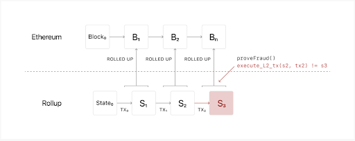

# Types of Scaling Solutions

Several options have been proposed and worked on for scaling Ethereum on a shorter time frame. Some of these efforts are coming to fruition now and are worth considering. The main tradeoffs for choosing a scaling solution involve considerations of throughput vs. security vs. usability. The following are some solutions currently in the works at various stages: 

## Rollups

In general, on Rollup Layer 2 solutions,  transactions are submitted to L2 nodes instead of L1, and batched. Eventually they are put on L1 and no longer mutable. L2 nodes are Ethereum compatible, independent blockchains. All state and execution is handled in L2: Signature verification, Contract execution, etc. The L1 only stores transaction data

There are two major kinds of Rollups: ZK-Rollups and Optimistic Rollups.

### Zero-Knowledge / ZK-Rollups

As we mentioned earlier in the section on Zero-Knowledge proofs, ZKPs can compress a larger amount of computation or verificatio into a single operation. ZK-Rollups bundle hundreds of transfers that occur on the ZKP Rollup L2 into a single L1, mainnet transaction via a smart contract located on L1. From the data submitted the smart contract can verify all the transfers that are included. 

Critically, you don’t need all the data to verify the transactions, just the zero-knowledge proof. Transactions are written to Ethereum as calldata, to reduce gas.

- **Pros** No delay, less vulnerable to economic attacks
- **Cons** Limited to simple transfers and ZK-Rollup chains not compatible with EVM as validity proofs are intense to compute and have to build their own language to process. 

ZK-Rollups are not worth it for applications with little on-chain activity but are attractive for simple, high-volume exchanges. Currently using this sort of rollup: <a href="https://loopring.io/#/" target="_blank" rel="noopener noreferrer">Loopring</a>, <a href="https://starkware.co/" target="_blank" rel="noopener noreferrer">Starkware,</a> <a href="https://matter-labs.io/" target="_blank" rel="noopener noreferrer">Matter Labs' zkSync,</a> <a href="https://aztec.network/" target="_blank" rel="noopener noreferrer">Aztec's ZK.Money network</a>

### Optimistic Rollups

Optimistic Rollups use a sidechain that sits in parallel to the mainnet Ethereum chain. They don’t do any computation by default: after a transaction, the Optimistic Rollup L2s proposes a new state to the L1 mainnet, or “notarizes” the transaction. L2 Transactions written to L1 mainnet as <b>calldata</b>.

The main mechanism that makes this work are <b>fraud proofs:</b> If someone notices a fraudulent transaction the Optimistic Rollup network will execute a fraud-proof and run the transaction’s computation using the available state data; the gas you need to run a fraud proof is reimbursed.

- **Pros** Anything you can do on L1 you can do with Optimistic Rollups because it is EVM and Solidity compatible. All transaction data is stored on the L1 chain, meaning it remains secure and decentralized.

- **Cons** Long wait times for on-chain transactions due to potential fraud challenges. Potentially vulnerable to attacks if the value in an optimistic rollup exceeds the amount in an operator’s bond.

Optimistic Roll-ups are currently being built by <a href="https://optimism.io/" target="_blank" rel="noopener noreferrer">Optimistic PBC,</a> <a href="https://offchainlabs.com/" target="_blank" rel="noopener noreferrer">Arbitrum,</a> <a href="https://fuel.sh/" target="_blank" rel="noopener noreferrer">Fuel Network,</a> and <a href="https://cartesi.io/" target="_blank" rel="noopener noreferrer">Cartesi</a>

