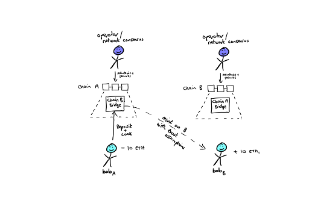

# Types of Scaling Solutions

Several options have been proposed and worked on for scaling Ethereum on a shorter time frame. Some of these efforts are coming to fruition now and are worth considering. The main tradeoffs for choosing a scaling solution involve considerations of <b>throughput</b> vs. <b>security</b> vs. <b>usability</b>. The following are some solutions currently in the works at various stages: 

<i>Note: This section draws heavily on the work on Faina Shalts, engineer at Truffle (and Bootcamp alumni!) as well as from <a href="https://ethereum.org/en/developers/docs/scaling/" target="_blank" rel="noopener noreferrer">Ethereum.org</a></i>

## Rollups

In general, on Rollup Layer 2 solutions,  transactions are submitted to L2 nodes instead of L1, and batched. Eventually they are put on L1 and no longer mutable. L2 nodes are Ethereum compatible, independent blockchains. All state and execution is handled in L2: Signature verification, Contract execution, etc. The L1 only stores transaction data. 

Note: the terminology here can be challenging but Pranay Mohan of Celo Network <a href="https://mobile.twitter.com/pranaymohan/status/1409195144360992773" target="_blank" rel="noopener noreferrer">proposes</a> we think of rollups as shard clients and the rollup contracts as on-chain light clients.

There are two major kinds of Rollups: Optimistic Rollups and ZK-Rollups.

### Optimistic Rollups

Optimistic Rollups use a sidechain that sits in parallel to the mainnet Ethereum chain. They don’t do any computation by default: after a transaction, the Optimistic Rollup L2s proposes a new state to the L1 mainnet, or “notarizes” the transaction. L2 Transactions written to L1 mainnet as <b>calldata</b>.

The main mechanism that makes this work are <b>fraud proofs:</b> If a verifier notices a fraudulent transaction the Optimistic Rollup network will execute a fraud-proof and run the transaction’s computation using the available state data; the gas you need to run a fraud proof is reimbursed.

- **Pros** Anything you can do on L1 you can do with Optimistic Rollups because it is EVM and Solidity compatible. All transaction data is stored on the L1 chain, meaning it remains secure and decentralized.

- **Cons** Long wait times for on-chain transactions due to potential fraud challenges. Potentially vulnerable to attacks if the value in an optimistic rollup exceeds the amount in an operator’s bond.

Optimistic Roll-ups are currently being built by <a href="https://optimism.io/" target="_blank" rel="noopener noreferrer">Optimistic PBC,</a> <a href="https://offchainlabs.com/" target="_blank" rel="noopener noreferrer">Arbitrum,</a> <a href="https://fuel.sh/" target="_blank" rel="noopener noreferrer">Fuel Network,</a> <a href="https://www.immutable.com/" target="_blank" rel="noopener noreferrer">ImmutableX,</a> <a href="https://www.deversifi.com/" target="_blank" rel="noopener noreferrer">Deversifi</a> and <a href="https://cartesi.io/" target="_blank" rel="noopener noreferrer">Cartesi</a>

### Zero-Knowledge / ZK-Rollups

As we mentioned earlier in the section on Zero-Knowledge proofs, ZKPs can compress a larger amount of computation or verification into a single operation. ZK-Rollups bundle hundreds of transfers that occur on the ZKP Rollup L2 into a single L1, mainnet transaction via a smart contract located on L1. From the data submitted the smart contract can verify all the transfers that are included. 

The main benefit over an Optimistic rollup is that you get finality much faster, usually within a couple of hours though it could be made faster still at an increased gas price.

Critically, you don’t need all the data to verify the transactions, just the zero-knowledge proof. Transactions are written to Ethereum as calldata, to reduce gas.

- **Pros** Minimal delay, less vulnerable to economic attacks
- **Cons** Currently available ZK-Rollup chains are not compatible with the EVM as validity proofs are intense to compute and have to build their own language to process. However, there is some work on building Solidity to ZKP language transpilers, like <a href="https://medium.com/nethermind-eth/warp-your-way-to-starknet-ddd6856875e0" target="_blank" rel="noopener noreferrer">this one for Cairo,</a> Starknet's ZKP language. There is also ongoing work to create EVM-compatible Zk-Rollups.

We're seeing the emergence of two major types of ZK Rollups: Those that run their own VM (virtual machine) and those that are EVM compatible. 

#### Non-EVM ZK-Rollups

<a href="https://starknet.io/" target="_blank" rel="noopener noreferrer">StarkNet</a> is the best example of a ZK Rollup that uses its own virtual machine, called the StarkNet OS. StarkNet uses the Cairo programming language both for its infrastructure and for writing StarkNet contracts.

- **Pros** 
  - Cairo language logic is converted to STARK proofs, enabling a significant increase of throughput. 
  - Cairo also allows for a new paradigm, "provable computation" , allowing programs to prove they have been executed without having to be re-run. *This is a key technological advancement in the blockchain space and allows for really interesting applications like private transactions or complicated logic that doesn't need to be re-run in full to update the Ethereum state).* 
  - StarkNet is efficient, fast, and very scalable. 
  - StarkNet is already live on mainnet and the ecosystem is growing quickly. <a href="https://blog.infura.io/post/starknet-now-available-to-all-infura-users" target="_blank" rel="noopener noreferrer"> Infura recently released initial StarkNet support </a>
- **Cons**
  - Learning a new smart contract language can be challenging.
  - Ecosystem tools are still maturing to help developers get started.
  - Existing tooling either does not work or needs significant finessing to get to a point where it is compatible

Luckily, it is also possible to use StarkNet with Solidity, by employing a <a href="https://medium.com/nethermind-eth/warp-your-way-to-starknet-ddd6856875e0" target="_blank" rel="noopener noreferrer">transpiler</a>.

#### EVM Compatible ZK-Rollups: The Elusive zkEVM

ZK Rollups that are EVM compatible are a complicated effort, largely because the Ethereum Virtual Machine was built to optimize bytecode manipulation, while ZK proofs require mathematical manipulation to perform their function. 

Over the past several months multiple zkEVM solutions have made headway but we are still waiting to see one on mainnet. The most notable zkEVM projects at this time are <a href="https://scroll.io/" target="_blank" rel="noopener noreferrer"> Scroll </a>, <a href="https://zksync.io/" target="_blank" rel="noopener noreferrer">zkSync </a> (going live Oct 2022), and <a href="https://polygon.technology/solutions/polygon-hermez/" target="_blank" rel="noopener noreferrer"> Polygon Hermez</a>. 

- **Pros** 
  - Once live, zkEVM solutions will allow the best of all worlds: Zero-Knowledge proofs and Ethereum/Solidity compatibility.
- **Cons**
  - There are currently no live solutions on mainnet. zkSync seems as though it will be first to mainnet but it is unlikely that it will be a fully EVM-compatible solution initially. Be wary of marketing gimmicks around EVM compatibility!

For a detailed discussion of the different types of zkEVMs we are likely to see soon, take a look at <a href="https://vitalik.ca/general/2022/08/04/zkevm.html" target="_blank" rel="noopener noreferrer"> Vitalik's article about this topic. </a>

ZK-Rollups are attractive for simple, high-volume exchanges. As the ecosystem grows, we are likely to see a lot of innovation around the types of blockchain applications that can be served via ZK-Rollups. Currently using this sort of rollup: <a href="https://loopring.io/#/" target="_blank" rel="noopener noreferrer">Loopring</a>, <a href="https://starkware.co/" target="_blank" rel="noopener noreferrer">Starkware,</a> <a href="https://matter-labs.io/" target="_blank" rel="noopener noreferrer">Matter Labs' zkSync,</a> <a href="https://aztec.network/" target="_blank" rel="noopener noreferrer">Aztec's ZK.Money network</a>

## Channels

Channels, also called Side Channels or State Channels, allow participants to transact a certain number of times off-chain (on the channel) while only submitting 2 transactions to the network on chain (basically, the start and stop of the channel).

Fundamentally for a channel to exist, participants must lock a portion of Ethereum’s state, like an ETH deposit, in a multisig contract. Locking state in this way opens up the channel, allowing for the off-chain transactions to occur. When the interaction is finished, one final L1 transaction is submitted, updating the network state based on the activity that occurred on the channel (mainly the rebalancing of funds between the participants).

Sidenote: State channels on Ethereum can be enforced through a concept known as counterfactual instantiation. Here's a technical, but concise, overview of counterfactual instantiation:

> Counterfactual instantiation is achieved by making users sign and share commitments to the multisig wallet. These commitments say that if the counterfactually instantiated contract were to be instantiated on-chain, the multisig wallet (which holds the state deposit) will look at the instantiated contract and transfer the appropriate state deposits based on the state of that contract.

On Ethereum, you can use the <a href="https://solidity-by-example.org/app/create2/" target="_blank" rel="noopener noreferrer">CREATE2</a> opcode to predetermine the address of a contract. This means you can make these commitments in a channel and, if you need to dispute something, either party can deploy that contract with the chain of valid commitments.

State Channel pros and cons (from <a href="https://ethereum.org/en/developers/docs/scaling/state-channels/" target="_blank" rel="noopener noreferrer">Ethereum.org</a>):
- <b>Pros</b> Instant withdrawal/settling on mainnet, high throughput, lower cost per transaction
- <b>Cons</b> Time and cost to set up and settle a channel. Funds must be locked up, participants need to periodically watch the network. Channels don’t support open participation.

Examples of state channels are <a href="https://connext.network/" target="_blank" rel="noopener noreferrer">Connext,</a> <a href="https://raiden.network/" target="_blank" rel="noopener noreferrer">Raiden Network,</a> and Bitcoin's <a href="https://lightning.network/" target="_blank" rel="noopener noreferrer">Lightning Network.</a>

## Sidechains

The terminology here can get a little tricky, so bear with us. Sidechains are essentially blockchain networks separate from your Layer 1 (for us, Ethereum). They are connected through a <a href="https://medium.com/@blockchain_simplified/bridging-the-gap-using-blockchain-bridges-26a75a874de3" target="_blank" rel="noopener noreferrer">bridge,</a> which allows state to be conveyed from one chain to the other.

We'll discuss this more in the crosschain and interoperability section, but essentially you'd use a chain that either has a consensus mechanism with a higher trust assumption (such as Proof of Authority) or some increased transaction throughput relative to your Layer 1. You would then be able to conduct transactions on that sidechain and, when you need to update the state (perhaps a user wishes to exit your network but wants to take their tokens), you can release it on your Layer 1.

Examples of sidechains are <a href="https://skale.network/" target="_blank" rel="noopener noreferrer">SKALE</a> and <a href="https://www.xdaichain.com/" target="_blank" rel="noopener noreferrer">xDai.</a> 

## Conclusion

This concludes our overview of the kinds of scaling solutions available to us. It is by no means comprehensive, since the field is rapidly evolving. In the next section, we'll provide a basic rubric by which you can judge any Layer 2 or general scaling solution.

## Additional Material
- <a href="https://ethereum.org/en/developers/docs/scaling/" target="_blank" rel="noopener noreferrer">Wiki: Scaling (Ethereum.org)</a> Great overview of the topic, including the "pros and cons" of different solutions
- <a href="https://youtu.be/BgCgauWVTs0" target="_blank" rel="noopener noreferrer">Video: Layer 2 Scaling Explained (Finematics)</a>
- <a href="https://l2beat.com/" target="_blank" rel="noopener noreferrer">Dashboard: L2beat</a> A research and network dashboard showing the current level of activity on different networks.
- <a href="https://blog.infura.io/offchain-protocols-sidechains-and-rollups/" target="_blank" rel="noopener noreferrer">Article: Off-chain protocols: Sidechains and Rollups (Infura)</a>
- <a href="https://drive.google.com/file/d/1BdVQVX5cEJ2IDbCnfTAsyjlpU7IWUeB1/view" target="_blank" rel="noopener noreferrer">Slide Deck: Scaling Ethereum using Rollups and Sidechains</a> From the <a href="https://www.meetup.com/ethereum-engineering/events/277601273/" target="_blank" rel="noopener noreferrer">Engineering Ethereum meetup</a> and presented by Peter Robinson.
- <a href="https://forum.makerdao.com/t/a-multichain-strategy-and-roadmap-for-maker/8380" target="_blank" rel="noopener noreferrer">Article: Maker's roadmap for L2s</a> Discusses one major application's understanding and strategy for Layer 2 solutions.
- <a href="https://stonecoldpat.medium.com/a-note-on-bridges-layer-2-protocols-b01f8fc22324" target="_blank" rel="noopener noreferrer">Article: A Note on Bridges & Layer 2 Protocols (Patrick McCorry)</a> A discussion around different sorts of bridge technologies and considerations we should have when using them.
- <a href="https://www.youtube.com/watch?v=8bbBpa8usfk&t=272s" target="_blank" rel="noopener noreferrer">Video: How Layer 2 Addresses Barriers for Enterprise Building on Mainnet</a>

### Rollups
- <a href="https://vitalik.ca/general/2021/01/05/rollup.html" target="_blank" rel="noopener noreferrer">Article: An Incomplete Guide to Rollups (Vitalik Buterin)</a> A follow-up article to Buterin's <a href="https://ethereum-magicians.org/t/a-rollup-centric-ethereum-roadmap/4698" target="_blank" rel="noopener noreferrer">post on eth.research</a> entitled, "What would a rollup-centric ethereum roadmap look like?" and <a href="https://www.youtube.com/watch?v=wcCHlqgGSH4" target="_blank" rel="noopener noreferrer">here's a video version</a> of the article.
- <a href="https://ethresear.ch/t/rollup-diff-compression-application-level-compression-strategies-to-reduce-the-l2-data-footprint-on-l1/9975" target="_blank" rel="noopener noreferrer">Research: Compressing Data Using Rollups</a> A technical discussions around optimizing data compression for Rollups
<a href="https://mobile.twitter.com/bkiepuszewski/status/1411725611958247429" target="_blank" rel="noopener noreferrer">Thread: Rollup verification</a> A great walkthrough about how rollups conduct verification and how that verification can make it to Layer 1
- <a href="https://research.paradigm.xyz/rollups" target="_blank" rel="noopener noreferrer">Article: (Almost) Everything You Need to Know About Optimistic Rollup (Paradigm)</a> Really good technical overview of optimistic rollup tech
- <a href="https://tracer.finance/radar/arbitrum-in-under-10/" target="_blank" rel="noopener noreferrer">Artilce: Arbitrum in under 10 minutes</a> An explainer of Arbitrum, an optimistic rollup.
- <a href="https://www.youtube.com/watch?v=l4jccXoqLGM" target="_blank" rel="noopener noreferrer">Video: Scaling Ethereum with Rollups</a> John Adler from Fuel Labs discusses the concepts behind optimistic rollups
- <a href="https://medium.com/nethermind-eth/warp-your-way-to-starknet-ddd6856875e0" target="_blank" rel="noopener noreferrer">Article: Warp Your Way to Starknet</a> Early example of a Solidity to Cairo compiler
- <a href="https://medium.com/yagi-fi/provable-vs-composable-computation-or-why-cairo-will-supersede-solidity-6b00e69bfc9e" target="_blank" rel="noopener noreferrer"> Article: Provable computation and the Cairo Language </a>
- <a href="https://starkware.co/tech-stack/" target="_blank" rel="noopener noreferrer"> StarkWare Website With Details on StarkNet and Cairo </a>
- <a href="https://l2beat.com/scaling/tvl/" target="_blank" rel="noopener noreferrer"> Website Providing Details On Currently Available Rollup Solutions</a>
- <a href="https://vitalik.ca/general/2022/08/04/zkevm.html" target="_blank" rel="noopener noreferrer"> Article: Vitalik on zkEVMs </a>
    

### State Channels
- <a href="https://education.district0x.io/general-topics/understanding-ethereum/basics-state-channels/" target="_blank" rel="noopener noreferrer">Article: State Channel Basics</a>
- <a href="https://medium.com/statechannels/counterfactual-generalized-state-channels-on-ethereum-d38a36d25fc6" target="_blank" rel="noopener noreferrer">Article: Generalized State Channels on Ethereum</a> Goes into more detail about counterfactual instantiation.
- <a href="https://www.jeffcoleman.ca/state-channels/" target="_blank" rel="noopener noreferrer">Article: State Channels</a> Basic overview of the technology from 2015. Good evergreen concepts here.
- <a href="https://medium.com/spankchain/a-state-channels-adventure-with-counterfactual-rick-part-1-ce68e16252ea" target="_blank" rel="noopener noreferrer">Article Series: A State Channels Adventure</a> A potentially NSFW walkthrough of the physics behind counterfactual instantiation.
- <a href="https://solidity-by-example.org/app/create2/" target="_blank" rel="noopener noreferrer">Tutorial: Precompute Contract Addresses with CREATE2</a> A great code tutorial from Solidity by Example showing how to find a predetermined address for a contract, the backbone of counterfactual instantiation.
- <a href="https://blog.statechannels.org/introducing-web3torrent/" target="_blank" rel="noopener noreferrer">Code Demo: Web3 Torrent</a> A Proof of Concept from StateChannels.org, a torrenting network built using state channels (or a subset of state channels they call <a href="https://blog.statechannels.org/virtual-channels/" target="_blank" rel="noopener noreferrer">virtual channels</a>).

