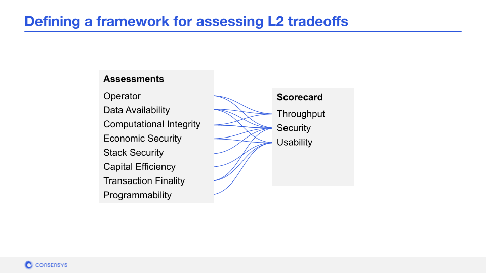
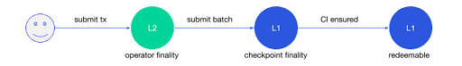

## Rubric for Analyzing Scalability Solutions

The explosion in demand for sophisticated, bleeding-edge cryptographic products leads to a common predicament in blockchain. For those not deeply familiar with these projects and their associated tech, it’s extremely difficult—if not intimidating—to decide which is best and safest to use. Not to mention the rate of change of L2 documentation and the L2 frameworks themselves.

However, there are trade-offs to using scalability solutions. Trade-offs to the blockchain primitives we discussed earlier in the course. With this section, we will continue propose a framework to assist the analysis of L2 projects. It’s meant to help the reader develop an intuition for approaching a possible L2 solution for their various needs and circumstances. But it's also meant to highlight the trade-offs a scalability approach requires against our main blockchain network layer.

This framework has eight assessment variables (<b>Operator</b>, <b>Data Availability</b>, <b>Computational Integrity</b>, <b>Economic Security</b>, <b>Stack Security</b>, <b>Capital Efficiency</b>, <b>Transaction Finality</b>, and <b>Programmability</b>). We use these assessment variables to score a project in three areas: <b>Throughput</b>, <b>Security</b> and <b>Usability</b>. See how the variables contribute to each area below:

To be clear, these variables are not exhaustive. We haven’t included network costs, users costs or the downstream network effects a Layer 2 inherits from the underlying Layer 1 blockchain. Again, the idea of the framework is not necessarily to be comprehensive but rather help develop an intuition for the benefits and trade-offs of different L2 solutions.

Be sure to keep in mind the mental model around distributed consensus we learned earlier, it will come in handy. You can understand this lesson as a deeper development of the roles and features we discussed there.

## L2 Operator  
An Operator describes an actor within the L2 system responsible for executing state change within the L2 network. This includes facilitating entrances and exits to the L2 system as well as processing and authorizing transactions within the L2 system.

Some considerations when analyzing an operator:
- <b>Is an Operator required in the L2 network?</b>
- <b>Understanding Their Role:</b> Who or what is the operator? What is the Operator responsible for? What is the motivation to become an Operator? 
- <b>Trust Assumptions:</b> Who can become an Operator? What power does an Operator have? What consensus rules do they abide by? What trust assumptions must users make about the Operator?
- <b>Risk Exposure:</b> After answering the above questions, what risks do we need to consider? For example, how does the network respond when an Operator disappears, misbehaves. How does the system respond to L1 attacks or mass exit?

## Computational Integrity 
Computational Integrity (CI) is a key property of network security. CI seeks to ensure that the code for a given computation runs exactly as intended and therefore the state transition outputs are correct. Let’s unpack this.

The operation of each state advancement in a network can be simplified to:

CI ensures that the data in the network is correct, because the code that advances the state of the network has run correctly and without manipulation by the operator actually performing the computation. 

It is enforced through two primary methods:

- <b>Crypto-Economic Incentives</b> This could take the form of incentivised consensus where the network can only advance if all network participants run and post the same computation resulting in a critical mass of agreement. It could also take the form of incentivised watchtowers where the network trusts third-parties to verify CI from operators and, in the case of misbehavior, trigger a network failsafe.
- <b>Zero-Knowledge Cryptography</b> Building mathematical assurances into the network’s code execution model making integrity provable and verifiable

## Data Availability
This refers to the availability and immutability of intermediary state transition data. To go back to our state advancement of the network diagram:

State transition data is a list of all <b>intermediary state changes,</b> alongside proof they are valid (e.g. aggregate signatures, ZKPs). Once a user’s assets enter a L2, they are subject to the security properties of the L2, and therefore data availability is key to being able to verify that what happens to the user’s assets within the L2 is valid and correct.

## Economic Security
Economic Security refers to the operational security that upholds the financial integrity of the L2 system. It can be rooted in two different areas:

- <b>Inherited Economic Security from L1</b> This can be a strong inheritance where L2 assets are ultimately secured in contracts on L1 and L2 state transitions are checkpointed on L1. It can also be a weak inheritance, where L2 assets are ultimately secured on L1, but computational integrity and data availability are not secured by L1 
- <b>Security Inherent to the Operator</b> The characteristics of the L2 Operators may lend additional security, for example in Proof of Stake. Keep in mind, consensus methods such as Proof of Authority lend no inherent security beyond basic trust in the Operators.

## Stack Security
Stack Security is more of a passive security that comes from having a battle-hardened software stack. It includes aspects like:

- <b>Shared Cryptographic Primitives</b> Or primitives developed and hardened over decades of research and application. Compare this with newer cryptographic features that may not currently enjoy widespread adoption. For example, Elliptic Curve Cryptography versus newer ZKP methods.
- <b>Shared Technology Stack</b> Investments into core technology stack and open-source network effects. Examples include the Go-Ethereum implementation, Solidity compiler and EVM runtime maintained by hundreds of contributors over time.
- <b>Shared Ancillary Tooling</b> Mature development environments and workflows, such as Truffle, as well as security tooling, such as EVM bytecode formal verification, Solidity static analysis and fuzzers.
- <b>Shared ecosystem and aligned security objectives</b> The powerful network effects delivered by open-source development and the community that forms around it. Includes security gathered from audits, formal verification development, and institutional knowledge of attack vectors and history.

## Capital Efficiency
This refers to the cost and utility of capital held in an L2 network over time. L2 capital efficiency points that should be considered include:

1. Capital must be locked into an L1 contract in order to move into the L2. Locking capital can come at high opportunity cost depending on the lockup times. Some systems require a lockup time of minutes, others require weeks. 
2. The real cost of capital can be discounted depending on the utility available within the network. If the user can access great utility, the opportunity costs of lockup can be lower even if their capital is locked up. 
3. Fees for rapid exits, facilitated by liquidity providers (LPs), will be determined by real cost of capital. We'll discuss this more in our live session, "Problems Still to Be Solved in Scalability."

## Transaction Finality
Transaction finality on L1s is essentially full redeemability of assets. For L2s, there are multiple phases of finality: Operator finality, <b>Checkpoint finality</b> and <b>L1 finality.</b> The relationship of these three within a generic L2 is shown below:

A user submitting a transaction within an L2 gets near-instantaneous finality when their transaction has been processed by an Operator. The user does not necessarily have to wait for L1 redeemability, rather they can use the <b>Operator Finality</b> as proof to exit via a Liquidity Provider. 

The Operator periodically submits a batch of L2 transactions and the subsequent state changes to L1. These submissions represent <b>Checkpoint finality.</b> The assets are not redeemable on L1 yet, but the data proving ownership of those assets are now on L1. This should give the user a much higher confidence in their assets’ eventual redemption.

At some point, the computational integrity of all those submitted L2 state transitions is verified on L1. Once that occurs, we have <b>L1 finality</b> and the user’s assets are redeemable on L1.

## Programmability
Programmability at the L2 layer is important. Programmability is the key feature of  Ethereum. Transactions become a canvas for innovation compared to the more limited execution environment like Bitcoin’s Script.

L2 projects that reuse the Ethereum stack benefit from the collective investment into security, developer tools, community support and knowledge of stack, languages, gotchas and failure modes.

Zero-knowledge proof (ZKP)-powered L2s are forcing innovation in the programmability arena. ZKP execution environments have traditionally been limited in their capacity due to the nature of their circuits. New zk-circuit-friendly languages are emerging (Gnark, Cairo, Zinc) and bringing greater programmability; however, they require new virtual machines with little proven track record and nascent community support.

Extending programmability at the L2 layer will provide an opportunity to experiment with low-level innovation and EIP protocol-level changes like account abstraction, native meta-transaction, and different computation models or runtimes.

## Conclusion

This was a very technical discussion of the rubric for analyzing L2 or scalability solutions. We hope it gives you a sense of the trade-offs each solution provides. If you'd like a less-technical approach to this same rubric, you can see the article below.

## Additional Material

- <a href="https://consensys.net/blog/blockchain-explained/four-questions-to-judge-any-layer-2-scaling-solution/" target="_blank" rel="noopener noreferrer">Article: For Questions to Judge Any Layer 2 Scaling Solution</a> A less-technical, more general-audience article discussing the same paradigm outlined in this lesson
- <a href="https://medium.com/matter-labs/evaluating-ethereum-l2-scaling-solutions-a-comparison-framework-b6b2f410f955" target="_blank" rel="noopener noreferrer">Article: Evaluating Ethereum L2 Scaling Solutions: A Comparison Framework</a> Another framework proposal from Matter Labs
- <a href="https://gourmetcrypto.substack.com/p/layer-2-for-beginners" target="_blank" rel="noopener noreferrer">Article: Layer-2 for Beginners (Ali Atiia)</a> Or How to Spot a Sidechain Charlatan and Keep Your Penny Safe
- <a href="https://l2beat.com/scaling/tvl/" target="_blank" rel="noopener noreferrer"> L2Beat's Website Allows Deeper Dives Into Many Layer 2 Protocols</a>
