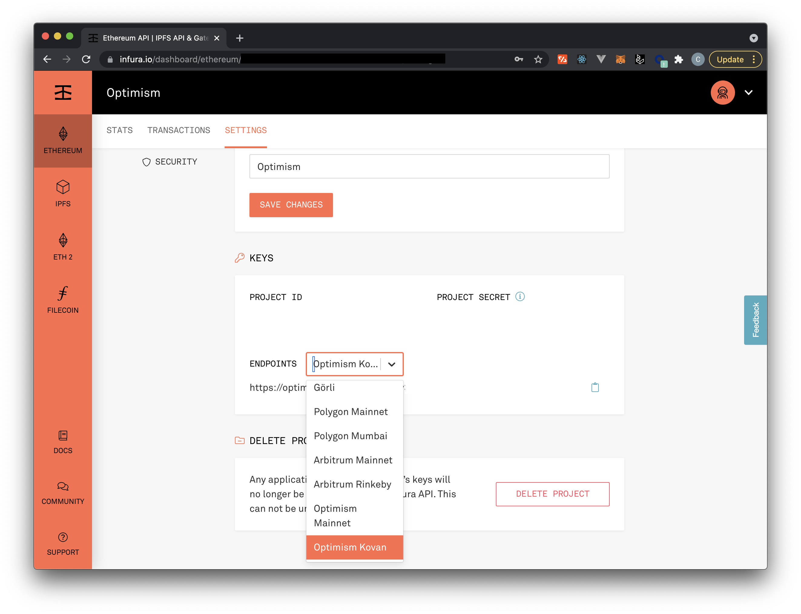

# Optimism

Optimistic rollups are a great way to leverage all the tooling you've learned so far because they are generally compatible with the Ethereum Virtual Machine.

In the next few lessons, we're going to walk through some examples of how to actually use this new technology.

**Again, we want to stress how new this technology is. You should be extremely cautious when working with it and be aware that documentation may not be up to date.**

## Basic Mechanics

To create a sandboxed environment which guarantees deterministic smart contract execution between L1 and L2, Optimism uses an **Optimism Virtual Machine,** which replaces context-dependent EVM opcodes with their OVM counterparts. See a complete comparison of <a href="https://community.optimism.io/docs/protocol/evm-comparison.html" target="_blank" rel="noopener noreferrer">the OVM vs EVM here.</a>

To accommodate this change, Optimism had to have their own compiler. They ended up forking `solc` and changed ~500 lines. Beware a potential gotcha: a contract compiled with the Optimism Solidity Compiler ends up bigger than it was, meaning that contracts near the 24KB limit must be refactored since they need to be executable on the mainnet as well as Optimism.

Accounts on the Optimism Chain "are redeployable contracts layer-2 contracts which can represent a user and provide a form of 'account abstraction'." (<a href="https://community.optimism.io/docs/protocol/protocol.html#account-contracts" target="_blank" rel="noopener noreferrer">source</a>)

To put it all together, the Optimism Rollup chain:
- Uses the OVM as its runtime/state transition function
- Uses Optimistic Geth as the L2 client with single sequencer
- Has solidity smart contracts deployed on Ethereum mainnet for data availability and dispute resolution/fraud proofs (you can read more about these "bridge" contracts <a href="https://community.optimism.io/docs/protocol/protocol.html#bridge-contracts" target="_blank" rel="noopener noreferrer">here</a>)

Top-level summary of how fraud proofs work: 
1. Somebody will dispute a transaction if they disagree
2. They’ll publish all related state on Ethereum including a Merkle proofs for each piece of state
3. They will re-execute the state transition on-chain
4. They will be rewarded for correctly disputing, the malicious sequencer will get slashed, and the invalid state roots will be pruned guaranteeing safety

This is all implemented in Optimism’s Fraud Prover service which is packaged with an optimistic-geth instance in a docker compose image. You can read more about the Transaction Challenge contracts <a href="https://community.optimism.io/docs/protocol/protocol.html#transaction-challenge-contracts" target="_blank" rel="noopener noreferrer">here.</a>

## Optimism Example

We'll be walking through the Optimism Truffle Box to show you how to deploy our SimpleStorage smart contract from previous lessons to Optimism!

After this example, you will be able to compile, migrate, and test Optimistic Solidity code against a variety of Optimism test networks.

### Requirements

- Node.js 10.x or later
- NPM version 5.2 or later
- <a href="https://docs.docker.com/get-docker/" target="_blank" rel="noopener noreferrer">docker</a>, version 19.03.12 or later
<a href="https://docs.docker.com/compose/install/" target="_blank" rel="noopener noreferrer">docker-compose</a>, version 1.27.3 or later
- Recommended Docker memory allocation of >=8 GB.

You'll also need to setup an Optimism project from your Infura account. You don't have to update your account, right now access is being offered at the "core" level for free up to 100,000 daily requests. You must enable the Optimistic Ethereum ADD-ON under the billing section under Manage Add-Ons in your Infura account Settings for the API requests to work properly. When setting up your project, be sure to select the "Ethereum" network. Then, under settings, select the "Optimism Kovan" testnet, as shown below:

You'll also need to have Kovan test ETH for the project if you'd like to run it on a public testnet. You can get some from the <a href="https://github.com/kovan-testnet/faucet" target="_blank" rel="noopener noreferrer">Kovan testnet faucet</a>, the <a href="https://app.mycrypto.com/faucet" target="_blank" rel="noopener noreferrer">MyCrypto faucet</a>, or <a href="https://faucets.chain.link" target="_blank" rel="noopener noreferrer">Chainlink's faucet</a>.

Once you have Kovan ETH, you'll need to bridge it to Optimism. After getting Kovan ETH, follow these steps:

1. Add Optimism Ethereum as a Custom RPC to your Metamask wallet, using <a href="https://community.optimism.io/docs/users/metamask.html#connecting-manually" target="_blank" rel="noopener noreferrer">the steps here,</a> except set the RPC URL to <code>https://optimism-kovan.infura.io/v3/" + infuraKey</code>
2. Go to <a href="https://gateway.optimism.io/" target="_blank" rel="noopener noreferrer">this site</a> and bridge your Kovan ETH to Optimism Kovan ETH
3. Ensure that your <code>optimistic_kovan</code> network in <code>truffle-config.ovm.js</code> is connected to your Optimism Kovan wallet.
<i>Note: You may get an error about your fee being too low when attempting to deploy to Optimistic Kovan. To bypass this error, you may need to increase the gas value in the optimistic_kovan network configuration in truffle-config.ovm.js to the value the error indicates. Gas price should be set at the transaction level, like so: <code>{ gasPrice: 15000000 }</code>.</i>

Note, we'll also be building it locally so if you're having trouble finding Kovan ETH, you can start by running it locally.

Let's get started! (For more detail, you can find the tutorial this lesson is based on <a href="https://www.trufflesuite.com/boxes/optimism" target="_blank" rel="noopener noreferrer">here.</a>)

## Setup

From a new directory, `unbox` the Optimism box:

<pre>truffle unbox optimism</pre>

You will need at least one mnemonic to use with the network. The <code>.dotenv</code> npm package has been installed for you, and you will need to create a <code>.env</code> file for storing your mnemonic and any other needed private information.

The <code>.env</code> file is ignored by git in this project, to help protect your private data. In general, it is good security practice to avoid committing information about your private keys to github. The truffle-config.ovm.js file expects a <code>GANACHE_MNEMONIC</code> and a <code>KOVAN_MNEMONIC</code> value to exist in <code>.env</code> for running commands on each of these networks, as well as a default <code>MNEMONIC</code> for the optimism network we will run locally.

If you are unfamiliar with using <code>.env</code> for managing your mnemonics and other keys, the basic steps for doing so are below:

Use touch <code>.env</code> in the command line to create a <code>.env</code> file at the root of your project.
Open the <code>.env</code> file in your preferred IDE
Add the following, filling in your own Infura project key and mnemonics:
<pre>
MNEMONIC="candy maple cake sugar pudding cream honey rich smooth crumble sweet treat"
INFURA_KEY="<Your Infura Project ID>"
GANACHE_MNEMONIC="<Your Ganache Mnemonic>"
KOVAN_MNEMONIC="<Your Kovan Mnemonic>"
</pre>
<i>Note: the value for the <code>MNEMONIC</code> above is the one you should use, as it is expected within the local Optimism Ethereum network we will run in this Truffle Box.</i>

As you develop your project, you can put any other sensitive information in this file. You can access it from other files with require('dotenv').config() and refer to the variable you need with <code>process.env['<YOUR_VARIABLE>']</code>.

### Some Differences

You may notice some differences in the workflow from our typical Truffle environment. For example, a new configuration file exists in this project: <code>truffle-config.ovm.js</code>. This file contains a reference to the new file location of the <code>contracts_build_directory</code> and <code>contracts_directory</code> for Optimism contracts and lists several networks for running the Optimism Layer 2 network instance.

Another difference: When you compile or migrate, the resulting <code>json</code> files will be at <code>build/optimism-contracts/</code>. This is to distinguish them from any Ethereum contracts you build, which will live in <code>build/ethereum-contracts</code>. As we have included the appropriate <code>contracts_build_directory</code> in each configuration file, Truffle will know which set of built files to reference.

## Compiling

The SimpleStorage.sol contract code is already in both the <code>ethereum</code> and <code>optimism</code> directories. To compile using the Optimism Virtual Machine compiler, run:

<pre>npm run compile:ovm</pre>

As we mentioned earlier, the OVM and EVM compiler are *slightly* different, so keep an eye out for any issues or errors.

## Migration

Now that we've compiled the contract for Optimism, we can migrate it to an Optimism Layer 2 network. First, let's just try to our local Ganache, which will be almost similar to a normal Ethereum ganache instance:

<pre>npm run migrate:ovm --network=ganache</pre>

This may be a bit underwhelming! However, if we have loaded in our Infura Optimism Kovan network endpoint and have enough Optimism Kovan eth in the wallet tied to the `.env` mnemonic, we can also run:

<pre>npm run migrate:ovm --network=optimistic_kovan</pre>

*Please note: as of early September, the Optimism box is having issues with gas prices on Kovan network. Local or Mainnet Optimism deployment may be better.*

Like standard Truffle, if you would like to migrate previously migrated contracts on the same network, you can run <code>truffle migrate --config truffle-config.ovm.js --network=(ganache | optimistic_ethereum | optimistic_kovan)</code> and add the <code>--reset</code> flag.

Following the above steps should allow you to deploy to the Optimism Layer 2 chain. This is only the first step! Once you are ready to deploy your own contracts to function on Layer 1 Ethereum using Layer 2 Optimism, you will need to be aware of the ways in which <a href="https://community.optimism.io/docs/developers/bridge/standard-bridge.html" target="_blank" rel="noopener noreferrer">Layer 1 and Layer 2 interact in the Optimism ecosystem.</a>

Furthermore, keep an eye out for new developments in Truffle tooling to assist with bridging L1-L2 data and execution. 

Please note that, at this moment, Optimism has a whitelist of applications that are allowed to go from Optimism to Ethereum mainnet. <a href="https://community.optimism.io/docs/developers/l2/deploy.html" target="_blank" rel="noopener noreferrer">You can learn more about that here.</a>

## Additional Material
- <a href="https://optimism.io" target="_blank" rel="noopener noreferrer">Optimism website</a>
- <a href="https://community.optimism.io/docs/" target="_blank" rel="noopener noreferrer">Docs: Optimism</a> Great documentation for different audiences, whether you want to learn about the infrastructure or deploy dapps.
- <a href="https://github.com/ethereum-optimism/optimism-tutorial/blob/main/README.md" target="_blank" rel="noopener noreferrer">Tutorial: Optimism Beginner Tutorial</a>
- <a href="https://community.optimism.io/docs/developers/l2/deploy.html" target="_blank" rel="noopener noreferrer">Docs: Whitelisting on Optimism</a>
