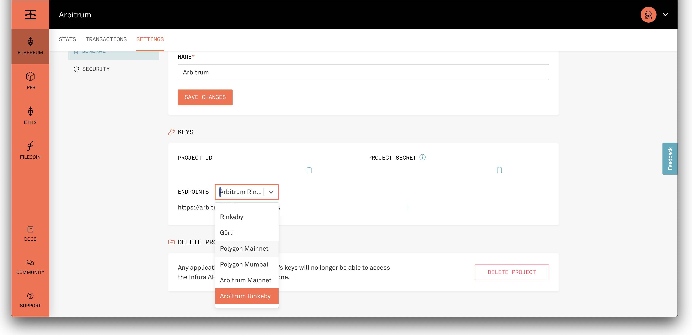

# Arbitrum Example

In this lesson, we're going to walkthrough setting up a development environment for the optimistic rollup protocol <a href="https://developer.offchainlabs.com/" target="_blank" rel="noopener noreferrer">Arbitrum,</a> built by Offchain Labs.

As we've discussed before, optimistic rollups offer an easier path to scaling in certain situations since they leverage much of the same toolkit as EVM development. Out of the box, Arbitrum supports <a href="https://developer.offchainlabs.com/docs/solidity_support" target="_blank" rel="noopener noreferrer">Solidity</a> as well as <a href="https://developer.offchainlabs.com/docs/frontend_integration" target="_blank" rel="noopener noreferrer">Truffle, Hardhat, The Graph, etc.</a> You can see the differences between Ethereum and Arbitrum <a href="https://developer.offchainlabs.com/docs/differences_overview" target="_blank" rel="noopener noreferrer">here.</a>

Like Optimism, Arbitrum's consensus layer is a dispute-based one, called a Multi-Round Interactive Optimistic Rollup protocol. Anyone can monitor or submit disputes on the Arbitrum chain, Read more about the protocol <a href="https://developer.offchainlabs.com/docs/Rollup_Protocol" target="_blank" rel="noopener noreferrer">here</a> and how to run a validator <a href="https://developer.offchainlabs.com/docs/inside_arbitrum#validators" target="_blank" rel="noopener noreferrer">here.</a>

As of now, Arbitrum has limited functionality in terms of porting assets from L1 >> L2 and vice versa. See its capabilities in the tutorials listed <a href="https://developer.offchainlabs.com/docs/tutorials" target="_blank" rel="noopener noreferrer">here.</a>

**Again, we want to stress how new this technology is. You should be extremely cautious when working with it and be aware that documentation may not be up to date.**

The requirements and setup for Arbitrum are very similar to the previous lesson on Optimism, except that Arbitrum's testnet is running on Rinkeby while Optimism's is on Kovan. We'll also be using our <code>SimpleStorage.sol</code> contract as a generic stand-in for your dapp's contract. Feel free to swap it out!

### Requirements

- Node.js 10.x or later
- NPM version 5.2 or later
- <a href="https://docs.docker.com/get-docker/" target="_blank" rel="noopener noreferrer">docker</a>, version 19.03.12 or later
<a href="https://docs.docker.com/compose/install/" target="_blank" rel="noopener noreferrer">docker-compose</a>, version 1.27.3 or later
- Recommended Docker memory allocation of >=8 GB.

You'll also need to setup an Arbitrum project on your Infura account. You don't have to update your account, right now access is being offered at the "core" level for free up to 100,000 daily requests. You must enable the Arbitrum Rollup ADD-ON under the billing section under Manage Add-Ons in your Infura account Settings for the API requests to work properly. When setting up your project, be sure to select the "Ethereum" network. Then, under settings, select the "Arbitrum Rinkeby" testnet, as shown below:



You'll also need to have Rinkeby test-ETH for the project if you'd like to run it on a public testnet. Follow the steps on the Rinkeby testnet faucet <a href="https://www.rinkeby.io/#faucet" target="_blank" rel="noopener noreferrer">here</a> to get some.

Once you have Rinkeby test-ETH, you'll need to bridge it to Arbitrum testnet. Follow these steps:

1. Add Arbitrum Ethereum as a Custom RPC to your Metamask wallet, using <a href="https://developer.offchainlabs.com/docs/public_testnet#connecting-to-the-chain" target="_blank" rel="noopener noreferrer">the steps here,</a> except set the RPC URL to <code>https://arbitrum-rinkeby.infura.io/v3/" + infuraKey</code>
2. Go to <a href="https://bridge.arbitrum.io/" target="_blank" rel="noopener noreferrer">this site</a> and bridge your Rinkeby ETH to Arbitrum Rinkeby ETH
3. Ensure that your <code>arbitrum_testnet</code> network in <code>truffle-config.arbitrum.js</code> is the mnemonic associated with your Arbitrum Rinkeby MetaMask wallet we just bridged.

Let's get started! (For more detail, you can find the tutorial this lesson is based on <a href="https://www.trufflesuite.com/boxes/arbitrum" target="_blank" rel="noopener noreferrer">here.</a>)

## Setup

From a new directory, `unbox` the Arbitrum box:
<pre>truffle unbox arbitrum</pre>

You will need at least one mnemonic to use with the network. The `.dotenv` npm package has been installed for you, and you will need to create a `.env` file for storing your mnemonic and any other needed private information.

The `.env` file is ignored by git in this project, to help protect your private data. In general, it is good security practice to avoid committing information about your private keys to github. The `truffle-config.arbitrum.js` file expects a `MNEMONIC` value to exist in `.env` for running commands on each of these networks, as well as a default `MNEMONIC` for the Arbitrum network we will run locally.

If you are unfamiliar with using `.env` for managing your mnemonics and other keys, the basic steps for doing so are below:

1. Use `touch .env` in the command line to create a `.env` file at the root of your project.
2. Open the `.env` file in your preferred IDE
3. Add the following, filling in your own Infura project key and mnemonics:

```
MNEMONIC="jar deny prosper gasp flush glass core corn alarm treat leg smart"
INFURA_KEY="<Your Infura Project ID>"
RINKEBY_MNEMONIC="<Your Rinkeby Mnemonic>"
MAINNET_MNEMONIC="<Your Arbitrum Mainnet Mnemonic>"
```

_Note: the value for the `MNEMONIC` above is the one you should use, as it is expected within the local arbitrum network we will run in this Truffle Box._

4. As you develop your project, you can put any other sensitive information in this file. You can access it from other files with `require('dotenv').config()` and refer to the variable you need with `process.env['<YOUR_VARIABLE>']`.

### Some Differences

You may notice some differences in the workflow from our typical Truffle environment. For example,a new configuration file exists in this project: `truffle-config.arbitrum.js`. This file contains a reference to the new file location of the `contracts_build_directory` and `contracts_directory` for Arbitrum contracts and lists several networks for running the Arbitrum Layer 2 network instance.

Please note, the classic `truffle-config.js` configuration file is included here as well, because you will eventually want to deploy contracts to Ethereum as well. All normal truffle commands (`truffle compile`, `truffle migrate`, etc.) will use this config file and save built files to `build/ethereum-contracts`. You can save Solidity contracts that you wish to deploy to Ethereum in the `contracts/ethereum` folder.

Another difference: When you compile or migrate, the resulting `json` files will be at `build/arbitrum-contracts/`. This is to distinguish them from any Ethereum contracts you build, which will live in `build/ethereum-contracts`. As we have included the appropriate `contracts_build_directory` in each configuration file, Truffle will know which set of built files to reference.

## Compiling

To compile your Arbitrum contracts, run the following in your terminal:

```
npm run compile:arbitrum
```

This script lets Truffle know to use the `truffle-config.arbitrum.js` configuration file, which tells Truffle where to store your build artifacts. When adding new contracts to compile, you may find some discrepancies and errors, so please remember to keep an eye on [differences between ethereum and Arbitrum](https://developer.offchainlabs.com/docs/differences_overview){target=_blank}.

## Migration

Now that we've compiled the contract for Arbitrum, we can migrate it to an Arbitrum Layer 2 network. First, let's just try to our local Ganache, which will be almost similar to a normal Ethereum ganache instance:

<pre>npm run migrate:arbitrum --network=ganache</pre>

This may be a bit underwhelming! However, if we have loaded in our Infura Arbitrum Rinkeby network endpoint and have enough Arbitrum Rinkeby ETH in the wallet tied to the `.env` mnemonic, we can also run:

<pre>npm run migrate:arbitrum --network=arbitrum_testnet</pre>

Like standard Truffle, if you would like to migrate previously migrated contracts on the same network, you can run `truffle migrate --config truffle-config.arbitrum.js --network=(arbitrum_local | arbitrum_testnet | arbitrum_mainnet)` and add the `--reset` flag.

Following the above steps should allow you to deploy to the Optimism Layer 2 chain. This is only the first step! Once you are ready to deploy your own contracts to function on Layer 1 Ethereum using Layer 2 Arbitrum, you will need to be aware of the ways in which <a href="https://developer.offchainlabs.com/docs/bridging_assets" target="_blank" rel="noopener noreferrer">Layer 1 and Layer 2 interact in the Arbitrum ecosystem.</a>

Furthermore, keep an eye out for new developments in Truffle tooling to assist with bridging L1-L2 data and execution.

## Additional Material
- <a href="https://developer.offchainlabs.com/docs/developer_quickstart" target="_blank" rel="noopener noreferrer">Docs: Arbitrum Quickstart</a>
- <a href="https://github.com/OffchainLabs/arbitrum-tutorials/tree/master/packages/demo-dapp-pet-shop" target="_blank" rel="noopener noreferrer">Tutorial: Truffle's Pet Shop Box on Arbitrum</a>
