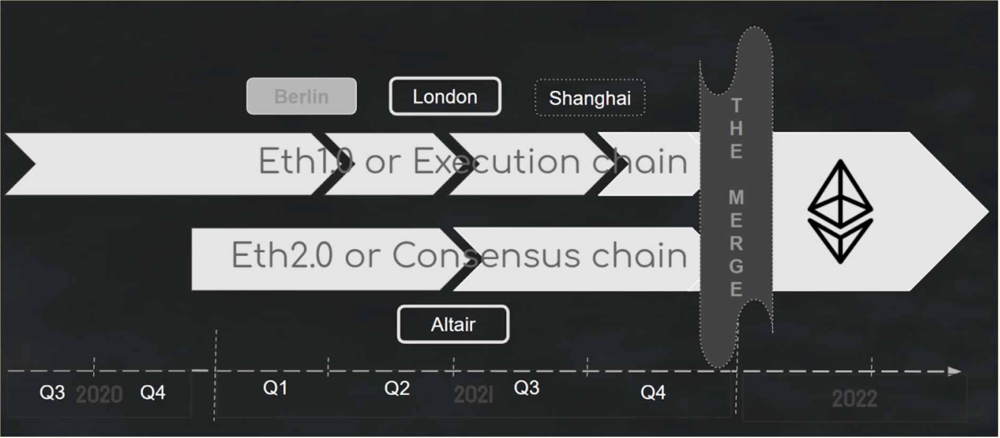

## Future Considerations

As this course launches, on September 2021, there have been some interesting developments towards an Eth1-Eth2 merge. We'll discuss a few of these here. Please note, this may change as it is currently be developed!

First, there is a <a href="https://github.com/ethereum/pm/blob/master/Merge/mainnet-readiness.md" target="_blank" rel="noopener noreferrer">"mainnet readiness"</a> checklist the Ethereum developers will be using to judge when the time is right for an Eth1-Eth2 merge.

Here's the rough timeline given by Tim Beiko in August 2021:

There's also been talk of using rollups as a way to help with the Merge. Essentially, the L2s will function as a sort of shard-like data layer. You can read more about that <a href="https://ethereum-magicians.org/t/a-rollup-centric-ethereum-roadmap/4698" target="_blank" rel="noopener noreferrer">here.</a>

## Rayonism Network

In March 2021, as part of ETHGlobal Scaling hackathon, a group of Ethereum 2.0 developers tried to create a merge testnet. Known as <a href="https://rayonism.io/" target="_blank" rel="noopener noreferrer">Rayonism,</a> it was meant as a short-term proof of concept project to allow researchers to test certain assumptions being made about the Eth1-Eth2 merge. One of the features it meant to test was the notion of <b>time,</b> a particularly challenging issue with distributed networks, as we discussed earlier in the course.

The Rayonism testnet did run for a short period of time. You can checkout the Merge testnet tutorial they ran <a href="https://github.com/protolambda/mergenet-tutorial" target="_blank" rel="noopener noreferrer">here</a> (although it most likely will not work now!)

## Additional Materials
- <a href="https://youtu.be/pG8DPW64f-A" target="_blank" rel="noopener noreferrer">Video: What Happens after ETH1 and ETH2 merge? (Vitalik Buterin)</a>
- [Write-up from Merge Workshop in October 2021](https://consensys.net/blog/ethereum-2-0/an-update-on-the-merge-after-the-amphora-interop-event-in-greece/){target=_blank}
- <a href="https://ethereum-magicians.org/t/a-rollup-centric-ethereum-roadmap/4698" target="_blank" rel="noopener noreferrer">Forum: A Rollup-centric Ethereum Roadmap</a>
- <a href="https://github.com/ethereum/pm/blob/master/Merge/mainnet-readiness.md" target="_blank" rel="noopener noreferrer">GitHub: Mainnet Readiness Checklist</a>
- <a href="https://github.com/ethereum/consensus-specs/blob/dev/specs/merge/beacon-chain.md" target="_blank" rel="noopener noreferrer">GitHub: Eth1 and Eth2 Merge spec</a>
- <a href="https://rayonism.io/" target="_blank" rel="noopener noreferrer">Rayonism: a research and engineering testnet that combines Eth1-Eth2 Merge and Sharding</a>
