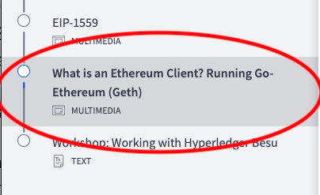
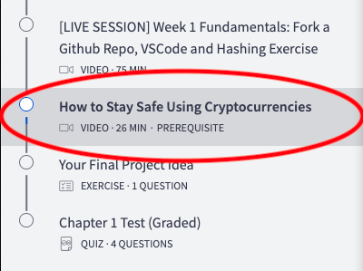

# Chapter 2 Study Guide

For folks who are interested in study groups, we’re providing a few resources you can walk through as a group. **These are just suggestions to get you started and you don’t have to follow them.**

_Please note: Some of these exercises may take more than one session!_ Don’t feel like you have to finish them all in one sitting. It might be helpful to start working on them separately, then come together when you’re all at a similar stopping point. You can share what you’ve gone through, some challenges you had, and help anyone still working through the exercises.

We’ll also be going through these examples / tutorials in the weekly sessions. We’ll be encouraging people to share their work there as well. You can also discuss these in the respective Discord channels. **Remember: Be kind to those in your group!**

## **1. Beginner: Setting Up Geth and / or Hyperledger Besu**

For this week’s session, we’re discussing some more aspects of cryptographic fundamentals but we’re also pivoting to discuss the Ethereum protocol. During the presentation on Friday and a demonstration next week, we’re going to talk about Ethereum clients.

Creating the environment on your local machine for an Ethereum client has a few gotchas so it’s good to start ahead of time. Also, this will help prepare you for the presentation on Friday where Tom will walk through setting up Hyperledger Besu, starting a local testnet and integrating MetaMask.

To set up Geth, please follow the instructions in this lesson in **Chapter 2, “What is an Ethereum Client? Running Go-Ethereum (geth)”:**

If you can’t access that lesson, it’s most likely because you haven’t completed this lesson in **Chapter 1, “How to Stay Safe Using Cryptocurrencies”** which you should do immediately:

You can do some prep for Friday’s presentation by [installing Hyperledger Besu](https://besu.hyperledger.org/en/stable/public-networks/get-started/install/binary-distribution/){target=\_blank}. Running Besu from a binary requires Java JDK 11+ to run, which can be a bit tricky. [You can install it from here](https://www.oracle.com/java/technologies/downloads/){target=\_blank}.

## 2. Technical: [Bitcoin Transactions](https://github.com/cooganb/bitcoin-whitepaper-exercises/blob/master/transactions/README.md){target=\_blank} and [Wallet Exercise](https://github.com/cooganb/bitcoin-whitepaper-exercises/blob/master/wallet/README.md){target=\_blank}

If you haven’t done this yet, [clone this repo of Bitcoin Whitepaper Exercises](https://github.com/cooganb/bitcoin-whitepaper-exercises){target=\_blank} and complete the Hashing exercise. If you need some help, you can watch the recording in Chapter 1: [**\[LIVE SESSION\] Week 1 Fundamentals: Fork a Github Repo, VSCode and Hashing Exercise**](https://courses.consensys.net/courses/take/blockchain-developer-bootcamp-registration-2021/lessons/27760900-live-session-week-1-fundamentals-fork-a-github-repo-vscode-and-hashing-exercise){target=\_blank}

In our session on Wednesday, we’ll walk through the verifyBlock(...) function from the hashing exercise and then move on to creating digital signatures using the OpenPGP library. **Please note: We are using an insecure version of OpenPGP (3.0.8 vs 5.0.0), this is only intended for educational purposes!**

## 3. Advanced: Start Exploring Other Ethereum Clients

Besides Hyperledger Besu and Geth, there are other Ethereum clients. If you’re interested in learning more, you can explore these two clients and their installation documentation:

- [Erigon](https://github.com/ledgerwatch/erigon){target=\_blank} Previously called “Turbogeth” Erigon recently formally became its own client.
- [OpenEthereum AKA Parity](https://docs.nethereum.com/en/latest/ethereum-and-clients/parity/){target=\_blank} This client has been deprecated due to its original builders ([Parity Technologies](https://www.parity.io/){target=\_blank}) becoming more interested in Polkadot development. However, it might be interesting to poke around in the repo! Written in Rust.

Some other interesting Ethereum client-related things:

- [Nethereum](https://docs.nethereum.com/en/latest/getting-started/){target=\_blank} A library written in C# to “simplify smart contract management and interaction with Ethereum nodes”
- [Geth Snap Sync](https://blog.ethereum.org/2021/03/03/geth-v1-10-0/){target=\_blank} Now natively integrated with Geth, you can read more about Snap sync [here](https://github.com/ethereum/devp2p/blob/master/caps/snap.md){target=\_blank}

There’s a lively channel in the discord called #🏃node-runners with folks who are also interested in running their own Ethereum nodes if you want to join the conversation there or compare notes about Ethereum clients!
